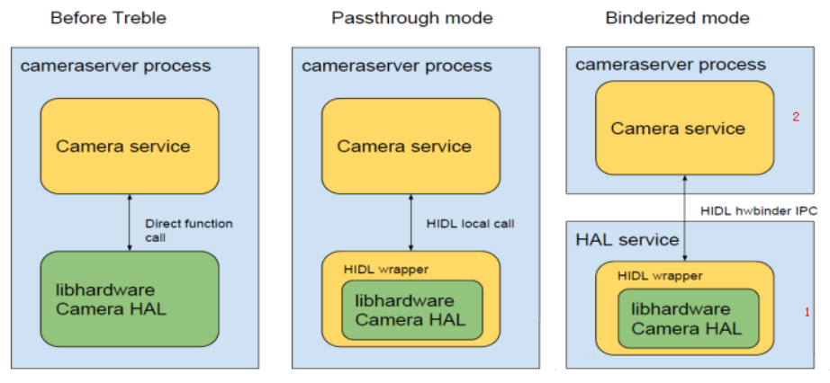
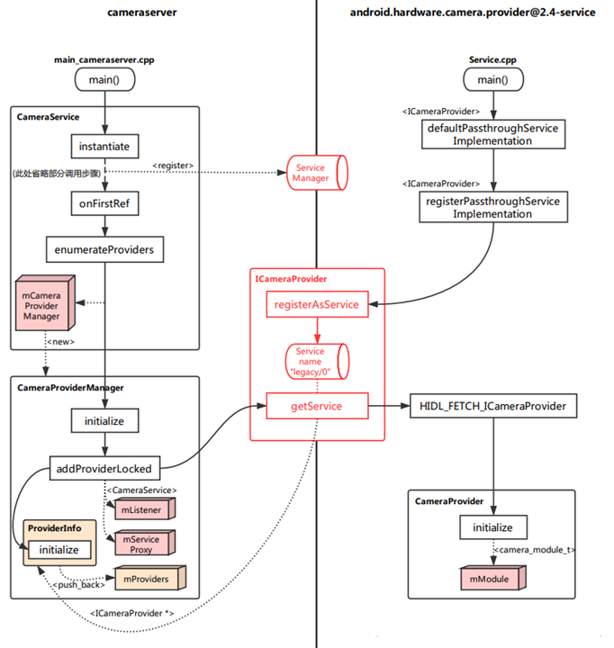

### 前言

<p style="text-indent:2em">去年正式进入框架组的时候，啥也不会，瞎jb分析了一通 Android N 上面的 Camera 相关流程。其实基本上都是跟着别人的分析日志看代码，然后按照自己的理解记了些笔记而已。不过当时感觉受益匪浅，并且后来在项目开发、维护的时候，很多相关的内容都派上了用场。从正式进入项目到现在大概有 10 个月了吧，其中大概有一半时间在 Android N 上填坑，另一半就是填 Android O 上的坑了(虽然这些坑基本上都是自己人挖的)。现在终于感觉自己对 Android Camera 这块的架构也有一定的认识了。然而，公司业务要往 HAL3 上迁移了，又要重新开始学习 Camera 流程了……
不过现在的我已经有一定的能力，可以自己跟踪流程去分析了。趁此机会，我就从比较简单的 Camera 服务启动流程开始，锻炼锻炼分析代码、抽象出主干思想的功力吧。</p>

### Camera 服务启动流程概览

<p style="text-indent:2em">在 Android O 中，系统启动时，就会启动 CameraProvider 服务。它将 Camera HAL 从 CameraServer 进程中分离出来，作为一个独立进程 android.hardware.camera.provider@2.4-service 来控制 HAL。这两个进程之间通过 HIDL 机制进行通信。这样的改动源自于 Android O 版本加入的 Treble 机制，它的主要功能(如下图所示)是将 service 与 HAL 隔离，以方便 HAL 部分进行独立升级。这其实和 APP 与 Framework 之间的 Binder 机制类似，通过引入一个进程间通信机制而针对不同层级进行解耦(从 Local call 变成了 Remote call)。


<p style="text-indent:2em">如此一来 Camera 服务的启动流程就变得有些复杂了，但是最核心的部分其实没变，最终都要从动态库中获取连接 HAL 的结构，并保存下来以备未来对 Camera 设备进行操作。这几天跟了一下代码流程，大概总结了一下 CameraServer 与 CameraProvider 这两个进程启动、初始化的调用逻辑，如下图。</p>



#### 总体逻辑顺序：

1. CameraProvider 进程启动，注册，实例并初始化 CameraProvider；
2. CameraServer 进程启动，注册，实例并初始化 CameraService；
3. CameraServer 通过 HIDL 通信获取远端 CameraProvider，此时实例化 CameraProvider 并初始化。

<p style="text-indent:2em">上图中，实线箭头是调用关系。左边是 CameraServer 进程中的动作，右边则是 CameraProvider 进程中的动作，它们之间通过 ICameraProvider 联系在了一起，而这个东西与 HIDL 相关，我们可以不用关心它的实现方式。由图可见：</p>
- CameraServer  一侧，CameraService 类依旧是主体。它通过 CameraProviderManager 来管理对 CameraProvider 的操作。此处初始化的最终目的是连接上 CameraProvider。
- CameraProvider 一侧，最终主体是 CameraProvider。初始化最终目的是得到一个 mModule，通过它可以直接与 HAL 接口定义层进行交互。

<p style="text-indent:2em">至此，我们就能对 Android O 上的 Camera 服务启动流程有一个大致的了解。但由于我个人功力尚浅，目前只能理解到这个地步，还无法轻易抽象出更容易理解的框架，所以图片中的流程还是比较凌乱的，可能需要对照相应代码才能理解。下面是我分析代码时的一些笔记，有需要可以对照上图中的流程看看。</p>

### CameraProvider 的启动与注册

<p style="text-indent:2em">这个服务进程的启动很简单，主要动作是注册该 CameraProvider，以便 CameraServer 启动时能找到它。需要注意的是，此时 CameraProvider 还未实例化与初始化。

#### 跟代码：

<p style="text-indent:2em">在 Android 启动的过程中，init 进程调用该脚本启动 CameraProvider 服务。根据该目录下的 Android.bp 可以知道，其实就是运行该目录下 service.cpp 编译的可执行文件，service.cpp 内容如下：</p>

```c++
// aosp/hardware/interfaces/camera/provider/2.4/default/service.cpp

int main()
{
	android::ProcessState::initWithDriver("/dev/vndbinder");///1
    ......
    status = defaultPassthroughServiceImplementation<ICameraProvider>("legacy/0",/*maxThreads*/ 6);///2
}
```

1. 与 `/dev/vndbinder` 进行某种关联，打开 vndservicemanager 服务，可以和其它 vendor 组件进行通信。
2. 创建默认为直通模式(passthrough)的 CameraProvider 服务实现。

```c++
// aosp/system/libhidl/transport/include/hid/LegacySupport.h

template <class Interface, class ExpectInterface = Interface>
__attribute__((warn_unused_result)) status_t defaultPassthroughServiceImplementation(
        const std::string& name, size_t maxThreads = 1) {
    configureRpcThreadpool(maxThreads, true);///1
    status_t result = registerPassthroughServiceImplementation<Interface, ExpectInterface>(name);///2

    if (result != OK) {
        return result;
    }

    joinRpcThreadpool();///3
    return UNKNOWN_ERROR;
}
```

1. 配置 RPC 线程池(当前设置最大线程为 6)，第一次执行这个函数会open /dev/hwbinder。
2. 将 Interface(即ICameraProvider)以入参 legacy/0 为名注册到相应的管理服务中。
3. 连接到线程池。

```c++
// aosp/system/libhidl/transport/include/hid/LegacySupport.h

template <class Interface, class ExpectInterface = Interface>
__attribute__((warn_unused_result)) status_t registerPassthroughServiceImplementation(
        const std::string& name = "default") {
    return registerPassthroughServiceImplementation(Interface::descriptor,
                                                    ExpectInterface::descriptor, name);
}
```

<p style="text-indent:2em">这里的 Interface::descriptor 定义在 CameraProviderAll.cpp 中。</p>

```c++
// aosp\out\soong\.intermediates\hardware\interfaces\camera\provider\2.4\android.hardware.camera.provider@2.4_genc++\gen\android\hardware\camera\provider\2.4\CameraProviderAll.cpp

const char* ICameraProvider::descriptor("android.hardware.camera.provider@2.4::ICameraProvider");
```

```c++
// aosp/system/libhidl/transport/include/hid/LegacySupport.cpp

__attribute__((warn_unused_result)) status_t registerPassthroughServiceImplementation(
        const std::string& interfaceName, const std::string& expectInterfaceName,
        const std::string& serviceName) {
    return details::registerPassthroughServiceImplementation(
            interfaceName, expectInterfaceName,
            [](const sp<IBase>& service, const std::string& name) {
                return details::registerAsServiceInternal(service, name);
            },
            serviceName);
}
```

<p style="text-indent:2em">通过以调用命名空间 details 中 registerAsServiceInternal 方法的 lambda 回调为参数调用命名空间 details 中的 registerPassthroughServiceImplementation 从而获取 CameraProvider 服务并完成进行注册。</p>

```c++
// aosp/system/libhidl/transport/include/hid/LegacySupport.cpp

namespace details {

__attribute__((warn_unused_result)) status_t registerPassthroughServiceImplementation(
        const std::string& interfaceName, const std::string& expectInterfaceName,
        RegisterServiceCb registerServiceCb, const std::string& serviceName) {
    sp<IBase> service =
            getRawServiceInternal(interfaceName, serviceName, true /*retry*/, true /*getStub*/);

    if (service == nullptr) {
        ALOGE("Could not get passthrough implementation for %s/%s.", interfaceName.c_str(),
              serviceName.c_str());
        return EXIT_FAILURE;
    }
    if (service->isRemote()) {
        ALOGE("Implementation of %s/%s is remote!", interfaceName.c_str(), serviceName.c_str());
        return EXIT_FAILURE;
    }

    std::string actualName;
    Return<void> result = service->interfaceDescriptor(
            [&actualName](const hidl_string& descriptor) { actualName = descriptor; });
    if (!result.isOk()) {
        ALOGE("Error retrieving interface name from %s/%s: %s", interfaceName.c_str(),
              serviceName.c_str(), result.description().c_str());
        return EXIT_FAILURE;
    }
    if (actualName != expectInterfaceName) {
        ALOGE("Implementation of %s/%s is actually %s, not a %s!", interfaceName.c_str(),
              serviceName.c_str(), actualName.c_str(), expectInterfaceName.c_str());
        return EXIT_FAILURE;
    }

    status_t status = registerServiceCb(service, serviceName);
    if (status == OK) {
        ALOGI("Registration complete for %s/%s.", interfaceName.c_str(), serviceName.c_str());
    } else {
        ALOGE("Could not register service %s/%s (%d).", interfaceName.c_str(), serviceName.c_str(),
              status);
    }

    return status;
}

}  // namespace details
```

<p style="text-indent:2em">首先通过 interfaceName 为 android.hardware.camera.provider@2.4::ICameraProvider，serviceName 为 legacy/0，retry 为 true，getStub 为 true 调用命名空间 details 中 getRawServiceInternal 方法得到了 CameraProvider 实例化对象，通过调用传入的 lambda 回调以 serviceName：legacy/0 注册 CameraProvider 实例化对象。</p>

```c++
// aosp/system/libhidl/transport/include/hidl/ServiceManagement.cpp

namespace details {
......
sp<::android::hidl::base::V1_0::IBase> getRawServiceInternal(const std::string& descriptor,
                                                             const std::string& instance,
                                                             bool retry, bool getStub) {
    using Transport = IServiceManager1_0::Transport;
    sp<Waiter> waiter;

    sp<IServiceManager1_1> sm;
    Transport transport = Transport::EMPTY;
    if (kIsRecovery) {
        transport = Transport::PASSTHROUGH;
    } else {
        sm = defaultServiceManager1_1();
        if (sm == nullptr) {
            ALOGE("getService: defaultServiceManager() is null");
            return nullptr;
        }

        Return<Transport> transportRet = sm->getTransport(descriptor, instance);

        if (!transportRet.isOk()) {
            ALOGE("getService: defaultServiceManager()->getTransport returns %s",
                  transportRet.description().c_str());
            return nullptr;
        }
        transport = transportRet;
    }

    const bool vintfHwbinder = (transport == Transport::HWBINDER);
    const bool vintfPassthru = (transport == Transport::PASSTHROUGH);
    const bool trebleTestingOverride = isTrebleTestingOverride();
    const bool allowLegacy = !kEnforceVintfManifest || (trebleTestingOverride && isDebuggable());
    const bool vintfLegacy = (transport == Transport::EMPTY) && allowLegacy;

    if (!kEnforceVintfManifest) {
        ALOGE("getService: Potential race detected. The VINTF manifest is not being enforced. If "
              "a HAL server has a delay in starting and it is not in the manifest, it will not be "
              "retrieved. Please make sure all HALs on this device are in the VINTF manifest and "
              "enable PRODUCT_ENFORCE_VINTF_MANIFEST on this device (this is also enabled by "
              "PRODUCT_FULL_TREBLE). PRODUCT_ENFORCE_VINTF_MANIFEST will ensure that no race "
              "condition is possible here.");
        sleep(1);
    }

    for (int tries = 0; !getStub && (vintfHwbinder || vintfLegacy); tries++) {
        if (waiter == nullptr && tries > 0) {
            waiter = new Waiter(descriptor, instance, sm);
        }
        if (waiter != nullptr) {
            waiter->reset();  // don't reorder this -- see comments on reset()
        }
        Return<sp<IBase>> ret = sm->get(descriptor, instance);
        if (!ret.isOk()) {
            ALOGE("getService: defaultServiceManager()->get returns %s for %s/%s.",
                  ret.description().c_str(), descriptor.c_str(), instance.c_str());
            break;
        }
        sp<IBase> base = ret;
        if (base != nullptr) {
            Return<bool> canCastRet =
                details::canCastInterface(base.get(), descriptor.c_str(), true /* emitError */);

            if (canCastRet.isOk() && canCastRet) {
                if (waiter != nullptr) {
                    waiter->done();
                }
                return base; // still needs to be wrapped by Bp class.
            }

            if (!handleCastError(canCastRet, descriptor, instance)) break;
        }

        // In case of legacy or we were not asked to retry, don't.
        if (vintfLegacy || !retry) break;

        if (waiter != nullptr) {
            ALOGI("getService: Trying again for %s/%s...", descriptor.c_str(), instance.c_str());
            waiter->wait(true /* timeout */);
        }
    }

    if (waiter != nullptr) {
        waiter->done();
    }

    if (getStub || vintfPassthru || vintfLegacy) {
        const sp<IServiceManager1_0> pm = getPassthroughServiceManager();
        if (pm != nullptr) {
            sp<IBase> base = pm->get(descriptor, instance).withDefault(nullptr);
            if (!getStub || trebleTestingOverride) {
                base = wrapPassthrough(base);
            }
            return base;
        }
    }

    return nullptr;
}
```

<p style="text-indent:2em">在调用 getRawServiceInternal() 函数时，由于我们的参数 getStub 为 true，直通模式，所以该函数主要执行以下部分，将返回 CameraProvider 实例对象：</p>

```c++
if (getStub || vintfPassthru || vintfLegacy) {
    const sp<IServiceManager1_0> pm = getPassthroughServiceManager();
    if (pm != nullptr) {
        sp<IBase> base = pm->get(descriptor, instance).withDefault(nullptr);
        if (!getStub || trebleTestingOverride) {
            base = wrapPassthrough(base);
        }
        return base;
    }
}
```

<p style="text-indent:2em">首先获取 ServiceManager 代理 pm，再通过 descriptor 为 android.hardware.camera.provider@2.4::ICameraProvider ，instance 为 legacy/0 的参数调用 pm 的get方法从而获得 CameraProvider 实例对象。
```c++
// aosp/system/libhidl/transport/include/hidl/ServiceManagement.cpp

struct PassthroughServiceManager : IServiceManager1_1 {
    static void openLibs(
        const std::string& fqName,
        const std::function<bool /* continue */ (void* /* handle */, const std::string& /* lib */,
                                                 const std::string& /* sym */)>& eachLib) {
        //fqName looks like android.hardware.foo@1.0::IFoo
        size_t idx = fqName.find("::");

        if (idx == std::string::npos ||
                idx + strlen("::") + 1 >= fqName.size()) {
            LOG(ERROR) << "Invalid interface name passthrough lookup: " << fqName;
            return;
        }

        std::string packageAndVersion = fqName.substr(0, idx);
        std::string ifaceName = fqName.substr(idx + strlen("::"));

        const std::string prefix = packageAndVersion + "-impl";
        const std::string sym = "HIDL_FETCH_" + ifaceName;

        constexpr int dlMode = RTLD_LAZY;
        void* handle = nullptr;

        dlerror(); // clear

        static std::string halLibPathVndkSp = details::getVndkSpHwPath();
        std::vector<std::string> paths = {
            HAL_LIBRARY_PATH_ODM, HAL_LIBRARY_PATH_VENDOR, halLibPathVndkSp,
#ifndef __ANDROID_VNDK__
            HAL_LIBRARY_PATH_SYSTEM,
#endif
        };

        if (details::isTrebleTestingOverride()) {
            // Load HAL implementations that are statically linked
            handle = dlopen(nullptr, dlMode);
            if (handle == nullptr) {
                const char* error = dlerror();
                LOG(ERROR) << "Failed to dlopen self: "
                           << (error == nullptr ? "unknown error" : error);
            } else if (!eachLib(handle, "SELF", sym)) {
                return;
            }
        }

        for (const std::string& path : paths) {
            std::vector<std::string> libs = findFiles(path, prefix, ".so");

            for (const std::string &lib : libs) {
                const std::string fullPath = path + lib;

                if (kIsRecovery || path == HAL_LIBRARY_PATH_SYSTEM) {
                    handle = dlopen(fullPath.c_str(), dlMode);
                } else {
#if !defined(__ANDROID_RECOVERY__) && defined(__ANDROID__)
                    handle = android_load_sphal_library(fullPath.c_str(), dlMode);
#endif
                }

                if (handle == nullptr) {
                    const char* error = dlerror();
                    LOG(ERROR) << "Failed to dlopen " << lib << ": "
                               << (error == nullptr ? "unknown error" : error);
                    continue;
                }

                if (!eachLib(handle, lib, sym)) {
                    return;
                }
            }
        }
    }

    Return<sp<IBase>> get(const hidl_string& fqName,
                          const hidl_string& name) override {
        sp<IBase> ret = nullptr;

        openLibs(fqName, [&](void* handle, const std::string &lib, const std::string &sym) {
            IBase* (*generator)(const char* name);
            *(void **)(&generator) = dlsym(handle, sym.c_str());
            if(!generator) {
                const char* error = dlerror();
                LOG(ERROR) << "Passthrough lookup opened " << lib << " but could not find symbol "
                           << sym << ": " << (error == nullptr ? "unknown error" : error)
                           << ". Keeping library open.";

                // dlclose too problematic in multi-threaded environment
                // dlclose(handle);

                return true;  // continue
            }

            ret = (*generator)(name.c_str());

            if (ret == nullptr) {
                LOG(ERROR) << "Could not find instance '" << name.c_str() << "' in library " << lib
                           << ". Keeping library open.";

                // dlclose too problematic in multi-threaded environment
                // dlclose(handle);

                // this module doesn't provide this particular instance
                return true;  // continue
            }

            // Actual fqname might be a subclass.
            // This assumption is tested in vts_treble_vintf_test
            using ::android::hardware::details::getDescriptor;
            std::string actualFqName = getDescriptor(ret.get());
            CHECK(actualFqName.size() > 0);
            registerReference(actualFqName, name);
            return false;
        });

        return ret;
    }
 .......
}

sp<IServiceManager1_0> getPassthroughServiceManager() {
    return getPassthroughServiceManager1_1();
}
sp<IServiceManager1_1> getPassthroughServiceManager1_1() {
    static sp<PassthroughServiceManager> manager(new PassthroughServiceManager());
    return manager;
}
```


<p style="text-indent:2em">将 CameraProvider 注册为一个服务，其他进程需要使用 Camera HAL 层时通过 binder 得到 CameraProvider 代理类即可操作 Camera HAL 层。</p>

```c++
// aosp/system/libhidl/transport/include/hidl/ServiceManagement.cpp

namespace details {
status_t registerAsServiceInternal(const sp<IBase>& service, const std::string& name) {
    if (service == nullptr) {
        return UNEXPECTED_NULL;
    }

    //ljw:获取 HwServiceManager 对象的 binder 代理对象: BpHwServiceManager, fromBinder 最终为 new BpHwServiceManager(new BpHwBinder(0)) 
    sp<IServiceManager1_2> sm = defaultServiceManager1_2();
    if (sm == nullptr) {
        return INVALID_OPERATION;
    }

    //ljw:获取descriptor:android.hardware.camera.provider@2.4::ICameraProvider
    const std::string descriptor = getDescriptor(service.get());

    if (kEnforceVintfManifest && !isTrebleTestingOverride()) {
        using Transport = IServiceManager1_0::Transport;
        Return<Transport> transport = sm->getTransport(descriptor, name);

        if (!transport.isOk()) {
            LOG(ERROR) << "Could not get transport for " << descriptor << "/" << name << ": "
                       << transport.description();
            return UNKNOWN_ERROR;
        }

        if (transport != Transport::HWBINDER) {
            LOG(ERROR) << "Service " << descriptor << "/" << name
                       << " must be in VINTF manifest in order to register/get.";
            return UNKNOWN_ERROR;
        }
    }

    bool registered = false;
    //ljw:
    Return<void> ret = service->interfaceChain([&](const auto& chain) {
        //ljw:通过 HwServiceManager 代理对象 BpHwServiceManager 进行服务的注册
        registered = sm->addWithChain(name.c_str(), service, chain).withDefault(false);
    });

    if (!ret.isOk()) {
        LOG(ERROR) << "Could not retrieve interface chain: " << ret.description();
    }

    if (registered) {
        //ljw:
        onRegistrationImpl(descriptor, name);
    }

    return registered ? OK : UNKNOWN_ERROR;
}
}
```

