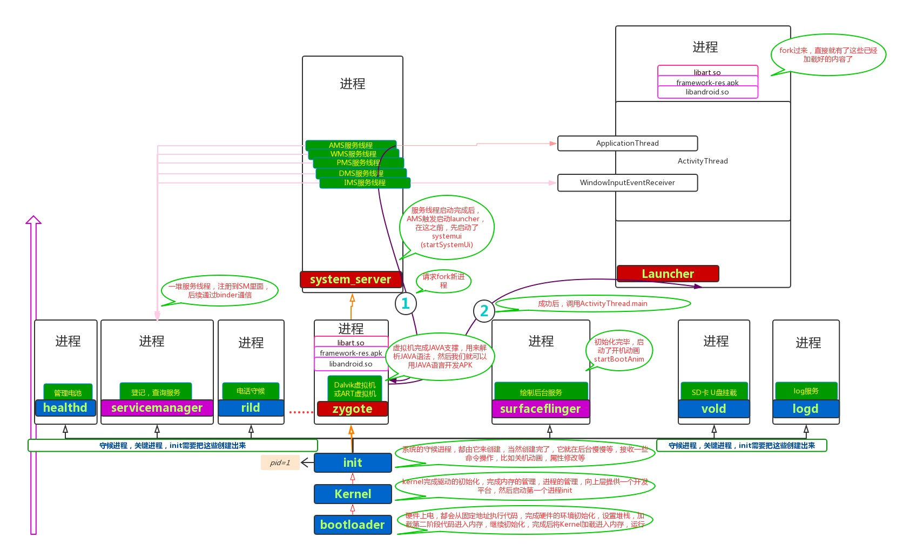
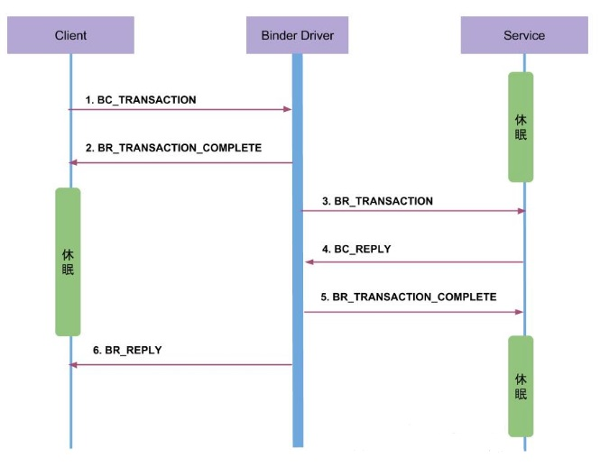
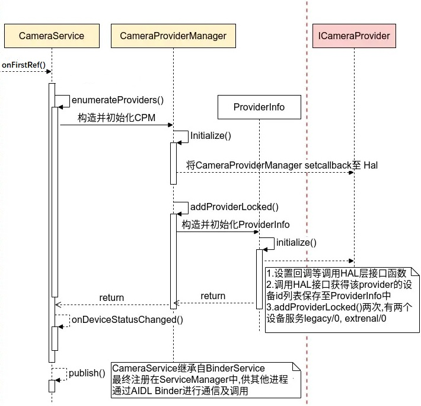

### 前言

所谓 Android 开机的过程就是加载和启动各种服务的过程。我们知道 Android 机器在开机时，首先装载 BootLoader 引导程序，进行硬件上电，从初始代码处开始执行初始化，再进行第二阶段的代码加载和初始化。然后就进入到 Kernel 加载和初始化阶段，进行初始化驱动、安装根文件系统等操作，之后会启动第一个用户进程 init 进程。Init 进程是所有用户进程的父进程，会进行守护进程的创建，同时会创建关键进程。init进程启动后会加载 init.rc 脚本，CameraProvider 进程和 CameraServer 进程就是在这时启动的。其中 ServiceManager 是一个守护进程，在应用层通过context.getSystemService() 方法获取的各种服务 Manager 都是在这里进行管理，它维护着系统服务和客户端的 Binder 通信。

对于 Camera 系统启动，开机会先加载 Kernel 驱动，上层是先启动 CameraProvider 进程注册并加载 CameraHal 。接着启动 CameraServer 进程构造注册并加载 CameraService，此过程中会通过 HIDL 通信获取CameraProvider，并对 CameraProvider进行初始化。应用调用 Camera2 API 的时候会获取 CameraService，然后通过 CameraProvider 访问 Hal，Hal 最终访问到驱动。

#### 总体逻辑顺序总结

1. CameraProvider 进程启动、注册
2. CameraServer 进程启动、构造并注册 CameraService、初始化 CameraService(onFirstRef)
3. CameraService 初始化过程中通过 HIDL 通信获取 CameraProvider，并对 CameraProvider 进行初始化 

### CameraServer 进程启动过程

#### 概述

我们已经知道 init 进程在加载 init.rc 之后会去加载其他 rc 文件从而启动其他进程，CameraServer 进程的 rc 文件在 /frameworks/av/camera/cameraserver/cameraserver.rc 路径下，由同级目录的 Android.bp 文件打包到 /system/etc/init/ 目录下，这个目录就是被 init 进程启动脚本的目录之一。也就是说只要加载了cameraserver.rc 文件，服务就开始启动了，就会往 main_cameraserer.cpp 的入口函数中执行，因为 Android.bp 文件中定义了这个模块为 cameraserver。

CameraServer 进程启动之后，就会创建 CameraService 并进行初始化。在文件 /frameworks/av/camera/cameraserver/main_cameraserver.cpp 中，执行了CameraService::instantiate() 方法。这个方法不在 CameraService 中，而是它的父类 BinderService 的方法(定义在frameworks/native/libs/binder/include/binder/BinderService.h 文件中)。instantiate() 方法通过调用 publish() 将 CameraService 添加到 ServiceManager 中，这样其他进程就可以通过 Binder 调用 CameraService 了。通过 addService() 方法中的 transact() 就可以进行 service 的注册，同时生成一个句柄，这个句柄就是 "camera"，也就是应用层获取 Manager 时的 Context.CAMERA_SERVICE。在这个 instantiate() 方法中，调用了 publish() 方法，在 publish() 内部调用了 addService() 方法，传入的参数 service name 是通过 CameraService::getServiceName() 方法获取的，这个方法返回了 "media.camera"，以及通过 new 创建的一个 CameraService 对象。这个 addService() 方法定义在 /frameworks/native/libs/binder/IServiceManager.cpp 中，功能就是创建一个 Service。该方法传入的第二个参数是一个 sp 类型的变量，sp 是 Android 定义的一种指针格式，包装对象首次被强指针引用时，会调用包装对象的 onFirstRef() 方法，这里就是 CameraService。

instantiate() 方法通过调用 publish() 将 CameraService 添加到 ServiceManager 中，这样其他进程就可以通过 Binder 调用 CameraService 了。通过 addService() 方法中的 transact() 就可以进行 service 的注册，同时生成一个句柄，这个句柄就是 "camera"，也就是应用层获取 Manager 时的 Context.CAMERA_SERVICE。在 onFirstRef 方法中，直观地进行了四步操作，创建 CameraModule 、获取 Camera 的一些信息、设置 callback、链接 CameraServiceProxy 服务。如果继续追踪到 HAL 层，会看到CameraModule 进行了动态链接库的加载等操作，这部分内容不在此展开。

#### CameraService 初始化

CameraService的初始化是通过调用 onFirstRef() 方法完成的，onFirstRef() 方法属于其父类RefBase，当有 sp 包装的类初始化的时候调用。此方法中主要是调用 enumerateProviders() 构造并初始化 CameraProviderManager 从而知道有多少相机相关的设备包括闪光灯，完成后就完成了 CameraService 的初始化。此方法还将CameraService封装为HidlCameraService并注册为android.frameworks.cameraservice.service@1.0 和 ping CameraServiceProxy。

CameraProvider进程启动过程

为了介绍 CameraProvider 启动过程，有必要简单说下 HwServiceManager 进程，因为 CameraProvider 会注册到 HwServiceManager 中，HwServiceManager 是各个硬件进程服务的管理器。HwServiceManager 进程由 init 进程通过脚本 hwservicemanager.rc 启动，目录在system/hwservicemanager/hwservicemanager.rc，我们直接看服务main函数，在system/hwservicemanager/service.cpp

