### Android Camera整体架构简述

#### Android Camera 基本分层图:

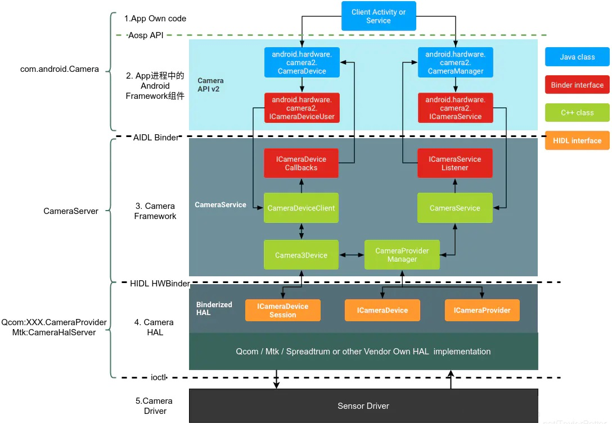

自Android 8.0之后大多机型采用Camera API2 HAL3架构，读完整部代码后再看上面这张图，真的是很清晰，很简洁，很到位。从上图得知，Android手机中Camera软件主要有大体上有4层，进程之间的通信都是通过binder实现，其中app和camera server通信使用aidl，camera server和hal通信使用hidl。

1. App层：应用开发者调用AOSP提供的接口即可，AOSP的接口即Android提供的相机应用的通用接口，这些接口将通过Binder与Native Framework层的相机服务进行操作与数据传递。
2. Native Framework层：相机Native Framework服务是承上启下的作用，上与应用层交互，下与HAL层交互。
3. Hal层: 硬件抽象层，Android 定义好了Framework服务与HAL层通信的协议及接口，HAL层如何实现，各个Vendor有自己实现，如Qcom的老架构mm-Camera，新架构Camx架构，MTK的P之后的Hal3架构。
4. Driver层: 数据由硬件到驱动层处理，驱动层接收HAL层数据以及传递Sensor数据给到HAL层，这里当然是各个Sensor芯片不同驱动也不同。

说到这为什么要引入Android O Treble架构分这么多层，大体上还是为了分清界限，升级方便。Android要适应各个手机组装厂商的不同配置，不同sensor，不管怎么换芯片，从Framework及之上都不需要改变，App也不需要改变就可以在各种配置机器上顺利运行，HAL层对上的接口也由Android定义，各个平台厂商只需要按照接口实现适合自己平台的HAL层即可。

#### 仓库代码路径：

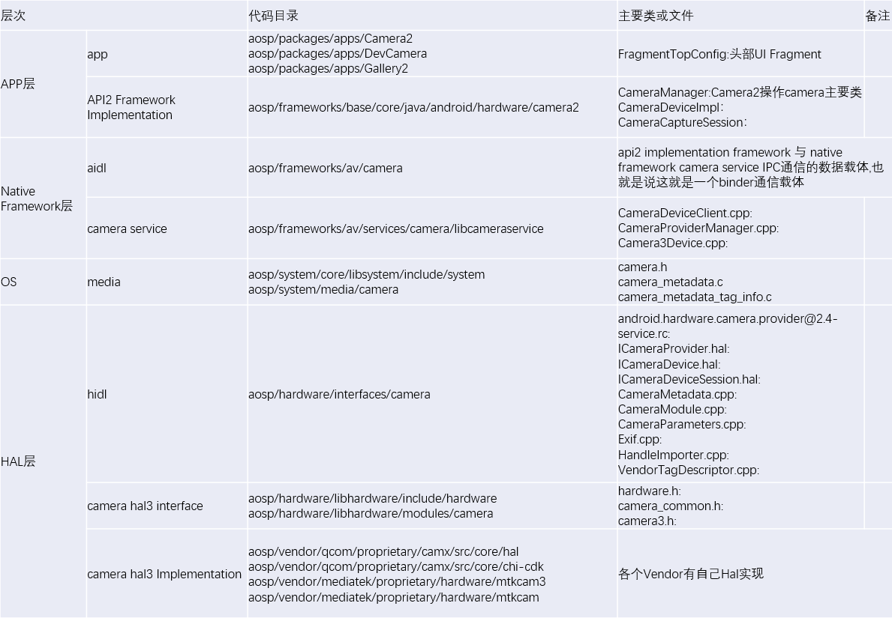

### Android Camera工作大体流程

#### Android Camera工作大体流程图：

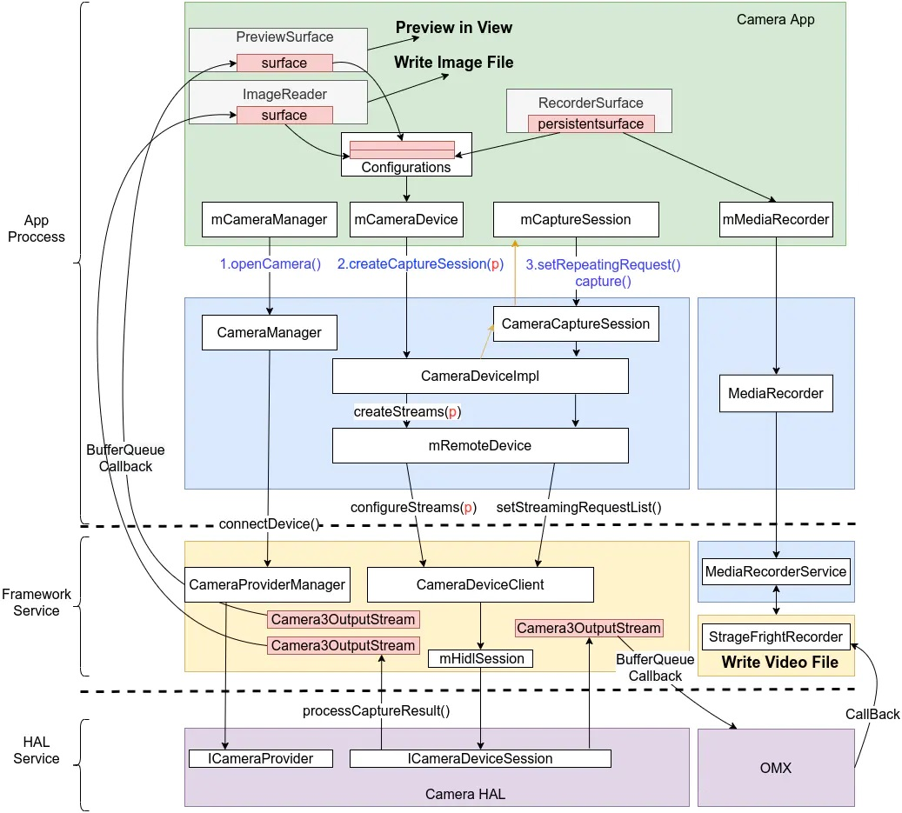

绿色框中是应用开发者需要做的操作，蓝色为AOSP提供的API，黄色为Native Framework Service，紫色为HAL层Service。

#### 步骤描述：

1. App一般在MainActivity中使用SurfaceView或者SurfaceTexture+TextureView或者GLSurfaceView等控件作为显示预览界面的控件,共同点都是包含了一个单独的Surface作为取相机数据的容器。
2. 在MainActivity onCreate的时候调用API去通知Framework Native Service CameraServer去connect HAL继而打开Camera硬件sensor。
3. openCamera成功会有回调从CameraServer通知到App，在onOpenedCamera或类似回调中去调用类似startPreview的操作。此时会创建CameraCaptureSession，创建过程中会向CameraServer调用ConfigureStream的操作，ConfigureStream的参数中包含了第一步中控件中的Surface的引用，相当于App将Surface容器给到了CameraServer，CameraServer包装了下该Surface容器为stream，通过HIDL传递给HAL，继而HAL也做configureStream操作。
4. ConfigureStream成功后CameraServer会给App回调通知ConfigStream成功，接下来App便会调用AOSP setRepeatingRequest接口给到CameraServer，CameraServer初始化时便起来了一个死循环线程等待来接收Request。
5. CameraServer将request交到Hal层去处理，得到HAL处理结果后取出该Request的处理Result中的Buffer填到App给到的容器中，SetRepeatingRequest为了预览则交给Preview的Surface容器，如果是Capture Request则将收到的Buffer交给ImageReader的Surface容器。
6. Surface本质上是BufferQueue的使用者和封装者，当CameraServer中App设置来的Surface容器被填满了BufferQueue机制将会通知到应用，此时App中控件取出各自容器中的内容消费掉，Preview控件中的Surface中的内容将通过View提供到SurfaceFlinger中进行合成最终显示出来，即预览；而ImageReader中的Surface被填了,则App将会取出保存成图片文件消费掉。
7. 录制视频通过Android MediaRecorder框架进行实现，另起文章进行简要整理，这里不在赘述。

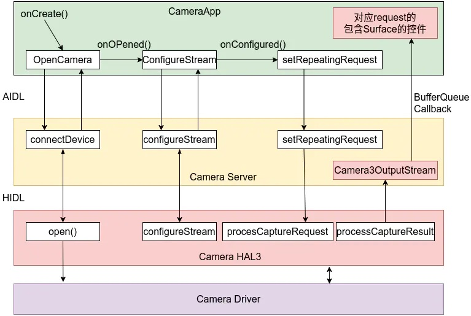

#### API 用途摘要

1. 监听和枚举相机设备。
2. 打开设备并连接监听器。
3. 配置目标使用情形的输出(如静态捕获、录制等)。
4. 为目标使用情形创建请求。
5. 捕获/重复请求和连拍。
6. 接收结果元数据和图片数据。
7. 切换使用情形时，返回到第 3 步。

### Camera App层简述

#### 说明

应用层即应用开发者关注的地方，主要就是利用AOSP提供的应用可用的组件实现用户可见可用的相机应用，主要的接口及要点在<a href="https://developer.android.google.cn/training/camera">Android开发者/文档/指南/相机</a>。

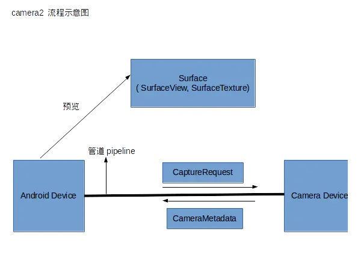

应用层开发者需要做的就是按照AOSP的API规定提供的接口，打开相机，做基本的相机参数的设置，发送request指令，将收到的数据显示在应用界面或保存到存储中。应用层开发者不需要关注有手机有几个摄像头，它们是什么牌子的，它们是怎么组合的，特定模式下哪个摄像头是开或者是关的，他们利用AOSP提供的接口通过AIDL binder调用向Native Framework层的CameraServer进程下指令，从CameraServer进程中取的数据。

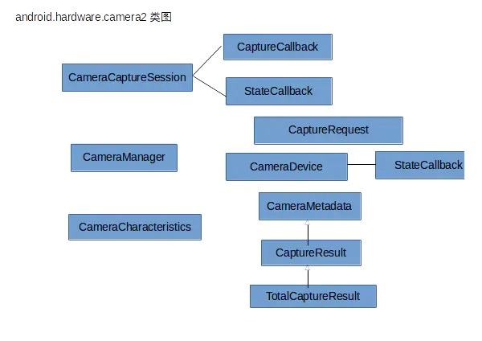

#### 基本过程都如下:

1. openCamera:Sensor上电
2. configureStream: 该步就是将控件如GLSurfaceView，ImageReader等中的Surface容器给到CameraServer。
3. request: 预览使用SetRepeatingRequest，拍一张可以使用Capture，本质都是setRequest给到CameraServer
4. CameraServer将Request的处理结果Buffer数据填到对应的Surface容器中，填完后由BufferQueue机制回调到应用层对应的Surface控件的CallBack处理函数，接下来要显示预览或保存图片，主要一个预览控件和拍照保存控件，App中对应的Surface中都有数据了。
5. 录制视频通过Android MediaRecorder框架进行实现，另起文章进行简要整理，这里不再赘述。

### Camera Framework层简述

#### 前言

Camera Framework层即CameraServer服务实现。CameraServer是Native Service，起承上启下，上对应用提供Aosp的接口服务，下与Hal进行交互。一般而言，CamerServer出现问题的概率极低，大部分还是App层及HAL层出现的问题居多。

#### CameraServer初始化简单过程如下:

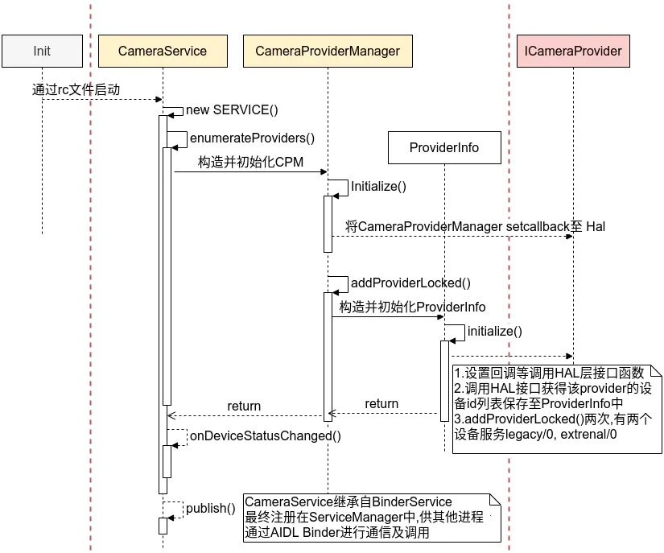

CameraServer由init(aosp/frameworks/av/camera/cameraserver/cameraserver.rc)启动

#### CameraServer初始化详细过程如下:

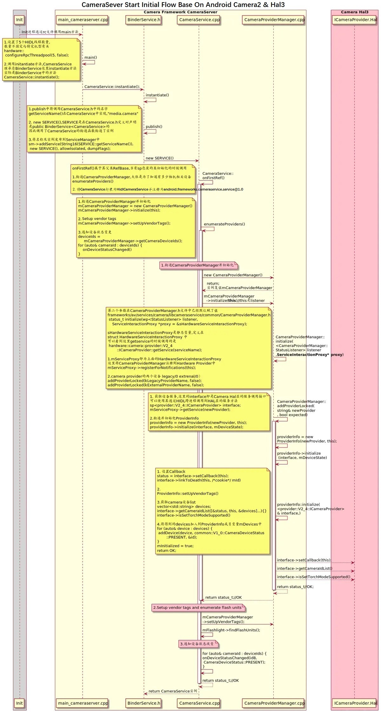

### App调用CameraServer的相关操作

#### 简单过程如下:

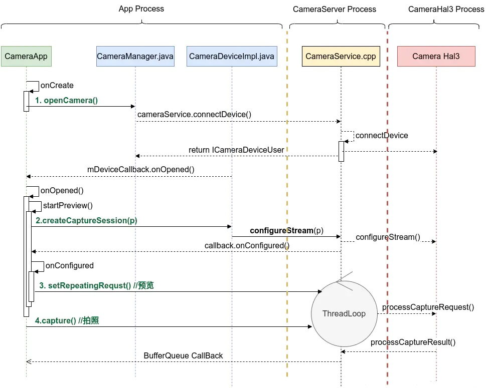

#### 详细过程如下:

1. ##### open camera: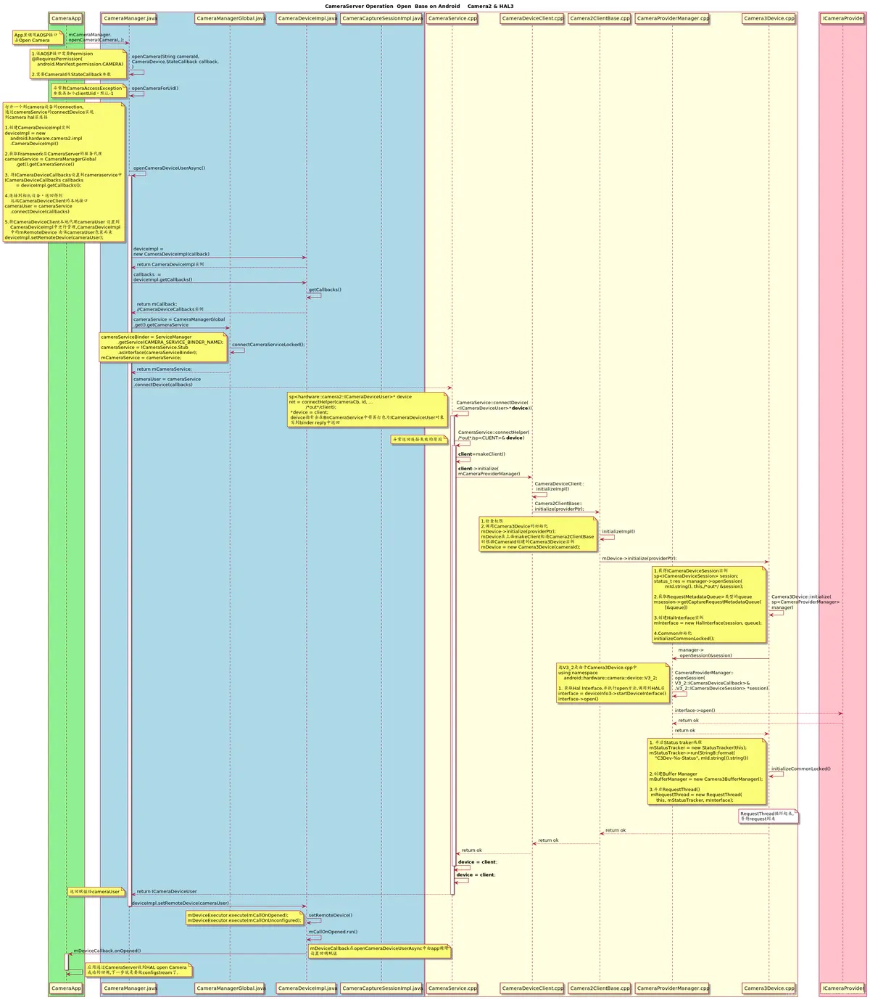
2. ##### configure stream：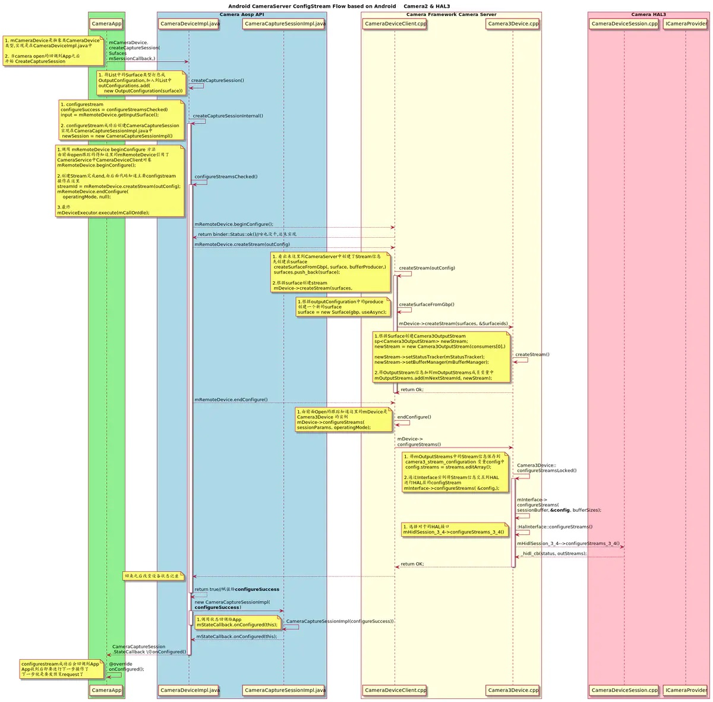
3. ##### preview and capture request: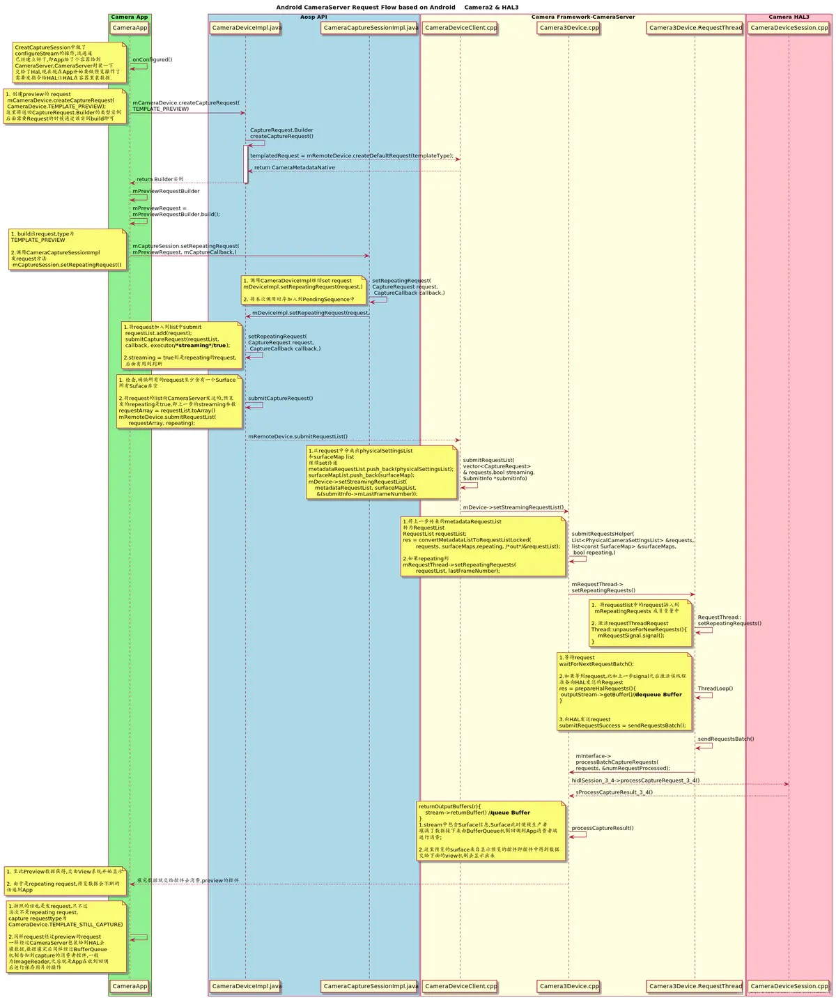
4. ##### flush and close: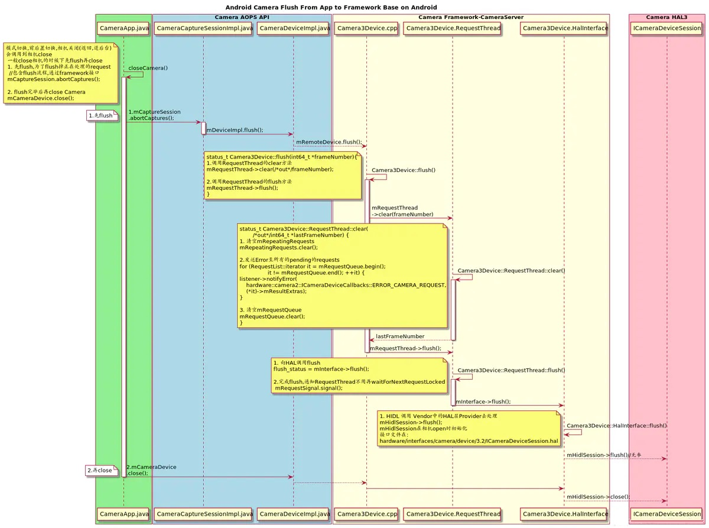

### Camera Hal3 子系统

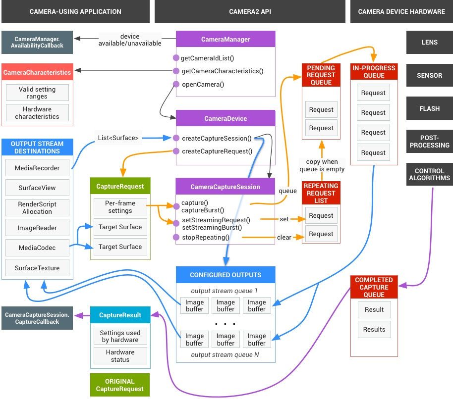

Android 官方讲解<a href="https://source.android.google.cn/devices/camera/camera3_requests_hal">HAL子系统</a>中。Android 的相机硬件抽象层(HAL)可将<a href="http://developer.android.google.cn/reference/android/hardware/package-summary.html">Camera2</a>中较高级别的相机框架 API 连接到底层的相机驱动程序和硬件。Android 8.0 引入了 Treble，用于将 CameraHal API 切换到由 HAL 接口描述语言(HIDL)定义的稳定接口。

#### HAL 操作摘要

- 捕获的异步请求来自于框架。
- HAL 设备必须按顺序处理请求。对于每个请求，均生成输出结果元数据以及一个或多个输出图像缓冲区。
- 请求和结果以及后续请求引用的信息流遵守先进先出规则。
- 指定请求的所有输出的时间戳必须完全相同，以便框架可以根据需要将它们匹配在一起。
- 所有捕获配置和状态(不包括 3A 例程)都包含在请求和结果中。

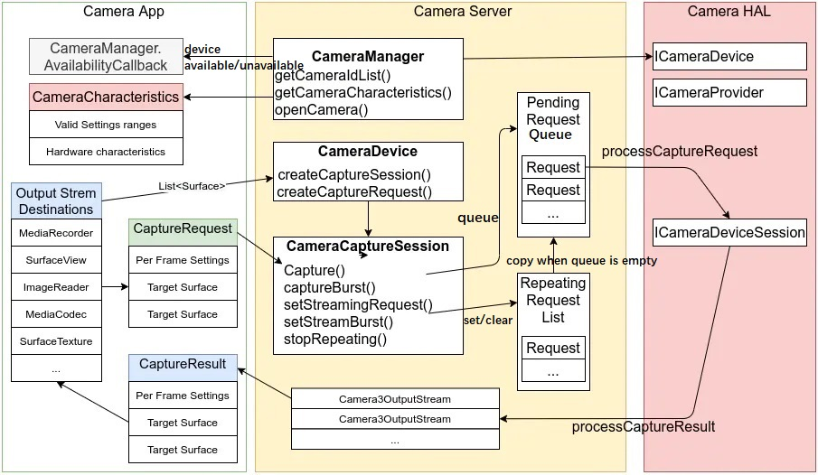

#### HAL 操作

1. 应用框架针对捕获的结果向相机子系统发出捕获数据的异步请求，一个请求对应一组结果。请求中包含所有配置信息。其中包括分辨率和像素格式；手动传感器、镜头和闪光灯控件；3A 操作模式；RAW 到 YUV 处理控件；以及统计信息的生成等。这样一来，便可更好地控制结果的输出和处理。一次可发起多个请求，而且提交请求时不会出现阻塞。请求始终按照接收的顺序进行处理。
2. 图中看到请求中携带了数据容器Surface,交到Native Framework CameraServer中，打包成Camera3OutputStream实例，在一次CameraCaptureSession中包装成Hal request交给HAL层处理。Hal层获取到处理数据后返回给CameraServer，即CaptureResult通知到Native Framework，Framework CameraServer则得到HAL层传来的数据放进Stream中的容器Surface中。而这些Surface正是来自应用层封装了Surface的控件，这样App就得到了相机子系统传来的数据。
3. HAL3 基于captureRequest和CaptureResult来实现事件和数据的传递，一个Request会对应一个Result。当然这些是Android原生的HAL3定义，接口放在那，各个芯片厂商实现当然不一样，其中接触的便是高通的mm-camera，camx，联发科的mtkcam hal3。

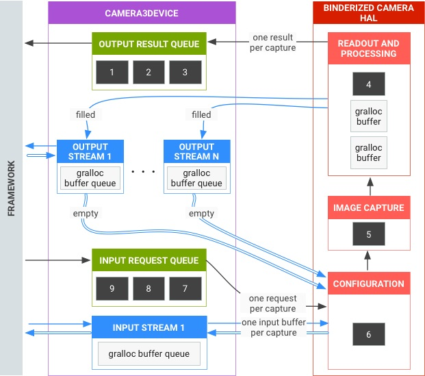

### Qcom Hal3 CamX-CHI 架构

#### 前言

高通作为平台厂商会根据谷歌定义的HAL3接口来实现自己的Camera HAL3，新的主流的Qcom Camera HAL3 架构就是CamX-CHI了。要理解弄通Camx-CHI，最主要还是要看code，手机厂商对该层代码有自己的改动，可能差别还是有的，具体项目大体框架一致但细节有区别，差异和机型的高通基线也保持一致。

#### CamX-CHI 架构总体结构简单总结

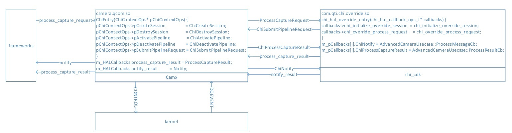

1. Camx-CHI的架构入口为Camx包中的camxhal3entry.cpp，camx包中是高通平台Camx-CHI架构的核心跳转及处理业务的代码，一般手机厂商不会去更改，代码目录在vendor/qcom/proprietary/camx/下，编译结果是camera.qcom.so
2. camx包通过chxentensionInterface调用到chi-cdk包下的代码，这里面一般是手机厂商自己定制功能的地方，代码目录在vendor/qcom/proprietary/chi-cdk/，编译结果是com.qti.chi.override.so。
3. 从这张图中知道提交一个request业务流程交给camx处理，但会经过chi-cdk进行request定制化重新打包再交给camx实际去执行或和kernel driver层进行交互，camx部分代码即核心流程管控的代码，而chi-cdk正是手机厂商想要实现自己定制化功能的代码地方。

#### CAMX架构中重要的数据结构及关系

1. Chi对Camx的操作，需要通过ExtensionModule进行操作，因此，Camx对外提供的接口扩展需要通过ExtensionModule进行，里面一个重要的变量就是g_chiContextOps。
2. Camx对Chi的操作，是通过HAL3Module接口的m_ChiAppCallbacks进行的，因此chi里面释放的接口，都会在m_ChiAppCallbacks里面体现。
3. Usecase：基本上与App上的各种模式有一定的对应关系，包括PreviewZSL，VideoLiveShot,，SAT(Multicamera)， RTB(Reatime Bokeh)，QCFA，Dual，superslowmotionfrc…， 一个usecase包含了realtime和snapshot的session， 需要包含所有的在这个usecase的所有feature的pipeline列表。
4. Feature: 在Usecase下打开某个功能设计的一种架构，通常情况下一个Usecase可以启用各种不同的feature，feature包含了usecase里面的部分pipeline，一般都是snapshot的才会包含feature进行处理，因此，usecase与feautre的界限并不明显。
5. Session：包含了ChxSession，ChiSession和CamxSession。Chxsession是对chi接口里面对CamxSession的封装，Usecase里面创建的Session都是要创建这一个。ChiSession是camx里面的一个部分，是对camxSession的继承和透传。
6. pipeline：包含单个经过验证的topology的可重用容器。驱动程序通过pipeline来了解所使用的引擎以及数据处理的流程。
7. Node：camera pipeline 内的逻辑功能块，在单个引擎上执行。node链接在一起构成一个topology。在CHI API的初始版本中，ISP外部的所有节点都是通过CPU代码调用的，调的是native API。

不同机型，产品性能及定位不同，即使基线一样usecase等也有可能不一样，高通这么做给了手机厂商极大的自定义空间，举个某机型例子，UseCase可以场景复用，对应的pipeline也可以不用或复用。

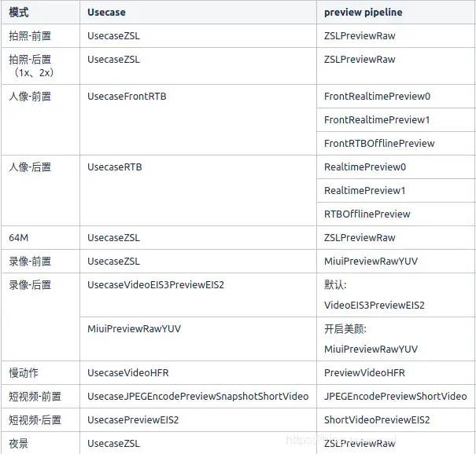

### MTK Hal3 MtkCam3 架构

