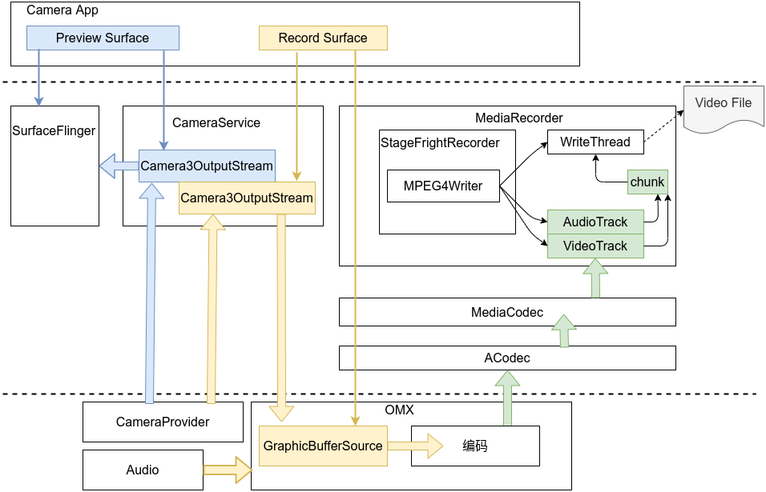

### MediaRecorder整体架构

#### MediaRecorder录制数据流框架



```
简单过程:
1. Camera应用中至少有两个Surface,一个使用于preview的,另一个使用于record的,record的surface是PersistentSurface类型,PersistentSurface中的GraphicBufferSource类型的成员变量mBufferSource最终由编码器创建引用;
2.CameraService中持有Record Surface的producer引用和Preview Surface的producer引用,因此预览和录制CameraService都充当着生产者的角色;
3.在向CameraProvider发request的时候先dequeueBuffer送至HAL去填充,填充完HAL发回result这时queueBuffer将数据填充至BufferQueue中,由BufferQueue的原理,可知这时候BufferQueue的Consumer将回调onFrameAvailable函数去收到数据准备完成通知,接下来Consumer使用acquireBuffer去消费即可,消费完即releaseBuffer去释放Buffer;
4.对于preview,消费者就是Surfaceflinger了,合成消费后拿去显示;对于record,消费者就是编码器了,举例OMX一种,编码器获取到数据消费用于编码;
5.编码器编完码之后将调用Framework中MediaServer的回调,将编码后的数据传递至MediaRecorder;
6.MediaRecorder在start之后将启动一个WriteThread,两个TrackThread(分别是Video和Audio),当TrackThread跟踪到有相应数据后将video或audio的数据分装成Chunk数据结构,保存在MPEG4Writer成员变量mChunks中.这时WriteThread发现有数据可写会将mChunks中的chunk写到文件中.
```

#### PersistentSurface及GraphicBufferSource实现的BufferQueue框架


```
1.CameraApp使用的Java层PersistentSurface继承Java层的Surface,因此它首先是个Surface,其次他一个成员变量指向Native层的 PersistentSurface 实例对象,也指向Natvie层创建的Surface对象;
2.Surface一般用来作为生产者的容器,这里一样,Java PersistentSurface的 natvie Surface给到CameraServer用于生产数据容器,Producer是CameraServer;
3.Native PersistentSurface的两个参数mBufferProducer和mBufferSource最终是由编码器创建,其mBufferProducer指向CameraServer中的Record Surface,mBufferSource作为消费者引用在编码器内部实现,mBufferSource是GraphicBufferSource类型,在其走在构造函数时会创建BufferQueue;
4.mBufferSource应是指向引用编码器内部的数据结构或实例,Acodec可以通过GraphicBufferSource类型的成员变量(由PersistentSurface的mBufferSource赋值来)对编码器进行一些参数设置.
```

#### 写文件的过程及重要类


### MediaRecorder init,prepare,start,stop简单过程

<p style="text-indent:2em">上面已经将重要过程过基本讲述了完了，下面是简单地梳理MediaRecorder的代码过程，文末将附上详细的代码跟进过程，简化图为了方便记忆主要过程，都基于详细代码跟进之后归纳重点的地方。</p>

