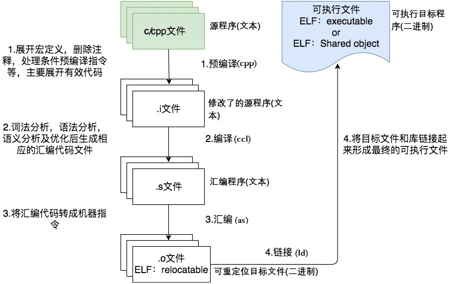
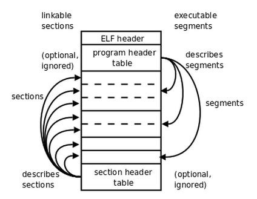
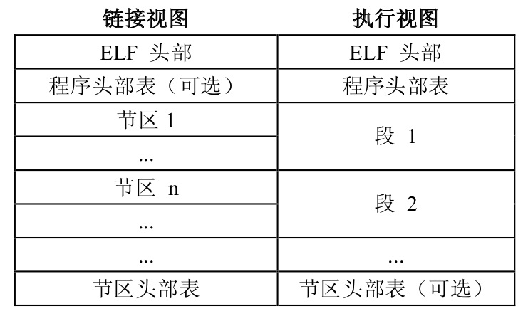
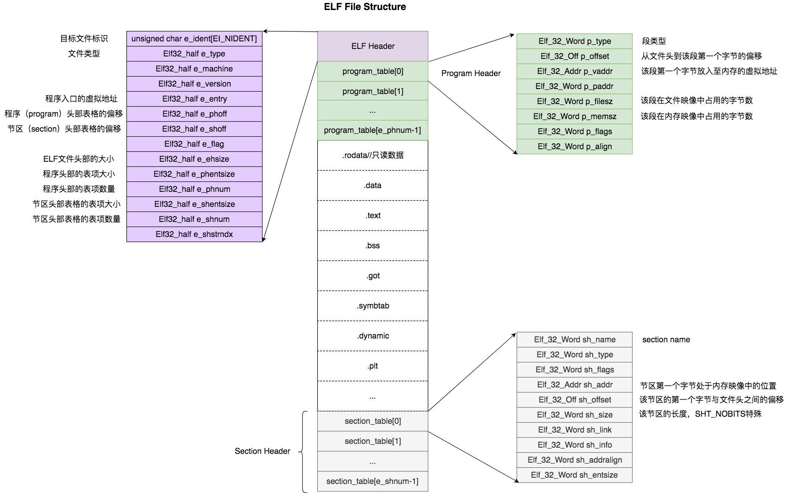

### ELF文件生成

### ELF的文件概述

#### 4种ELF文件类型

| ELF文件类型                        | 说明                                                         | 实例                   |
| ---------------------------------- | ------------------------------------------------------------ | ---------------------- |
| Relocatable File(可重定位目标文件) | 包含代码和数据，可以被链接成可执行文件或共享目标文件         | Linux下的.o文件        |
| Executable File(可执行目标文件)    | 包含可以直接执行的程序，ELF可执行文件，一般没有扩展名        | Linux下的/bin/bash文件 |
| Shared Object File(共享目标文件)   | 包含代码和数据，和其他目标文件链接成新的目标文件，和可执行文件链接作为进程映像的一部分来允许 | Linux下的.so文件       |
| Core Dump File(核心转储文件)       | 进程意外终止时可以产生的文件，存储着该进程的内存空间中的内容等信息 | Linux下的core dump     |

#### ELF文件简单结构

### 详细内容

ELF目标文件格式的最前部是ELF头(ELF Header)，它包含了描述整个文件的基本属性。紧接着是ELF文件各个节(section)。其中ELF文件中与节有关的重要结构就是节头部表(Section Header Table)，该表描述了ELF文件包含的所有节的信息。

ELF头(ELF header)以一个16字节的序列开始，这个序列描述了生成该文件的系统的字的大小和字节顺序。ELF头剩下的部分包含帮助链接器语法分析和解释目标文件的信息。ELF头开始的16字节中最开始的4个字节是所有ELF文件都必须相同的标识码，分别为0x7F、0x45、0x4c、0x46，第一个字节对应ASCII字符里面的DEL控制符，后面3个字节刚好是ELF这3个字母的ASCII码。这4个字节又被称为ELF文件的魔数，几乎所有的可执行文件格式的最开始的几个字节都是魔数。这种魔数用来确认文件的类型，操作系统在加载可执行文件的时候会确认魔数是否正确，如果不正确会拒绝加载。接下来的一个字节是用来标识系统的字的大小，0x00表示无效，0x01表示是32位的，0×02表示是64位的。第6个字是字节序，规定该ELF文件是大端的还是小端的，0x00表示无效，0x01表示小端，0x02表示大端。第7个字节规定ELF文件的主版本号，一般是1，因为ELF标准自1.2版以后就再也没有更新了。

节头部表(Section Header Table)

