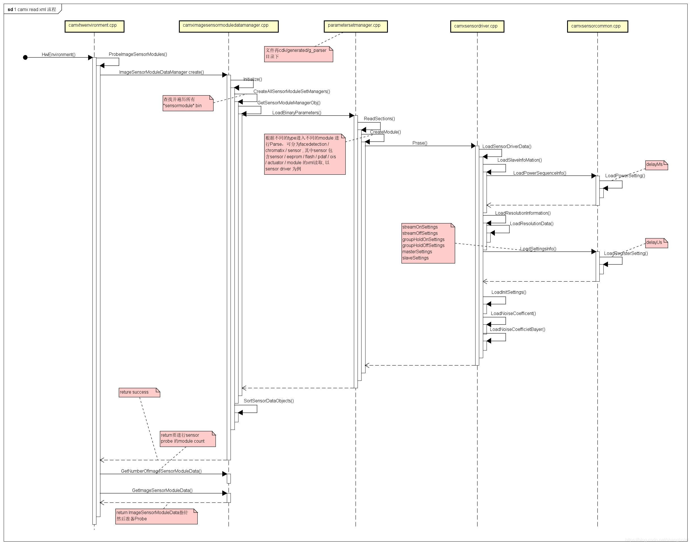
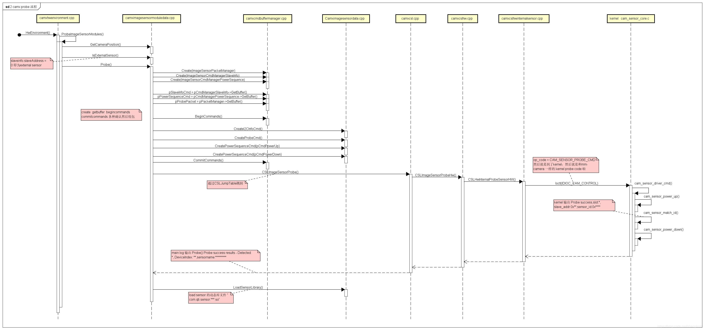

### 编译环境中的driver文件的相关位置

- sensor driver XML files : 

  ```
  chi-cdk/vendor/sensor/default/<sensor-name>/<sensor-name>_sensor.xml
  ```

- Module configuration files : 

  ```
  chi-cdk/vendor/module/<module-name>_module.xml
  ```

- Kernel dts files :

  ```
  kernel/msm-4.9/arch/arm64/boot/dts/qcom/<target-name>-camera-sensor-<platform>.dtsi
  ```

- Submodule driver XML files : 

  ```
  chi-cdk/vendor/sensor/default/<sub-module>/<sub-module-name_sub-module>.xml
  ```

- The driver binary in the device vendor makefile to be included in the build is at:

  ```
  vendor/qcom/proprietary/common/config/device-vendor.mk
  ```

### read xml 和 probe 流程

#### 说明

<p style="text-indent:2em">camx UMD 以xml node节点的方式标准化了driver相关的code，exposure 和 gain 的逻辑实现还是在同级目录的cpp中，并且将 xml 的解析工作放在了 </p>

```
out/target/<product>/gen/STATIC_LIBERARIES/libcamxgenerated_intermediates/generated/ 
```

<p style="text-indent:2em">中，主要是包含了：</p>

- g_chromatix：tuning 相关xml的解析code
- g_facedetection：人脸检测相关xml的解析code
- g_parser：主要的解析为manager流程中的 imageSensorModuleDataManager 的初始化调到了此目录下的paramtersetmanager.cpp 的 LoadBinaryParameters()，再根据type不同进行各个sub module xml 的读取。
- g_sensor：camera sensor xml 解析code，包括：actuator, eeprom, flash, moduleconfig, ois ,sensor, sensormodule, eebin，主要看此目录下的 camxsenordriver.cpp ，主要功能把 sensor driver xml 的各个节点内容全都 load 一遍。

#### 详细的加载过程流程图：



#### camx 的sensor probe 主要流程：

camera 的 probe success 主要需要 xml 中 salveAddress 、sensorIdRegAddr 、sensorID 和 powerUpSequence 这个4个参数(当然还有一个前提是你的 kenrel 的i2c clock power gpio等配置的没有问题)，这时候还用不到 initsetting 等等其他参数，毕竟你sensor 还没有读到正确寄存器值，详细过程见流程图。



