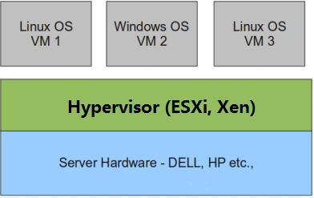
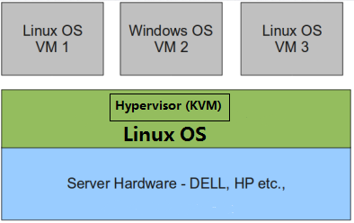

### 虚拟化介绍

虚拟化是云计算的基础。简单的说，虚拟化使得在一台物理的服务器上可以跑多台虚拟机，虚拟机共享物理机的 CPU、内存、IO 硬件资源，但逻辑上虚拟机之间是相互隔离的。物理机我们一般称为宿主机(Host)，宿主机上面的虚拟机称为客户机(Guest)。那么 Host 是如何将自己的硬件资源虚拟化，并提供给 Guest 使用的呢？这个主要是通过一个叫做 Hypervisor 的程序实现的。根据 Hypervisor 的实现方式和所处的位置，虚拟化又分为两种：

- 全虚拟化
- 半虚拟化

#### 全虚拟化：

Hypervisor 直接安装在物理机上，多个虚拟机在 Hypervisor 上运行。Hypervisor 实现方式一般是一个特殊定制的 Linux 系统。Xen 和 VMWare 的 ESXi 都属于这个类型。

#### 半虚拟化：

物理机上首先安装常规的操作系统，比如 Redhat、Ubuntu 和 Windows。Hypervisor 作为 OS 上的一个程序模块运行，并对虚拟机进行管理。KVM、VirtualBox 和 VMWare Workstation 都属于这个类型。

#### 理论上讲：

全虚拟化一般对硬件虚拟化功能进行了特别优化，性能上比半虚拟化要高；
半虚拟化因为基于普通的操作系统，会比较灵活，比如支持虚拟机嵌套。嵌套意味着可以在KVM虚拟机中再运行KVM。

### kvm介绍

KVM 全称是 Kernel-Based Virtual Machine。也就是说 KVM 是基于 Linux 内核实现的。KVM有一个内核模块叫 kvm.ko，只用于管理虚拟 CPU 和内存。那 IO 的虚拟化，比如存储和网络设备则是由 Linux 内核与Qemu来实现。作为一个 Hypervisor，KVM 本身只关注虚拟机调度和内存管理这两个方面。IO 外设的任务交给 Linux 内核和 Qemu。大家在网上看 KVM 相关文章的时候肯定经常会看到 Libvirt 这个东西。Libvirt 就是 KVM 的管理工具。其实，Libvirt 除了能管理 KVM 这种 Hypervisor，还能管理 Xen，VirtualBox 等。Libvirt 包含 3 个东西：后台 daemon 程序 libvirtd、API 库和命令行工具 virsh。

libvirtd是服务程序，接收和处理 API 请求；
API 库使得其他人可以开发基于 Libvirt 的高级工具，比如 virt-manager，这是个图形化的 KVM 管理工具；
virsh 是我们经常要用的 KVM 命令行工具 

