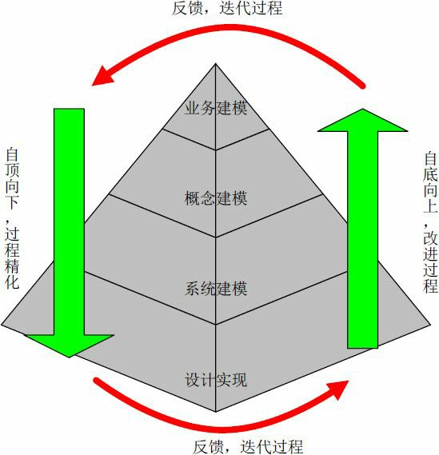

##### 

##### 抽象层次

我对面向对象编程的目标从来就不是复用。相反，对我来说，对象提供了一种处理复杂性问题的方式。这个问题可以追溯到亚里士多德：您把这个世界视为过程还是对象？在面向对象兴起运动之前，编程以过程为中心，例如结构化设计方法。然而，系统已经达到了超越其处理能力的复杂性极点。有了对象，我们能够通过提升抽象级别来构建更大的，更复杂的系统-----我认为，这才是面向对象编程运动的真正胜利。                      ----------Grandy Booch

抽象层次是面向对象方法中极其重要，但是又非常难以掌握的技巧。学会站在不同的抽象层次考虑问题是建立好模型的基础。抽象层次越高，具体信息越少，但是概括能力越强；反之，具体信息越丰富，结果越确定，但相应的概括能力越弱。从信息的表达能力上说，抽象层次越高表达能力越丰富，越容易理解，因为人们所认识的事物概念都是抽象的，具象只是一个相对的概念。实际上，由于人脑对信息的处理能力是有限度的，如果信息量超过了人脑的处理能力，人就会失去对这个事物的理解能力。因此，越是具体的表达信息量越大，越接近人脑的处理极限，人们的理解能力越是下降(这也是面向过程方法为什么困难的原因之一)。对面向对象方法来说，这时就需要提高抽象层次，用一个新的概念来概括一部分相关信息，一旦人们消化了这个新的概念，理解起来就变得容易了。同时，这个新的概念就屏蔽了(或者说封装了)更多具体的信息。抽象层次越高，被屏蔽的信息也就越多，信息量越少，也就越容易理解和处理。这就是面向对象比面向过程具有优势的原因。

但随之而来的另一个问题是如果抽象层次太高，信息量过少的话，人们实施起来又会产生新的困难——信息量不足。因此，在面向对象的分析过程中，在适当的时候采用适当的抽象层次是十分重要的。几乎所有使用过UML的朋友都会觉得选择用例的粒度是一件很困难的事，实际上用例粒度选择的困难本质上是由于没有找准抽象层次而产生的。

抽象有两种方法，一种是自顶向下，另一种是自底向上。自顶向下的方法适用于让人们从头开始认识一个事物。例如介绍汽车的工作原理时，从发动机、传动装置、变速器等较高层次的抽象概念来讲就比较容易明白。如果降一个层次，从发动机原理讲起，一大部分听众就会开始迷惑；再降一个层次，从热力学原理和力学原理讲起，那就更没人能搞懂汽车是怎么工作的了。自底向上的方法适用于在实践中改进和提高认识。例如在实践中发现了发动机的问题，因而改进发动机结构，甚至采用新的发动机原理，最终能够提升汽车的质量。

在软件开发过程中，主体上应当采用自顶向下的方法，用少量的概念覆盖系统需求，再逐步降低抽象层次，直到代码编写。同时应当辅以自底向上的方法，通过总结在较低抽象层次的实践经验来改进较高层次的概念以提升软件质量。

