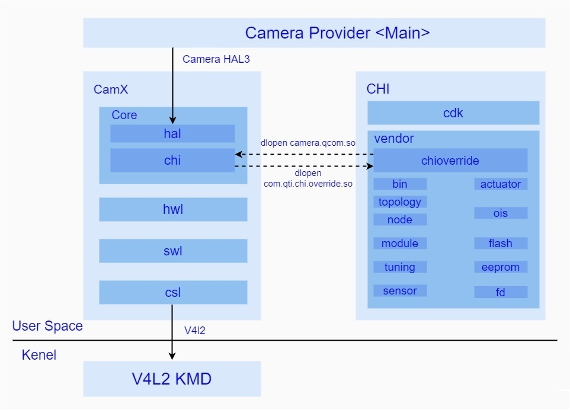
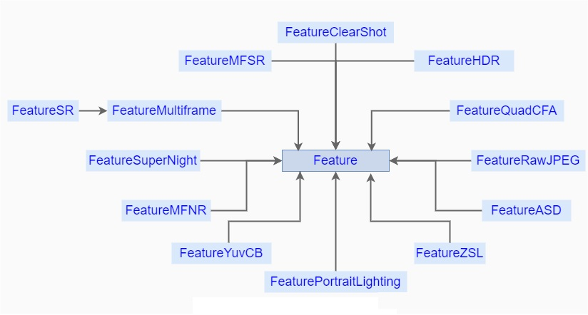
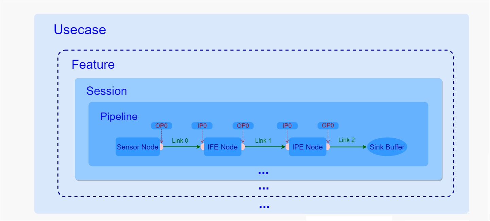
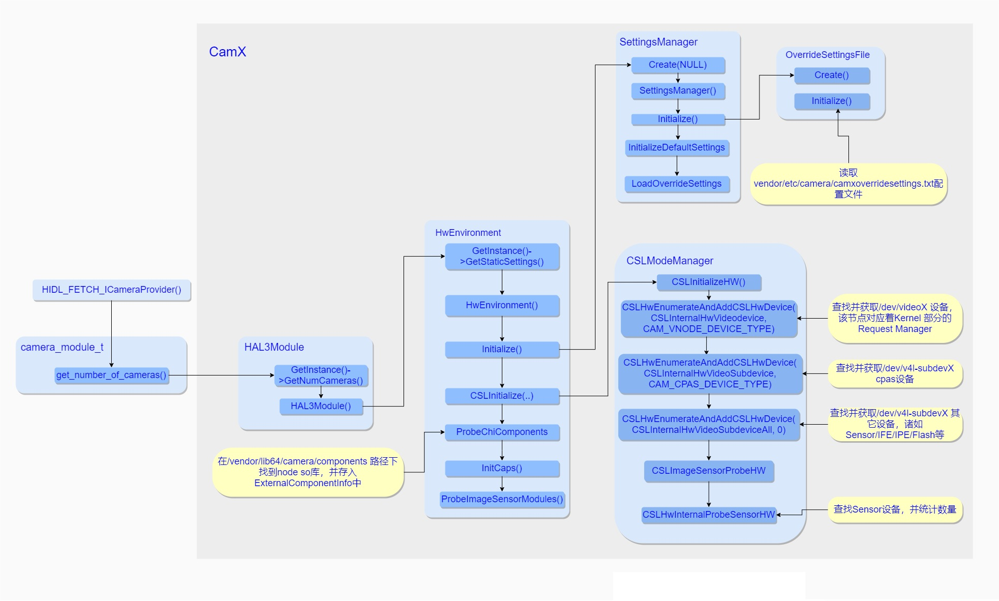
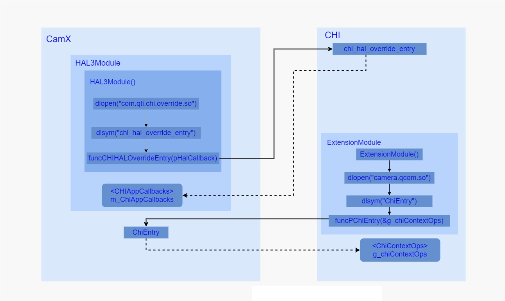

### 概览

回顾高通平台Camera HAL历史，之前高通采用的是QCamera & MM-Camera架构，但是为了更精细化控制底层硬件(Sensor/ISP等关键硬件)，同时方便手机厂商自定义一些功能，现在提出了CamX-CHI架构，由于在CamX-CHI中完全看不到之前老架构的影子，所以它完全是一个全新的架构，它将一些高度统一的功能性接口抽离出来放到CamX中，将可定制化的部分放在CHI中供不同厂商进行修改，实现各自独有的特色功能，这样设计的好处显而易见，那便是即便开发者对于CamX并不是很了解，但是依然可以很方便的加入自定义的功能，从而降低了开发者在高通平台的开发门槛。

接下来我们以最直观的目录结构入手对该架构做一个简单的认识，以下便是CamX-CHI基本目录结构：

该部分代码主要位于 vendor/qcom/proprietary/ 目录下，其中camx代表了通用功能性接口的代码实现集合(CamX)，chi-cdk代表了可定制化需求的代码实现集合(CHI)，从图中可以看出CamX部分对上作为HAL3接口的实现，对下通过v4l2框架与Kernel保持通讯，中间通过互相dlopen so库并获取对方操作接口的方式保持着与CHI的交互。

#### camx/中有如下几个主要目录：

- core/ ：用于存放camx的核心实现模块，如Session、Manager、Pipeline等结构的实现。其中还包含了主要用于实现HAL3接口的hal/(halutils/)目录，以及负责与CHI进行交互的chi/目录
- csl/：用于存放主要负责camx与camera driver的通讯模块，为camx提供了统一的Camera driver控制接口
- hwl/：硬件流程和用于存放自身具有独立运算能力的硬件node的实现，包括bps、ipe、ife、jpeg等，该部分node受csl管理。
- swl/：软件流程和用于存放自身并不具有独立运算能力必须依靠CPU才能实现的node的实现。包括stats、jpeg、sensor等。

#### chi-cdk/vendor/中有如下几个主要目录：

- chioverride/: 用于存放CHI实现的核心模块，负责与camx进行交互并且实现了CHI的总体框架以及具体的业务处理逻辑。
- bin/: 用于存放平台相关的配置项
- topology/: 拓扑图xml，用于存放用户自定义的usecase.xml配置文件
- node/: 各个node的实现，用于存放用户自定义功能的node
- module/: 模组驱动配置，用于存放不同sensor的配置文件，该部分在初始化sensor的时候需要用到
- tuning/: 效果调试参数，用于存放不同场景下的效果参数的配置文件
- sensor/: sensor驱动配置，用于存放不同sensor的私有信息以及寄存器配置参数
- actuator/: VCM驱动配置，用于存放不同对焦模块的配置信息
- ois/：ois驱动配置，用于存放防抖模块的配置信息
- flash/：闪光灯驱动配置，存放着闪光灯模块的配置信息
- eeprom/: eeprom驱动配置，存放着eeprom外部存储模块的配置信息
- fd/: 人脸参数配置，存放了人脸识别模块的配置信息

### 基本组件概念

#### Usecase

作为CamX-CHI中最大的抽象概念，其中包含了多条实现特定功能的Pipeline，具体实现是在CHI中通过Usecase类完成的，该类主要负责了其中的业务处理以及资源的管理。Usecase类，提供了一系列通用接口，作为现有的所有Usecase的基类。其中AdvancedCameraUsecase又继承于CameraUsecaseBase，相机中绝大部分场景会通过实例化AdvancedCameraUsecase来完成，它包括了几个主要接口：

- Create(): 该方法是静态方法，用于创建一个AdvancedCameraUsecase实例，在其初始化方法中会调用SelectUsecaseConfig方法去获取XML中的相应的Usecase配置信息。
- ExecuteCaptureRequest(): 该方法用于下发一次Request请求。
- ProcessResultCb(): 该方法会在创建Session的过程中，作为回调方法注册到其中，一旦Session数据处理完成的时候便会调用该方法将结果发送到AdvancedCameraUsecase中。
- ProcessDriverPartialCaptureResult(): 该方法会在创建Session的过程中，作为回调方法注册到其中，一旦Session中产生了partial metadata的时候，便会调用该方法将其发送至AdvancedCameraUsecase中。
- ProcessMessageCb(): 该方法会在创建Session的过程中，作为回调方法注册到其中，一旦Session产生任何事件，便会调用该方法通知到AdvancedCameraUsecase中。
- ExecuteFlush(): 该方法用于刷新AdvancedCameraUsecase。
- Destroy(): 该方法用于安全销毁AdvancedCameraUsecase。

Usecase的可定制化部分被抽象出来放在了(TARGET_PRODUCT)_usecase.xml中。这里简单介绍其中的几个主要的标签含义：

- UsecaseName: 代表了该Usecase的名字，后期根据这个名字找到这个Usecase的定义。
- Targets: 用于表示用于输出的数据流的集合，其中包括了数据流的格式，输出Size的范围等。
- Pipeline: 用于定义该Usecase可以使用的所有Pipeline，这里必须至少定义一条Pipeline。

根据chioverride/default/build/android/Android.mk文件规则，编译时会根据此xml的配置生成对应chioverride/default/g_pipelines.h。

#### Feature

代表了一个特定的功能，该功能需要多条Pipeline组合起来实现，受Usecase统一管理，在CHI中通过Feature类进行实现，在XML中没有对应的定义，具体的Feature选取工作是在Usecase中完成的，通过在创建Feature的时候，传入Usecase的实例的方式，来和Usecase进行相互访问各自的资源。以下是现有的Feature，其中Feature作为基类存在，定义了一系列通用方法。

几个常用的Feature:

- FeatureHDR: 用于实现HDR功能，它负责管理内部的一条或者几条pipeline的资源以及它们的流转，最终输出具有HDR效果的图像。
- FeatureMFNR: 用于实现MFNR功能，内部分为几个大的流程，分别包括Prefiltering、Blending、Postfilter以及最终的OfflineNoiseReproces(这一个是可选择使能的)，每一个小功能中包含了各自的pipeline。
- FeatureASD: 用于AI功能的实现，在预览的时候，接收每一帧数据，并且进行分析当前场景的AI识别输出结果，并其通过诸如到metadata方式给到上层，进行后续的处理。

#### Session

用于管理pipeline的抽象控制单元，一个Session中至少拥有一个pipeine，并且控制着所有的硬件资源，管控着每一个内部pipeline的request的流转以及数据的输入输出，它没有可定制化的部分，所以在CHI中的XML文件中并没有将Session作为一个独立的单元进行定义。Session的实现主要通过CamX中的Session类，其主要接口如下：

- Initialize(): 根据传入的参数SessionCreateData进行Session的初始化工作。
- NotifyResult(): 内部的Pipeline通过该接口将结果发送到Session中。
- ProcessCaptureRequest(): 该方法用于用户决定发送一个Request到Session中的时候调用。
- StreamOn(): 通过传入的Pipeline句柄，开始硬件的数据传输。
- StreamOff(): 通过传入的Pipeline句柄，停止硬件的数据传输。

#### Pipeline

作为提供单一特定功能的所有资源的集合，维护着所有硬件资源以及数据的流转，每一个Pipeline包括了其中的Node/Link，在CamX中通过Pipeline类进行实现，负责整条Pipeline的软硬件资源的维护以及业务逻辑的处理，接下来我们简单看下该类的几个主要接口：

- Create(): 该方法是一个静态方法，根据传入的PipelineCreateInputData信息来实例化一个Pipeline对象。
- StreamOn(): 通知Pipeline开始硬件的数据传输
- StreamOff(): 通知Pipeline停止硬件的数据传输
- FinalizePipeline(): 用于完成Pipeline的设置工作
- OpenRequest(): open一个CSL用于流转的Request
- ProcessRequest(): 开始下发Request
- NotifyNodeMetadataDone(): 该方法是Pipeline提供给Node，当Node内部生成了metadata，便会调用该方法来通知metadata已经完成，最后当所有Node都通知Pipeline metadata已经完成，Pipeline 便会调用ProcessMetadataRequestIdDone通知Session。
- NotifyNodePartialMetadataDone(): 该方法是Pipeline提供给Node，当Node内部生成了partial metadata，便会调用该方法来通知metadata已经完成，最后当所有Node都通知Pipeline metadata已经完成，Pipeline 便会调用ProcessPartialMetadataRequestIdDone通知Session。
- SinkPortFenceSignaled(): 用来通知Session 某个sink port的fence处于被触发的状态。
- NonSinkPortFenceSignaled(): 用来通知Session 某个non sink port的fence处于被触发的状态。

Pipeline中的Node以及连接方式都在XML中被定义，其主要包含了以下几个标签定义：

- PipelineName: 用来定义该条Pipeline的名称
- NodeList: 该标签中定义了该条Pipeline的所有的Node
- PortLinkages: 该标签定义了Node上不同端口之间的连接关系

#### Node

作为单个具有独立处理功能的抽象模块，可以是硬件单元也可以是软件单元，关于Node的具体实现是CamX中的Node类来完成的，其中CamX-CHI中主要分为两个大类，一个是高通自己实现的Node包括硬件Node，一个是CHI中提供给用户进行实现的Node，其主要方法如下：

- Create(): 该方法是静态方法，用于实例化一个Node对象。
- ExecuteProcessRequest(): 该方法用于针对hwl node下发request的操作。
- ProcessRequestIdDone(): 一旦该Node当前request已经处理完成，便会通过调用该方法通知Pipeline。
- ProcessMetadataDone(): 一旦该Node的当前request的metadata已经生成，便会通过调用该方法通知到Pipeline。
- ProcessPartialMetadataDone(): 一旦该Node的当前request的partial metadata已经生成，便会通过调用该方法通知到Pipeline。
- CreateImageBufferManager(): 创建ImageBufferManager

其可定制化的部分作为标签在XML中进行定义：

- NodeName： 用来定义该Node的名称
- NodeId: 用来指定该Node的ID，其中IPE NodeId为65538，IFE NodeId为65536，用户自定义的NodeId为255。
- NodeInstance: 用于定义该Node的当前实例的名称。
- NodeInstanceId: 用于指定该Node实例的Id。

#### Link

用于定义不同Port的连接，一个Port可以根据需要建立多条与其它从属于不同Node的Port的连接，它通过标签来进行定义，其中包括了作为输入端口，作为输出端口。一个Link中包含了一个SrcPort和一个DstPort，分别代表了输入端口和输出端口，然后BufferProperties用于表示两个端口之间的buffer配置。

#### Port

作为Node的输入输出的端口，在XML文件中，标签用来定义一个输入端口，标签用来定义输出端口，每一个Node都可以根据需要使用一个或者多个输入输出端口，使用OutputPort以及InputPort结构体来进行在代码中定义。

- PortName: 该端口的名称
- PortId: 该端口的Id
- NodeName: 该端口从属的Node名称
- NodeId: 该端口从属的Node的Id
- NodeInstance: 该端口从属的Node的实例名称
- NodeInstanceId: 该端口从属的Node的实例的Id

### 组件结构关系

通过之前的介绍，我们对于几个基本组件有了一个比较清晰地认识，但是任何一个框架体系并不是仅靠组件胡乱堆砌而成的，相反，它们都必须基于各自的定位，按照各自所独有的行为模式，同时按照约定俗成的一系列规则组合起来，共同完成整个框架某一特定的功能。所以这里不得不产生一个疑问，在该框架中它们到底是如何组织起来的呢？它们之间的关系又是如何的呢？ 接下来我们以下图入手开始进行分析：

由上图可以看到，几者是通过包含关系组合起来的，Usecase 包含Feature，而Feature包含了Session，Session又维护了内部的Pipeline的流转，而每一条pipeline中又通过Link将所有Node都连接了起来，接下我们就这几种关系详细讲解下：

首先，一个Usecase代表了某个特定的图像采集场景，比如人像场景，后置拍照场景等等，在初始化的时候通过根据上层传入的一些具体信息来进行创建，这个过程中，一方面实例化了特定的Usecase，这个实例是用来管理整个场景的所有资源，同时也负责其中的业务处理逻辑，另一方面，获取了定义在XML中的特定Usecase，获取了用于实现某些特定功能的pipeline。

其次，在Usecase中，Feature是一个可选项，如果当前用户选择了HDR模式或者需要在Zoom下进行拍照等特殊功能的话，在Usecase创建过程中，便会根据需要创建一个或者多个Feature，一般一个Feature对应着一个特定的功能，如果场景中并不需要任何特定的功能，则也完全可以不使用也不创建任何Feature。

然后，每一个Usecase或者Feature都可以包含一个或者多个Session，每一个Session都是直接管理并负责了内部的Pipeline的数据流转，其中每一次的Request都是Usecase或者Feature通过Session下发到内部的Pipeline进行处理，数据处理完成之后也是通过Session的方法将结果给到CHI中，之后是直接给到上层还是将数据封装下再次下发到另一个Session中进行后处理，这都交由CHI来决定。其中，Session和Pipeline是一对多的关系，通常一个Session只包含了一条Pipeline，用于某个特定图像处理功能的实现，但是也不绝对，比如FeatureMFNR中包含的Session就包括了三条pipeline，又比如后置人像预览，也是用一个Session包含了两条分别用于主副双摄预览的Pipeline，主要是要看当前功能需要的pipeline数量以及它们之间是否存在一定关联。

同时，根据上面关于Pipeline的定义，它内部包含了一定数量的Node，并且实现的功能越复杂，所包含的Node也就越多，同时Node之间的连接也就越错综复杂，比如后置人像预览虚化效果的实现就是将拿到的主副双摄的图像通过RTBOfflinePreview这一条Pipeline将两帧图像合成一帧具有虚化效果的图像，从而完成了虚化功能。

最后Pipeline中的Node的连接方式是通过XML文件中的Link来进行描述的，每一个Link定义了一个输入端和输出端分别对应着不同Node上面的输入输出端口，通过这种方式就将其中的一个Node的输出端与另外一个Node的输入端，一个一个串联起来，等到图像数据从Pipeline的起始端开始输入的时候，便可以按照这种定义好的轨迹在一个一个Node之间进行流转，而在流转的过程中每经过一个Node都会在内部对数据进行处理，这样等到数据从起始端一直流转到最后一个Node的输出端的时候，数据就经过了很多次处理，这些处理效果最后叠加在一起便是该Pipeline所要实现的功能，比如降噪、虚化等等。

### 关键流程详解

#### Camera Provider 启动初始化

当系统启动的时候，Camera Provider主程序会被运行，在整个程序初始化的过程中会通过获取到的camera_module_t调用其get_number_of_camera接口获取底层支持的camera数量，由于是第一次获取，所以在CamX-CHI中会伴随着很多初始化动作，具体操作见下图：

主要流程如下：

1. 通过HAL3Module::GetInstance()静态方法实例化了HAL3Module对象，在其构造方法里面通过HwEnvironment::GetInstance()静态方法又实例化了HwEnvironment对象，在其构造方法中，实例化了SettingsManager对象，然后又在它构造方法中通过OverrideSettingsFile对象获取了位于/vendor/etc/camera/camxoverridesettings.txt文件中的平台相关的配置信息（通过这种Override机制方便平台厂商加入自定义配置），该配置文件中，可以加入平台特定的配置项，比如可以通过设置multiCameraEnable的值来表示当前平台是否支持多摄，或者通过设置overrideLogLevels设置项来配置CamX-CHI部分的Log输出等级等等。
2. 同时在HwEnvironment构造方法中会调用其Initialize方法，在该方法中实例化了CSLModeManager对象，并通过CSLModeManager提供的接口，获取了所有底层支持的硬件设备信息，其中包括了Camera Request Manager、CAPS模块(该驱动模块主要用于CSL获取Camera平台驱动信息，以及IPE/BPS模块的电源控制)以及Sensor/IPE/Flash等硬件模块，并且通过调用CSLHwInternalProbeSensorHW方法获取了当前设备安装的Sensor模组信息，并且将获取的信息暂存起来，等待后续阶段使用，总得来说在HwEnvironment初始化的过程中,通过探测方法获取了所有底层的硬件驱动模块，并将其信息存储下来供后续阶段使用。
3. 之后通过调用HwEnvironment对象中的ProbeChiCompoents方法在/vendor/lib64/camera/components路径下找寻各个Node生成的So库，并获取Node提供的标准对外接口，这些Node不但包括CHI部分用户自定义的模块，还包括了CamX部分实现的硬件模块，并最后都将其都存入ExternalComponentInfo对象中，等待后续阶段使用。

另外在初始化阶段还有一个比较重要的操作就是CamX 与CHI是通过互相dlopen对方的So库，获取了对方的入口方法，最后通过彼此的入口方法获取了对方操作方法集合，之后再通过这些操作方法与对方进行通讯，其主要流程见下图：

从上图不难看出，在HAL3Module构造方法中会去通过dlopen方法加载com.qti.chi.override.so库，并通过dlsym映射出CHI部分的入口方法chi_hal_override_entry，并调用该方法将HAL3Module对像中的成员变量m_ChiAppCallbacks(CHIAppCallbacks)传入CHI中，其中包含了很多函数指针，这些函数指针分别对应着CHI部分的操作方法集中的方法，一旦进入到CHI中，就会将CHI本地的操作方法集合中的函数地址依次赋值给m_ChiAppCallbacks，这样CamX后续就可以通过这个成员变量调用到CHI中方法，从而保持了与CHI的通讯。

同样地，CHI中的ExtensionModule在初始化的时候，其构造方法中也会通过调用dlopen方法加载camera.qcom.so库，并将其入口方法ChiEntry通过dlsym映射出来，之后调用该方法，将g_chiContextOps(ChiContextOps，该结构体中定义了很多指针函数)作为参数传入CamX中，一旦进入CamX中，便会将本地的操作方法地址依次赋值给g_chiContextOps中的每一个函数指针，这样CHI之后就可以通过g_chiContextOps访问到CamX方法。

#### 打开相机设备/初始化相机设备

一旦用户打开了相机应用，App中便会去调用CameraManager的openCamera方法，该方法之后会最终调用到Camera Service中的CameraService::connectDevice方法，然后通过ICameraDevice::open()这一个HIDL接口通知Provider，然后在Provider内部又通过调用之前获取的camera_module_t中common的methods的open方法来获取一个Camera 设备，对应于HAL中的camera3_device_t结构体，紧接着，在Provider中会继续调用获取到的camera3_device_t的initialize方法进行初始化动作。接下来我们便来详细分析下CamX-CHI对于open以及initialize的具体实现流程：

##### open

该方法是camera_module_t的标准方法，主要用来获取camera3_device_t设备结构体的，CamX-CHI对其进行了实现，open方法中完成的工作主要有以下几个：

1. 将当前camera id传入CHI中进行remap操作，当然这个remap操作逻辑完全是根据CHI中用户需求来的，用户可以根据自己的需要在CHI中加入自定义remap逻辑。
2. 实例化HALDevice对象，其构造函数中调用Initialize方法，该方法会填充CamX中自定义的Camera3Device结构体。
3. 将m_HALCallbacks.process_capture_result指向了本地方法ProcessCaptureResult以及m_HALCallbacks.notify_result指向了本地方法Notify(之后会在配置数据流的过程中，将m_HALCallbacks注册到CHI中， 一旦当CHI数据处理完成之后，便会通过这两个回调方法将数据或者事件回传给CamX)。
4. 最后将HALDevice 中的Camera3Device成员变量作为返回值给到Provider中的CameraCaptureSession中。

Camera3Device 其实重定义了camera3_device_t，其中HwDevice对应于camera3_device_t中的hw_device_t，Camera3DeviceOps对应于camera3_device_ops_t，而在HALDevice的初始化过程中，会将CamX实现的HAL3接口的结构体g_camera3DeviceOps赋值给Camera3DeviceOps中。

#####  initialize

该方法在调用open后紧接着被调用，主要用于将上层的回调接口传入HAL中，一旦有数据或者事件产生，CamX便会通过这些回调接口将数据或者事件上传至调用者，其内部的实现较为简单。

initialize方法中有两个参数，分别是之前通过open方法获取的camera3_device_t结构体和实现了camera3_callback_ops_t的CameraDevice，很显然camera3_device_t结构体并不是重点，所以该方法的主要工作是将camera3_callback_ops_t与CamX关联上，一旦数据准备完成便通过这里camera3_callback_ops_t中回调方法将数据回传到Camera Provider中的CameraDevice中，基本流程可以总结为以下几点：

1. 实例化了一个Camera3CbOpsRedirect对象并将其加入了g_HAL3Entry.m_cbOpsList队列中，这样方便之后需要的时候能够顺利拿到该对象。
2. 将本地的process_capture_result以及notify方法地址分别赋值给Camera3CbOpsRedirect.cbOps中的process_capture_result以及notify函数指针。
3. 将上层传入的回调方法结构体指针pCamera3CbOpsAPI赋值给Camera3CbOpsRedirect.pCbOpsAPI，并将Camera3CbOpsRedirect.cbOps赋值给pCamera3CbOpsAPI，通过JumpTableHal3的initialize方法将pCamera3CbOpsAPI传给HALDevice中的m_pCamera3CbOps成员变量，这样HALDevice中的m_pCamera3CbOps就指向了CamX中本地方法process_capture_result以及notify。

经过这样的一番操作之后，一旦CHI有数据传入便会首先进入到本地方法ProcessCaptureResult，然后在该方法中获取到HALDevice的成员变量m_pCamera3CbOps，进而调用m_pCamera3CbOps中的process_capture_result方法，即camxhal3entry.cpp中定义的process_capture_result方法，然后这个方法中会去调用JumpTableHAL3.process_capture_result方法，该方法最终会去调用Camera3CbOpsRedirect.pCbOpsAPI中的process_capture_result方法，这样就调到从Provider传入的回调方法，将数据顺利给到了CameraCaptureSession中。

#### 配置相机设备数据流

在打开相机应用过程中，App在获取并打开相机设备之后，会调用CameraDevice.createCaptureSession来获取CameraDeviceSession，并且通过Camera api v2标准接口，通知Camera Service，调用其CameraDeviceClient.endConfigure方法，在该方法内部又会去通过HIDL接口ICameraDeviceSession::configureStreams_3_4通知Provider开始处理此次配置需求，在Provider内部，会去通过在调用open流程中获取的camera3_device_t结构体的configure_streams方法来将数据流的配置传入CamX-CHI中，之后由CamX-CHI完成对数据流的配置工作，接下来我们来详细分析下CamX-CHI对于该标准HAL3接口 configure_streams的具体实现：

配置数据流是整个CamX-CHI流程比较重要的一环，其中主要包括两个阶段：

1. 选择UsecaseId
2. 根据选择的UsecaseId创建Usecase

接下来我们就这两个阶段分别进行详细介绍:

##### ① 选择UsecaseId

不同的UsecaseId分别对应的不同的应用场景，该阶段是通过调用UsecaseSelector::GetMatchingUsecase()方法来实现的，该函数中通过传入的operation_mode、num_streams配置数据流数量以及当前使用的Sensor个数来选择相应的UsecaseId，比如当numPhysicalCameras值大于1同时配置的数据流数量num_streams大于1时选择的就是UsecaseId::MultiCamera，表示当前采用的是双摄场景。

##### ② 创建Usecase

根据之前选择的UsecaseId，通过UsecaseFactory来创建相应的Usecase，其中Class Usecase是所有Usecase的基类，定义并实现了一些通用接口，CameraUsecaseBase继承于Usecase，并扩展了部分功能。AdvancedCameraUsecase又继承于CameraUsecaseBase，作为主要负责大部分场景的Usecase实现类，另外对于多摄场景，现提供了继承于AdvancedCameraUsecase的UsecaseMultiCamera来负责实现。除了双摄场景，其它大部分场景使用的都是AdvancedCameraUsecase类来管理各项资源的，接下来我们重点梳理下AdvancedCameraUsecase::Create()方法。在AdvancedCameraUsecase::Create方法中做了很多初始化操作，其中包括了以下几个阶段：

1. 获取XML文件中Usecase配置信息
2. 创建Feature
3. 保存数据流，重建Usecase的配置信息
4. 调用父类CameraUsecaseBase的initialize方法，进行一些常规初始化工作

接下来我们就这几个阶段逐一进行分析：

###### 获取XML文件中Usecase配置信息

这一部分主要通过调用CameraUsecaseBase::GetXMLUsecaseByName方法进行实现。该方法的主要操作是从PerNumTargetUsecases数组中找到匹配到给定的usecaseName的Usecase，并作为返回值返回给调用者，其中这里我们以"UsecaseZSL“为例进行分析，PerNumTargetUsecases的定义是在g_pipeline.h中，该文件是在编译过程中通过usecaseconverter.pl脚本将定义在个平台目录下的common_usecase.xml中的内容转换生成g_pipeline.h。

###### 创建Feature

如果当前场景选取了Feature，则调用FeatureSetup来完成创建工作。

该方法主要是通过诸如operation_mode、camera数量以及UsecaseId等信息来决定需要选择哪些Feature,具体逻辑比较清晰，一旦决定需要使用哪一个Feature之后，便调用相应的Feature的Create()方法进行初始化操作。

###### 保存数据流，重建Usecase的配置信息

从Camera Service 传入的数据流，需要将其存储下来，供后续使用，同时高通针对Usecase也加入了Override机制，根据需要可以选择性地扩展Usecase，这两个步骤的实现主要是通过SelectUsecaseConfig方法来实现。

其中主要是调用以下两个方法来实现的：

ConfigureStream： 该方法将从上层配置的数据流指针存入AdvancedCameraUsecase中，其中包括了用于预览的m_pPreviewStream以及用于拍照的m_pSnapshotStream。

BuildUsecase： 这个方法用来重新在原有的Usecase上面加入了Feature中所需要的pipeline，并创建了一个新的Usecase，并将其存入AdvancedCameraUsecase中的m_pChiUsecase成员变量中，紧接着通过SetPipelineToSessionMapping方法将pipeline与Session进行关联。

###### 调用父类CameraUsecaseBase的initialize方法，进行一些常规初始化工作

