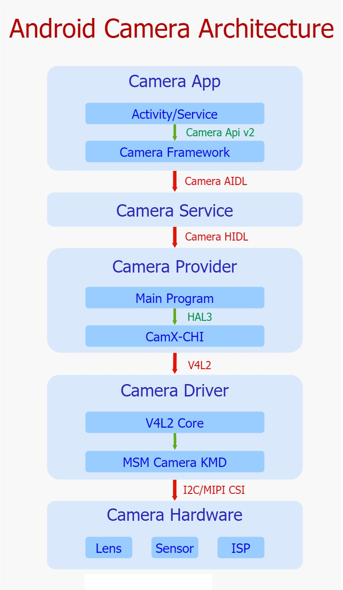

Android系统利用分层思想，将各层的接口定义与实现分离开来，以接口作为各层的脉络，连接整体框架，将具体实现的主导权交由各自有具体实现需求的平台厂商或者Android 开发者，这样既做到把控全局，也给予了众多开发者足够大的创作空间，这体现出了一个优秀的开源系统应有的胸怀和远见。其中，谷歌根据职能的不同将Camera框架一共划分成了五层，分别是App(相机应用层)、Service(相机服务层)、Provider(相机硬件抽象层)、Driver(相机驱动层)以及Hardware(硬件层)，下面的Camera的整体架构图很清晰地显示出了其五层架构以及相互的关联接口。

#### Camera App

应用层处于整个框架的顶端，承担着与用户直接进行交互的责任，承接来自用户直接或者间接的比如预览/拍照/录像等一系列具体需求，一旦接收到用户相关UI操作，便会通过Camera Api v2标准接口将需求发送至Camera Framework部分，并且等待Camera Framework回传处理结果，其中包括了图像数据以及整体相机系统状态参数，之后将结果以一定方式反馈给用户，达到记录显示种种美好瞬间的目的。

----------------------------------------------------------------------Api v2----------------------------------------------------------------------

#### Camera Framework

该层主要位于Camera App与Camera Service之间，以jar包的形式运行在App进程中，它封装了Camera Api v2接口的实现细节，暴露接口给App进行调用，进而接收来自App的请求，同时维护着请求在内部流转的业务逻辑，最终通过调用Camera AIDL跨进程接口将请求发送至Camera Service中进行处理，紧接着，等待Camera Service结果的回传，进而将最终结果发送至App。

==================================aidl=================================

#### Camera Service

该层位于Camera Framework与Camera Provider之间，作为一个独立进程存在于Android系统中，在系统启动初期会运行起来，它封装了Camera AIDL跨进程接口，提供给Framework进行调用，进而接收来自Framework的图像请求，同时内部维护着关于请求在该层的处理逻辑，最终通过调用Camera HIDL跨进程接口将请求再次下发到Camera Provider中，并且等待结果的回传，进而将结果上传至Framework中。

=================================HIDL================================

#### Camera Provider

该层位于Camera Service与Camera Driver之间，作为一个独立的进程存在于Android系统中，同时在系统启动初期被运行，提供Camera HIDL跨进程接口供Camera Service进行调用，封装了该接口的实现细节，接收来自Service的图像请求，并且内部加载了Camera HAL Module，该Module由OEM/ODM实现，遵循谷歌制定的标准Camera HAL3接口，进而通过该接口控制Camera HAL部分，最后等待Camera HAL的结果回传，紧接着Provider通过Camera HIDL接口将结果发送至Camera Service。

----------------------------------------------------------------------HAL 3----------------------------------------------------------------------

#### CamX-CHI(Camera HAL)

是高通对谷歌Camera HAL3接口的实现，以so库的形式被加载至Camera Provider中，之前采用的是QCamera & MM-Camera架构，但是为了更好灵活性和可扩展性，而今高通又提出了CamX-CHI架构，该架构提供HAL3接口给Provider进行调用，接收来自Provider的请求，而内部对HAL3接口进行了实现，并且通过V4L2标准框架控制着相机驱动层，将请求下发至驱动部分，并且等待结果回传，进而上报给Camera Provider。

CamX-CHI架构由CamX和CHI两个部分组成，CamX负责一些基础服务代码的实现，不经常改动，CHI负责实现一些可扩展性和定制化的需求，方便OEM/ODM添加自己的扩展功能。CamX主要包括实现HAL3入口的hal模块，实现与V4L2驱动交互的csl模块，实现硬件node的hwl和实现软件node的swl。CHI通过抽象出Usecase、Feature、Session、Pipeline、Node的概念，使厂商可以通过实现Node接口来接入自己的算法，并通过XML文件灵活配置Usecase、Pipeline、Node的结构关系。

=========================================V4L2=========================================

#### Camera Driver

Linux为视频采集设备制定了标准的V4L2接口，并在内核中实现了其基础框架V4L2 Core。用户空间进程可以通过V4L2接口调用相关设备功能，而不用考虑其实现细节。V4L2提出了总设备和子设备的概念，并通过media controller机制向用户空间暴露自己的硬件拓扑结构。视频采集设备驱动厂商按照V4L2 Core的要求开发自己的驱动程序，只需要实现相应的结构体和函数接口并调用注册函数注册自己就行。

----------------------------------------------------------------------KMD-----------------------------------------------------------------------

在高通平台上，高通对相机驱动部分进行了实现，利用了V4L2框架的可扩展特性，设计出了一套独特的KMD框架。在该框架内部主要包含了三个部分，CRM、Camera Sync以及一系列子设备，首先，作为框架顶层管理者，CRM创建了一个V4L2主设备用来管理所有的子设备，并且暴露设备节点video0给用户空间，同时内部维护着整个底层驱动业务逻辑。其次，Camera Sync创建了一个V4L2主设备，同时暴露了设备节点video1给用户空间，主要用于向用户空间反馈图像数据处理状态。最后，子设备模块被抽象成v4l2_subdev设备，同样也暴露设备节点v4l2-subdev给用户空间进行更精细化的控制。另外，在整个框架初始化的过程中，通过media controller机制，保持了在用户空间进行枚举底层硬件设备的能力。

=======================================I2C/MIPI CSI======================================

#### Camera Hardware

相机硬件处在整个相机体系的最底层，是相机系统的物理实现部分，该部分包括镜头、感光器、ISP三个最重要的模块，还有对焦马达、闪光灯、滤光片、光圈等辅助模块。镜头的作用是汇聚光线，利用光的折射性把射入的光线汇聚到感光器上。感光器的作用是负责光电转换，通过内部感光元件将接收到的光信号转换为电子信号，进而通过数电转换模块转为数字信号，并最后传给ISP。ISP负责对数字图像进行一些算法处理，如白平衡、降噪、去马赛克等。

通过上面的介绍，我们可以发现，谷歌通过以上五级分层，形成了整个相机框架体系，其中层与层之间通过行业协会、开源社区或者谷歌制订的标准接口进行连接，上层通过调用标准接口下发请求到下层，下层负责对标准接口进行实现，最终将请求再次封装并调用下一层级的对外接口下发到下层。所以总得来说，谷歌使用标准接口作为骨架搭建整体框架，而其具体实现交由各层自己负责，从整体上来看，职责划分明确，界限分明，这样的设计，一来利用标准接口，保持了整个框架业务正常流转，二来极大地降低了各层耦合度，保持了各层的相互独立，最终让整个框架处于一个稳定同时高效的运行状态。

