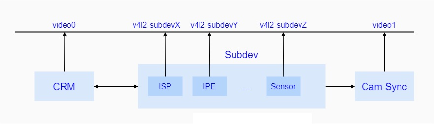

### 概览

利用了V4L2可扩展这一特性，高通在相机驱动部分实现了自有的一套KMD框架，该框架通过V4L2标准方法在系统中创建设备节点，将控制接口直接暴露给UMD CSL进行访问，而其内部主要定义了一系列核心模块，包括CRM(Camera Request Manager)，用于管理整个KMD的Session/Link的创建销毁以及Request的在子设备间的流转，该模块创建video0设备节点暴露关键接口给UMD，此外还包括了Sync模块，主要负责了UMD/KMD之间的数据同步与传输，创建video1设备节点暴露接口给UMD进行访问，除此之外，为了更精细化地控制一系列的硬件图像处理模块，包括ISP/IPE/Sensor等硬件模块，高通也分别为各自子模块创建了设备节点，进而暴露控制接口给UMD进行访问。

其中主要目录如下：

- cam_core/： 关于KMD核心函数的实现都放在这，主要包括了subdev、node、context的一些诸如创建/注册/销毁等标准方法。

- cam_req_mgr/: CRM的具体实现，用于创建v4l2_device，用于管理所有的子设备，同时生成video设备节点，暴露控制接口给UMD，主要包括了Session/Link的行为管理以及Request的同步与分发，此外，还创建了media_device，用于暴露枚举接口给UMD来轮询查找整个KMD的子设备。

- cam_sync/: 该部分主要实现了用于保持与UMD的图像数据的同步相关业务逻辑，由于该模块的特殊性，高通直接为其创建了一个单独的video设备节点，暴露了用于同步的一些控制接口。

- cam_utils/: 一些共有方法的实现，包括debug方法集等

- cam_smmu/: 高通自己实现了一套smmu api，供KMD使用

- cam_lrme/: 低分辨率运动估计模块的驱动实现

- cam_fd/: 人脸识别的驱动程序

- cam_isp/: isp的驱动程序

- cam_jpeg/: 编码器，可以通过该驱动完成jpeg的编码工作

- cam_cdm/: camera data mover，数据移动器的驱动实现，主要用于解析由CSL传入的命令信息，其中包括了寄存器的设置以及图像数据的处理等。

- cam_cpas/: 该模块主要用于CSL获取camera 平台驱动信息，IPE/BPS电源控制等

- cam_icp/: image control processor ，图像处理控制器驱动实现

- cam_hyp_intf/: Hypervisor 模块接口驱动程序实现

- cam_sensor_module/: 类传感器的系列硬件模块

- - cam_actuator/: 对焦马达的驱动实现
  - cam_cci/: 实现了用于通讯的CCI接口，其中包括了I2C以及gpio的实现
  - cam_csiphy: 基于MIPI CSI接口的物理层驱动，用于传输图像数据
  - cam_sensor_io: 使用cam_cci，向上实现了控制sensor的IO接口
  - cam_sensor: sensor 的驱动实现
  - cam_sensor_util: sensor相关的公有方法的实现
  - cam_eeprom: eeprom设备的驱动实现
  - cam_ois: 光学防抖设备的驱动实现
  - cam_flash: 闪光灯设备的驱动实现

### 核心模块解析

正如之前介绍的那样，整个框架主要由三个部分组成，CRM/Camera Sync以及子模块，接下来我们以下图为例简单讲解下各自的关系：

在系统初始化时，CRM内部会创建一个v4l2_device结构体，用于管理所有的子设备，与此同时每一个子设备在注册的时候都会创建各自的v4l2_subdev挂载到该v4l2_device上面。此外，CRM会创建一个video0设备节点提供关键接口给CSL来进行访问，而每个子设备也会在系统中生成各自的v4l2-sbudev设备节点，提供接口给CSL进行更为精细化的控制。而其中的Cam Sync在初始化的过程中，也创建了一个v4l2_device设备，并且生成了video1节点给CSL进行控制。这个框架主要就是围绕这三个部分进行的，CRM用于管理Session/Link的创建，控制Request在各个子设备中的流转，子设备受CSL控制进行配置以及图像处理工作，而一旦图像处理完成便会将结果发送至Cam Sync模块，进上传至CSL中。

#### CRM(Camera Request Manager)

该模块本质上是一个软件模块，主要做了以下几个事情：

- 接收来自CSL的Session/Link/Request请求，并且维护其在内核的状态。
- 在不同pipeline delay的子模块间，同步每一个Request状态，并按照需要发送给每一个子设备。
- 如果出现错误，负责上传至CSL。
- 负责针对实时子模块的flush操作。

其中针对Session/Link/Request的请求便是通过之前创建的video设备节点将接口暴露给CSL，一旦接收到命令便开始进行处理，而命令主要有以下几个：

- CAM_REQ_MGR_CREATE_SESSION/CAM_REQ_MGR_DESTROY_SESSION： 分别表示了Session的创建和销毁，该Session保持着与CamX-CHI的一一对应关系。
- CAM_REQ_MGR_LINK/CAM_REQ_MGR_UNLINK： 分别表示了Link的创建和销毁动作，每一个Session可以包含多条Link，而每一个Link都连接着此次图像采集过程中所需要的子设备，CRM也是通过该Link来管理Request同步与分发的操作。
- CAM_REQ_MGR_SCHED_REQ：一旦CSL开始下发Request的时候，便可以通过该命令告知KMD，而在KMD中，CRM会将此次Request存入Link中的in_q数组中，当子设备告知准备好了此次Request的处理后，便通知子设备进行配置并处理Request。
- CAM_REQ_MGR_ALLOC_BUF/CAM_REQ_MGR_RELEASE_BUF: 图像缓冲区的申请与释放，CRM中使用cam_mem_table结构体来管理着申请的缓冲区。

一旦CRM接收了来自CSL的请求，便会在内部进行处理，而其中的一系列业务处理便会通过接下来的几个结构体来完成：

首先在初始化过程中，会去创建一个cam_req_mgr_device。该结构体有以下几个主要的成员：

- video: 存储着对应的video_device。
- v4l2_dev: 保存着初始化过程中创建的v4l2_device。
- subdev_nodes_created: 标志着从属于v4l2_device的子设备是否都成功创建了设备节点。
- cam_eventq： v4l2文件描述结构体，其中维护着event事件队列。

之后会去创建一个cam_req_mgr_core_device，该结构体比较简单主要用于维护一个Session链表，在CSL下发创建Session的动作后，会将创建好的Session放入该量表中，同时通过crm_lock保持着业务处理中的同步。

一个Session可以包含很多条Link，其中变量num_links存储了Link数量，数组links存储着所有link，entry变量作为当前session的实体可以嵌入cam_req_mgr_core_device中的session链表中进行统一管理。

在CSL下发CAM_REQ_MGR_LINK命令的时候，会去创建cam_req_mgr_core_link。

该结构体比较复杂，接下来我们主要介绍下几个主要的变量：

- link_hdl：作为该Link的句柄，区别于其它Link。
- num_devs： 表示了该条Link上连接了多少个子设备。
- max_delay： 表示了从属于该Link上的所有子设备具有的最大的Pipeline delay值。
- l_dev： 存储着所有从属于该Link上的子设备，后续对于子设备的控制都是通过该数组来进行的。
- req： 该成员主要用于管理下发的request。
- state: 标志着该Link的状态，而Link状态主要包括了CAM_CRM_LINK_STATE_AVAILABLE/CAM_CRM_LINK_STATE_IDLE/CAM_CRM_LINK_STATE_READY/CAM_CRM_LINK_STATE_ERR几种状态。

创建完Link之后，会将其存入一个存储cam_req_mgr_core_link的全局变量g_links中进行统一管理。

而当下发CAM_REQ_MGR_SCHED_REQ命令的时候，会在内部进行解析，并且将其存入cam_req_mgr_core_link中的cam_req_mgr_req_data中等待后续的流转。

其中in_q变量主要用于存储request，而l_tbl用于记录pipeline delay的相关信息，而apply_data数组用于存储所有的等待处理的request信息。

#### Cam Sync

该模块本质上是一个软件模块，用于保持与UMD的图像数据的同步，主要利用了V4L2框架的event机制，由CSL进行事件的等待，一旦数据处理完毕，该模块便可以向上层发送事件，进而，通知CSL取出数据进行下一步处理，其中包括了几个主要ioctl的命令：

- CAM_SYNC_CREATE: 一旦CSL部分需要创建一个用于同步的实体的时候便下发该命令，而在Cam Sync中，会将传入的信息存入内部的sync_table_row数组中进行管理，并且将生成的sync_obj传入上层。
- CAM_SYNC_DESTROY： 销毁用于同步的sync实体。
- CAM_SYNC_REGISTER_PAYLOAD： 通过该命令将一些同步的回调方法注册到Cam Sync中，这样一但当数据处理完成，Cam Sync便可以由之前创建的sync_obj来找到相应的回调方法，进而调用该回调方法进行后续处理。
- CAM_SYNC_DEREGISTER_PAYLOAD：释放之前注册的相关同步实体的信息，包括其回调方法。
- CAM_SYNC_SIGNAL：该命令主要用于CamX-CHI中软件Node处理完数据之后，通知Cam Sync进行后续处理的目的。

其中包括了几个比较重要的结构体，首先在初始化过程中会去创建sync_device结构体，其主要的几个变量如下：

- vdev: 创建的video_device。
- v4l2_dev: 创建的v4l2_device设备。
- sync_table: 用于存储sync_table_row的数组。
- cam_sync_eventq: v4l2设备描述符结构体，其中维护着event事件队列。

其中最重要的时sync_table中存储的sync_table_row结构体，它代表了整个对应于CSL中的sync object，其中比较重要的变量含义如下：

- sync_id：该sync object的唯一标识，同时该标识于CSL保持同步。
- state: 代表了当前sync object的状态。
- user_payload_list： 存储着该sync object所对应的来自UMD的payload，该payload在KMD中并没有被使用，仅仅存储与KMD中，一旦当前sync object被触发，便直接将其再次传入UMD中。

### 模块初始化

在系统启动初期，整个相机驱动中的各个模块都开始进行加载了，接下来我们依次介绍下：

首先是CRM的初始化，按照linux驱动模块的标准方法，会走到module_init宏声明的驱动结构体中的probe方法，这里是cam_req_mgr_probe方法，在该方法中主要做了以下几个事情：

- 调用cam_v4l2_device_setup方法，创建并向系统注册用于管理所有子设备的v4l2_device。
- 调用cam_media_device_setup方法，创建并向系统注册media_device，并且创建了media设备节点，用于CSL枚举KMD中所有设备。
- 调用cam_req_mgr_util_init方法，其中初始化了一个cam_req_mgr_util_hdl_tbl，该结构体中存在一个handle数组，而每一个handle主要用于存储Session、Link以及各个子设备的相关信息，后期在整个图像采集的过程中，都是通过该结构体来找对应的操作实体，进而采取相应的动作。
- 调用cam_req_mgr_core_device_init方法，该方法中，会去创建并初始化一个cam_req_mgr_core_device结构体，作为全局变量g_crm_core_dev存在于整个框架中，而该结构体中主要包含了用于存储创建的Session的session_head链表，以及用于保护Session临界资源的crm_lock。

其次，是Cam Sync的初始化，整个流程最终会走到驱动结构体中的probe方法中，这里是cam_sync_probe方法，在该方法中主要做了以下几个事情：

- 创建sync_dev结构体，该结构中通过一个sync_table_row数组来维护着所有的sync objects。
- 调用cam_sync_media_controller_init方法，用于创建media_deivce设备，并且创建了media设备节点，提供给CSL枚举子设备的能力。
- 调用v4l2_device_register方法，创建并像系统注册一个v4l2_device结构体，其中用于ioctl的方法集是指向的g_cam_sync_ioctl_ops，一旦CSL有创建/注册sync objects需求的时候，便会最终走到该方法中，从而实现相应的功能。
- 调用video_register_device方法，生成video1设备节点，暴露控制接口给CSL。
- 调用cam_sync_init_entity方法，将video1中的meida_entity中function字段赋值CAM_SYNC_DEVICE_TYPE，这样在UMD就可以通过相应的media节点枚举出该模块。

以上两个模块都是具有独立的video设备节点的，但是对于子设备而言，由于代表着相应的硬件设备，同时需要嵌入到整个框架中才能正常运行，所以高通将其抽象成了v4l2_subdev来进行管理，这里主要还是介绍两个比较有代表性的子模块，ISP以及Sensor。

首先来看下ISP的初始化阶段，在其相应的probe方法cam_isp_dev_probe中做了如下几个事情：

- 调用cam_subdev_probe方法，在该方法中，会去注册一个v4l2_subdev，并且将其挂载到CRM中的v4l2_device上，同时还创建了一个node，并且存入了v4l2_subdev中的token中，方便以后进行读取，另外，将方法集赋值为cam_subdev_ops，最后，创建了该v4l2_subdev内部的media_entity，并且为其function字段赋值为CAM_IFE_DEVICE_TYPE，这样也方便在枚举子设备时分辨出当前节点代表着isp模块。
- 调用cam_isp_hw_mgr_init方法，该方法用于初始化isp中的硬件模块。
- 调用cam_isp_context_init方法，该方法中会初始化node，在node内部创建一定数量的context，用于后期的状态维护，并且为每一个context都配置了状态机，以及子状态机来用于管理整个isp模块。

其次来看下Sensor模块的初始化，在其相应的probe方法cam_sensor_driver_i2c_probe中主要做了以下几个事情：

- 调用cam_sensor_parse_dt方法获取dts中定义的硬件信息。
- 调用cam_sensor_init_subdev_params方法，该方法中会创建v4l2_subdev，然后挂载到CRM中的v4l2_device中，并且将sensor的私有方法集cam_sensor_internal_ops赋值给v4l2_subdev结构体中的ops，这样一旦操作相应的子设备节点，便最终会走到该方法集中，关于Sensor的一些操作便可以放到这个里面进行处理。最终将创建的v4l2_subdev中的media_entity中functon赋值为CAM_SENSOR_DEVICE_TYPE，方便CSL进行枚举Sensor设备。

通过上面的两个子设备的初始化代码梳理，不难发现，并没有进行设备节点的创建，那关于节点的创建动作发生在哪一个阶段呢？ 为了解决这个疑问我们不得不先介绍下linux两个宏定义，一个是module_init，另一个便是late_initcall，两者都是为了声明初始化函数，但是执行时间有一个先后顺序，而late_initcall一般在所有module_init定义的方法都运行完成之后才会被运行，而针对所有子设备的节点的创建便是在这里完成的，在该方法中主要做了以下工作：

- 调用cam_dev_mgr_create_subdev_nodes方法，而在该方法中会去调用v4l2标准方法v4l2_device_register_subdev_nodes来统一创建挂载在CRM中v4l2_device下的子设备节点。

至此，整个KMD框架便初始化完成，现在便静静等待CSL下发请求。

### 处理UMD CSL请求

整个KMD的初始化动作在linux内核启动的时候完成的，要稍早于CamX-CHI整个框架的初始化，所以在CamX-CHI进行初始化的时候，KMD框架的各个资源节点都已准备妥当，接下来我们就以CamX-CHI的初始化开始详细描述下整个KMD处理来自CSL请求的流程。

1. #### 获取模块资源

在CamX-CHI初始化的时候，并不知道内核驱动部分是个什么状态，所以需要打开所有的media设备节点来枚举查询每一个驱动模块。

首先，打开media0，根据CAM_VNODE_DEVICE_TYPE枚举并找到KMD框架中的CRM模块，并调用标准open方法来打开该设备，该动作最终会调用到cam_req_mgr_open方法，该方法主要做了以下几个工作：

- 调用v4l2_fh_open方法，打开v4l2文件。
- 调用cam_mem_mgr_init方法，初始化了内存管理模块，为之后的缓冲区的申请与释放做好准备。
- 更新CRM状态为CAM_MEM_MGR_INITIALIZED。

在打开video0之后，会另起一个线程用于监听video的事件，这样就建立了与底层的双向通讯，而在此之前，需要通过ioctl方法将CSL需要监听的事件下发到驱动层，其中包括以下几个事件：

- V4L_EVENT_CAM_REQ_MGR_SOF/V4L_EVENT_CAM_REQ_MGR_SOF_BOOT_TS： 一旦底层产生的SOF事件，便会向CSL发送该事件。
- V4L_EVENT_CAM_REQ_MGR_ERROR： 一旦底层产生了错误，会向上抛出该事件。

一旦CSL获取了CRM模块信息成功之后，便开始枚举查找各个子模块了，其中会先去打开Sensor子设备，获取硬件信息，并且存入CSL中，然后再依次获取其它诸如IFE/IPE等硬件子模块并获取各自的信息，并存入CSL中，为之后的数据流转做好准备。

以上动作都完成之后，便开始查询Cam Sync模块了，基本流程与CRM大致相同：

调用open方法打开video1，该方法最终会调用内核部分的cam_sync_open方法，而该方法中会调用v4l2_fh_open方法，从而打开v4l2文件。

调用ioctl方法，订阅针对CAM_SYNC_V4L_EVENT_ID_CB_TRIG事件的监听 ，而对于该事件，一般是在子模块处理数据完成之后，会触发Cam Sync发送该事件至上层。

2. #### 打开Session

好了，到这里，整个CamX初始化过程对于底层的请求都已经完成了，一旦用户打开相机应用之后，经过层层调用最终会去打开Session，进而调用video0的相应的ioctl方法传入CAM_REQ_MGR_CREATE_SESSION命令开始在驱动层打开Session的操作，而在驱动部分，会调用到CRM中的cam_req_mgr_create_session方法，在该方法中，会去创建一个用于代表session的handle，并将其存入全局静态变量hdl_tbl中。紧接着会去初始化该session中的link，其中该session管理着两个link数组，一个是用于初始化的links_init数组，一个是用于运行起来之后使用的links数组，这里的会首先初始化所有的links_init中的link，在使用的时候，会从该数组去取出一个空闲的link放入links中进行管理。

3. #### 打开设备

在打开Session之后，随着Pipeline的创建，CamX会通过调用CSL中的相应Node的ioctl方法，下发CAM_ACQUIRE_DEV命令，来依次打开底层硬件设备，这里我们还是以ISP为例进行分析：

- 一旦CSL调用了ISP设备节点的ioctl并且下发了CAM_ACQUIRE_DEV命令，并会通过层层调用一直调到__cam_node_handle_acquire_dev方法，在该方法中会首先去在ISP对应的node中的存储空闲context的队列中获取一个context。
- 紧接着，调用了cam_context_handle_acquire_dev方法，来通过调用之前获取的context的对应的状态机方法集中的acquire_dev方法来打开isp设备，而在该方法中，会调用cam_create_device_hdl方法，将当前session handle以及isp操作方法集存入存入hdl_tbl中，之后crm会通过该方法集操作isp模块。之后会将当前isp context状态更新为CAM_CTX_ACQUIRED，并且初始化了用于管理request的active_req_list/wati_req_list/pending_req_list/pending_req_list/free_req_list链表，并且将初始化好req_list都挂载到free链表中。

除了ISP，会根据不同的图像采集需求，打开不同的子设备，基本流程差不多，都是通过下发CAM_ACQUIRE_DEV命令来完成的，这里我们便不进行赘述了。

4. #### 创建Link

在打开所有的子设备之后，紧接着需要将它们链接起来形成一个拓扑结构，方便各个子模块的管理。而这个动作还是通过调用CRM对应的ioctl下发CAM_REQ_MGR_LINK命令来完成的，该动作会经过层层调用，一直调用到CRM中的cam_req_mgr_link方法，接下来我们具体介绍下该方法的主要动作：

- 调用__cam_req_mgr_reserve_link方法，在该方法中，首先会去从当前Session中的links_init数组中取出一个空闲的link，将其存入links数组，并且初始化其中的用于管理所有的request的in_q队列。
- 调用cam_create_device_hdl，创建link对应的handle，并且存入hdl_tbl中。
- 调用__cam_req_mgr_create_subdevs方法，初始化用于存储处于当前Link中的所有子设备。
- 调用__cam_req_mgr_setup_link_info方法，该方法首先会去调用该link中的所有子设备的get_dev_info方法来获取设备信息，然后会去依次调用hdl_tbl中的链接在此Link上的所有子设备的setup_link方法，来连接子设备，同时也将CRM的一些回调方法通过该方式注入到子设备中，使其具有通知CRM的能力。
- 更新该Link状态为CAM_CRM_LINK_STATE_READY，并且创建了一个工作队列用于操作的异步处理。

5. #### 开启数据流

一旦整个Link创建完成之后，便可以开启数据流了，该动作通过CSL控制每一个子设备来完成，这里还是以ISP为例进行分析：

由于在CamX初始化过程中已经存有打开的ISP文件句柄，所有通过调用其iotcl方法下发CAM_START_DEV命令来通知底层ISP模块开始进行数据流程传输，该命令首先会走到node,然后通过node下发到context，然后调用当前context的状态机对应的start_dev方法，而在该方法中，会首先更新当前context状态为CAM_CTX_ACTIVATED，然后通过操作底层硬件管理模块开始数据流的处理。

除了ISP，还有Sensor/FLash等模块也是需要开启数据流，为之后的Request的下发做好准备。

6. #### 下发Request

一旦开启了整个数据处理流程，便可以接收Request请求了，而该动作依然还是通过CRM来完成，调用其ioctl方法，传入CRM_WORKQ_TASK_SCHED_REQ命令，该动作最终会到达内核CRM中的cam_req_mgr_schedule_request方法，而方法会将此次任务封装成task交由工作队列进行异步处理，而在工作队列中最终会调用其回调方法cam_req_mgr_process_sched_req，该方法主要做了如下工作：

- 取出该request从属的link，并且将其中的in_q取出，找到一个空闲的slot，并将该slot便作为此次request在内核中的实体。
- 更新该slot的状态为CRM_SLOT_STATUS_REQ_ADDED，并且将link中的open_req_cnt计数加1。

从上面的梳理不难看出，下发Request的操作并不复杂，其中并没有一个实际的Request下发到子设备的动作，所以很自然地会产生一个疑问，没有下发Request的动作，那CRM是如何来驱动整个Request的流转的呢? 所以接下来我们来进一步介绍下，整个Request的流转机制。

7. #### 子设备处理数据

当CSL下发Request到KMD之后，便会进入到DRQ中进行流转，通过之前对于CamX的学习，想必大家应该已经熟悉了整个DRQ的运行机制，DRQ的每一个Node都会有一定依赖关系，一旦某个Node满足依赖关系之后，便会调用其ProcessRequest开始进行此次的Request处理，而该动作会将图像数据以及配置信息打包，通过调用ioctl方法下发CAM_CONFIG_DEV到具体的子设备节点来将配置写入KMD子设备中，而一旦子设备收到此次请求之后，会调用当前context的状态机所对应的config_dev方法，接下来我们具体介绍下其中的所作的动作：

- 将此次配置信息包括图像数据放入硬件管理模块中，但是此时并不进行处理，等待处理指示。
- 将此次Request信息封装一下，通过调用之前setup_link传入的回调方法集中的add_req方法通知CRM，而在CRM中，会首先通过一系列的判断，如果条件满足了便将此次request对应的slot状态更新为CRM_REQ_STATE_READY，并将该request存入pending队列中。

由上面的分析，发现该过程中并没有进行实际的硬件配置或者处理，此时便需要等待SOF的事件，来驱动接下来的操作，而SOF事件是ISP来通知CRM的，具体流程如下：

- EPOCH中断产生，触发回调方法__cam_isp_ctx_notify_sof_in_activated_state，在该方法中会封装事件，并且通过调用CRM中传入的回调方法notify_trigger将事件发送至CRM中。
- 一旦CRM收取到SOF事件，便会去找到对应的满足要求的request，并且调用__cam_req_mgr_process_req方法通知相应的子设备进行配置。
- 最后ISP会将此次SOF事件通过V4L2 event机制发送至UMD，通知到CSL中。

8. #### 数据操作完成

当CamX中的各自Node完成了下发Request的操作之后，便会等待数据的处理完成，一旦完成便会触发buf_done中断，进而告知context，最终会调用cam_sync_signal方法来通知Cam Sync，而在Cam Sync中会通过子设备调用cam_sync_signal时传入的sync_id在sync_table_row找到相应的sync object，最终通过event机制，将此次处理完成的事件传入UMD CSL中，进而进行后续处理。

等到最后一个Node处理完成之后，此次Request的处理便宣告完成。

之前QCamera & MM-Camera架构采用的相机驱动比较简单，主要就承担了硬件的上下电以及读写寄存器的任务，并且控制方向都是从上到下，并且控制逻辑由UMD负责。但是随着时代的发展，相机硬件模块越发复杂，所以用于直接控制硬件的驱动层也需要承担更为复杂的控制任务，通过上面的分析，我们可以看到，高通重新设计了一套优秀的KMD框架，在其中加入了更多复杂的控制逻辑，以达到精细化控制底层硬件模块的目的，其中比较重要的是CRM对于子设备的横向控制，这样的好处很明显，降低了UMD控制驱动的难度，UMD只需要将请求通过V4L2框架中的设备节点下发至KMD中，之后便由KMD中的CRM来统一管理，适时地将请求下发给各个子设备，进而控制着底层硬件模块。

