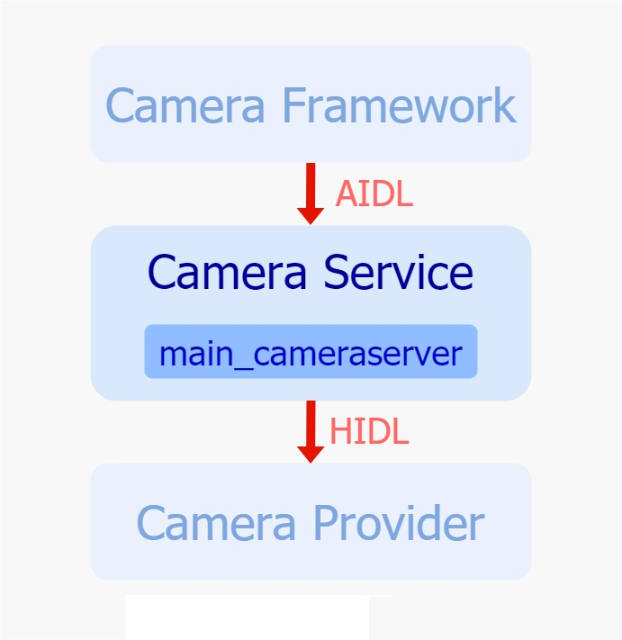
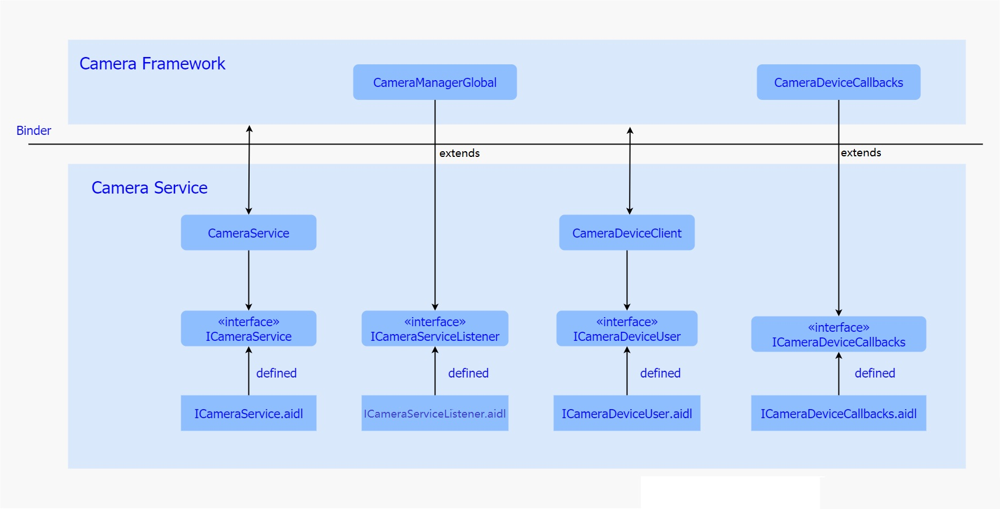
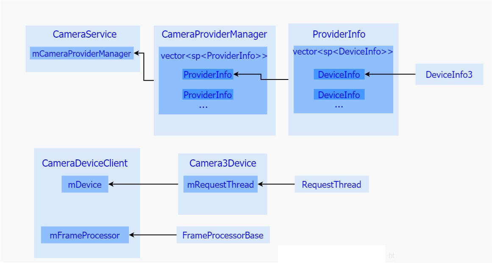

### 简介

Camera Service被设计成一个独立进程，作为一个服务端，处理来自Camera Framework 客户端的跨进程请求，并在内部进行一定的操作，随后作为客户端将请求再一次发送至作为服务端的Camera Provider，整个流程涉及到了两个跨进程操作，前者通过aidl机制实现，后者通过HIDL机制实现，由于在于Camera Provider通信的过程中，Service是作为客户端存在的，所以此处我们重点关注aidl以及Camera Service 主程序的实现。

### Camera AIDL 接口

在介绍Camera AIDL之前，不妨来简单了解下何为AIDL，谷歌为什么要实现这么一套机制？

在Android系统中，两个进程通常无法相互访问对方的内存，为了解决该问题，谷歌提出了Messager、广播以及后来的Binder，来解决这个问题，但是如果某个进程需要对另一个进程中进行多线程的并发访问，Messager和广播效果往往不是很好，所以Binder会作为主要实现方式，但是Binder的接口使用起来比较复杂，对开发者特别是初学者并不是很友好，所以为了降低跨进程开发门槛，谷歌开创性地提出了AIDL(自定义语言)机制，主动封装了Binder的实现细节，提供给开发者较为简单的使用接口，极大地提升了广大开发者的开发效率。

按照谷歌的针对AIDL机制的要求，需要服务端创建一系列*.aidl文件，并在其中定义需要提供给客户端的公共接口，并且予以实现，接下来我们来看下几个主要的aidl文件。

ICameraService.aidl定义了ICameraService 接口，实现主要通过CameraService类来实现，主要接口如下：

- getNumberOfCameras： 获取系统中支持的Camera 个数
- connectDevice：打开一个Camera 设备
- addListener: 添加针对Camera 设备以及闪光灯的监听对象

ICameraServiceListener.aidl定义了ICameraServiceListener接口，由Framework中的CameraManagerGlobal类实现，主要接口如下：

- onStatusChanged： 用于告知当前Camera 设备的状态的变更
- onTorchStatusChanged:

ICameraDeviceUser.aidl定义了ICameraDeviceUser接口，由CameraDeviceClient最终实现，主要接口如下：

- disconnect： 关闭Camera 设备
- submitRequestList：发送request
- beginConfigure： 开始配置Camera 设备，需要在所有关于数据流的操作之前
- endConfigure： 结束关于Camera 设备的配置，该接口需要在所有Request下发之前被调用
- createDefaultRequest： 创建一个具有默认配置的Request

ICameraDeviceCallbacks.aidl文件中定义了ICameraDeviceCallbacks接口，其实现主要由Framework中的CameraDeviceCallbacks类进行实现，主要接口如下：

- onResultReceived： 一旦Service收到结果数据，便会调用该接口发送至Framework
- onCaptureStarted： 一旦开始进行图像的采集，便调用该接口将部分信息以及时间戳上传至Framework
- onDeviceError: 一旦发生了错误，通过调用该接口通知Framework

### Camera Service 主程序

Camera Service 主程序，是随着系统启动而运行，主要目的是向外暴露aidl接口给Framework进行调用，同时通过调用Camera Provider的HIDL接口，建立与Provider的通信，并且在内部维护从Framework以及Provider获取到的资源，并且按照一定的框架结构保持整个Service在稳定高效的状态下运行，所以接下来我们主要通过几个关键类、初始化过程以及处理来自App的请求三个部分来详细介绍下。

#### 1. 关键类解析

首先我们来看下几个关键类，Camera Service中主要包含了以下几个类，用于提供aidi接口，并负责内部一系列逻辑的控制，并且通过HIDL接口保持与Provider的通信。

首先我们看下CameraService的这个类，它主要实现了aidl中ICameraService 接口，并且暴露给Camera Framework进行调用，这个类在初始化的时候会去实例化一个CameraProviderManager对象，而在实例化的过程中，该对象会去获取系统中所有的Camera Provider，并且在其内部实例化了对应Provider个数的ProviderInfo对象，并且随着每一个ProviderInfo的实例化，将每一个Camera Provider作为参数存入ProviderInfo中，并且最终将所有的ProviderInfo存入一个vector容器中进行统一管理，就这样，CameraProviderManager便达到了管理所有的Camera Provider的目的。

而对于单个ProviderInfo而言，内部会维护一个Camera Provider代理，而在系统运行初期，ProviderInfo会去向Camera Provider获取当前这设备所支持的Camera 设备，拿到Camera Provider中的ICameraDevice代理，并且依次存入提前实例化好的DeviceInfo3对象中，最后会将所有的DeviceInfo3存入一个内部容器，进行统一管理，而DeviceInfo3维护着Camera Provider中的ICameraDevice代理，保持了对Camera Provider的控制。

另外，Camera Service 中还包含了CameraDeviceClient类，该类在打开设备的时候被实例化，一次打开设备的操作对应一个该类对象，它实现了ICameraDeviceUser接口，以aidl方式暴露接口给Camera Framework进行调用，于此同时，该类在打开设备的过程中，获取了来自Camera Framework对于ICameraDeviceCallback接口的实现代理，通过该代理可以将结果上传至Camera Framework中，其中还包含了一个Camera3Device以及FrameProcessorBase，Camera3Device主要实现了对Camera Provider 的ICameraDeviceCallbacks回调接口，通过该接口接收来自Provider的结果上传，进而传给CameraDeviceClient以及FrameProcessBase，其中，Camera3Device会将事件通过notify方法给到CameraDeviceClient，而metadata以及imagedata 会给到FrameProcessBase，进而给到CameraDeviceClient，所以FrameProcessBase主要用于metadata以及imagedata的中转处理。而Camera3Device中RequestThread主要用于处理Request的接收与下发工作。

对于CameraService而言，主要包括了两个阶段，一个是系统刚启动的时候，会通过运行其主程序将其CameraService 服务运行起来，等待Camera Framework的下发图像需求，另一个阶段就是当用户打开相机应用的时候，会去获取相机设备，进而开始图像采集过程，接下来我们就主要以这两个阶段分别来详细介绍下内部运行逻辑。

#### 2. 启动初始化

当系统启动的时候，会首先运行Camera Service的主程序，将整个进程运行起来，这里我们首先来看下Camera Service 是怎样运行起来的。

当系统启动的时候会首先运行main_cameraserver程序，紧接着调用了CameraService的instantiate方法，该方法最终会调用到CameraService的onFirstRef方法，在这个方法里面便开始了整个CameraService的初始化工作。而在onFirstRef方法内又调用了enumerateProviders方法，该方法中主要做了两个工作：

- 一个是实例化一个CameraProviderManager对象，该对象管理着有关Camera Provider的一些资源。
- 一个是调用CameraProviderManager的initialize方法对其进行初始化工作。

而在CameraProviderManager初始化的过程中，主要做了三件事：

- 首先通过getService方法获取**ICameraProvider**代理。
- 随后实例化了一个ProviderInfo对象，之后调用其initialize方法进行初始化。
- 最后将ProviderInfo加入到一个内部容器中进行管理。

而在调用ProviderInfo的initialize方法进行初始化过程中存在如下几个动作：

- 首先接收了来自CameraProviderManager获取的ICameraProvider代理并将其存入内部成员变量中。
- 其次由于**ProviderInfo**实现了ICameraProviderCallback接口，所以紧接着调用了ICameraProvider的setCallback将自身注册到Camera Provider中，接收来自Provider的事件回调。
- 再然后，通过调用ICameraProvider代理的**getCameraDeviceInterface_V3_X**接口，获取Provider端的**ICameraDevice**代理，并且将这个代理作为参数加入到DeviceInfo3对象实例化方法中，而在实例化**DeviceInfo3**对象的过程中会通过ICameraDevice代理的**getCameraCharacteristics**方法获取该设备对应的属性配置，并且保存在内部成员变量中。
- 最后ProviderInfo会将每一个DeviceInfo3存入内部的一个容器中进行统一管理，至此整个初始化的工作已经完成。

通过以上的系列动作，Camera Service进程便运行起来了，获取了Camera Provider的代理，同时也将自身关于Camera Provider的回调注册到了Provider中，这就建立了与Provider的通讯，另一边，通过服务的形式将aidl接口也暴露给了Framework，静静等待来自Framework的请求。

#### 3. 处理App请求

一旦用户打开了相机应用，便会去调用CameraManager的openCamera方法进而走到Framework层处理，Framework通过内部处理，最终将请求下发到Camera Service中，而在Camera Service主要做了获取相机设备属性、打开相机设备，然后App通过返回的相机设备，再次下发创建Session以及下发Request的操作，接下来我们来简单梳理下这一系列请求在Camera Service中是怎么进行处理的。

##### a) 获取属性

对于获取相机设备属性动作，逻辑比较简单，由于在Camera Service启动初始化的时候已经获取了相应相机设备的属性配置，并存储在DeviceInfo3中，所以该方法就是从对应的DeviceInfo3中取出属性返回即可。

##### b) 打开相机设备

对于打开相机设备动作，主要由connectDevice来实现，内部实现比较复杂，接下来我们详细梳理下。

当CameraFramework通过调用ICameraService的connectDevice接口的时候，主要做了两件事情：

- 一个是创建CameraDeviceClient。
- 一个是对CameraDeviceClient进行初始化，并将其给到Framework。

而其中创建CameraDevcieClient的工作是通过makeClient方法来实现的，在该方法中首先实例化一个CameraDeviceClient，并且将来自Framework针对ICameraDeviceCallbacks的实现类CameraDeviceImpl.CameraDeviceCallbacks存入CameraDeviceClient中，这样一旦有结果产生便可以将结果通过这个回调回传给Framework，其次还实例化了一个Camera3Device对象。

其中的CameraDeviceClient的初始化工作是通过调用其initialize方法来完成的，在该方法中：

- 首先调用父类Camera2ClientBase的initialize方法进行初始化。
- 其次实例化FrameProcessorBase对象并且将内部的Camera3Device对象传入其中，这样就建立了FrameProcessorBase和Camera3Device的联系，之后将内部线程运行起来，等待来自Camera3Device的结果。
- 最后将CameraDeviceClient注册到FrameProcessorBase内部，这样就建立了与CameraDeviceClient的联系。

而在Camera2ClientBase的intialize方法中会调用Camera3Device的intialize方法对其进行初始化工作，并且通过调用Camera3Device的setNotifyCallback方法将自身注册到Camera3Device内部，这样一旦Camera3Device有结果产生就可以发送到CameraDeviceClient中。

而在Camera3Device的初始化过程中，首先通过调用CameraProviderManager的openSession方法打开并获取一个Provider中的ICameraDeviceSession代理，其次实例化一个HalInterface对象，将之前获取的ICameraDeviceSession代理存入其中，最后将RequestThread线程运行起来，等待Request的下发。而对于CameraProviderManager的openSession方法，它会通过内部的DeviceInfo保存的ICameraDevice代理，调用其open方法从Camera Provider中打开并获取一个ICameraDeviceSession远程代理，并且由于Camera3Device实现了Provider中ICameraDeviceCallback方法，会通过该open方法传入到Provider中，接收来自Provider的结果回传。

至此，整个connectDevice方法已经运行完毕，此时App已经获取了一个Camera设备，紧接着，由于需要采集图像，所以需要再次调用CameraDevice的createCaptureSession操作，到达Framework，再通过ICameraDeviceUser代理进行了一系列操作，分别包含了cancelRequest/beginConfigure/deleteStream/createStream以及endConfigure方法来进行数据流的配置。

##### c) 配置数据流

其中cancelRequest逻辑比较简单，对应的方法是CameraDeviceClient的cancelRequest方法，在该方法中会去通知Camera3Device将RequestThread中的Request队列清空，停止Request的继续下发。

beginConfigure方法是空实现，这里不进行阐述。

deleteStream/createStream 分别是用于删除之前的数据流以及为新的操作创建数据流。

紧接着调用位于整个调用流程的末尾–endConfigure方法，该方法对应着CameraDeviceClient的endConfigure方法，其逻辑比较简单，在该方法中会调用Camera3Device的configureStreams的方法，而该方法又会去通过ICameraDeviceSession的configureStreams_3_4的方法最终将需求传递给Provider。

到这里整个数据流已经配置完成，并且App也获取了Framework中的CameraCaptureSession对象，之后便可进行图像需求的下发了，在下发之前需要先创建一个Request，而App通过调用CameraDeviceImpl中的createCaptureRequest来实现，该方法在Framework中实现，内部会再去调用Camera Service中的aidl接口createDefaultRequest，该接口的实现是CameraDeviceClient，在其内部又会去调用Camera3Device的createDefaultRequest方法，最后通过ICameraDeviceSession代理的constructDefaultRequestSettings方法将需求下发到Provider端去创建一个默认的Request配置，一旦操作完成，Provider会将配置上传至Service，进而给到App中。

##### d) 处理图像需求

在创建Request成功之后，便可下发图像采集需求了，这里大致分为两个流程，一个是预览，一个拍照，两者差异主要体现在Camera Service中针对Request获取优先级上，一般拍照的Request优先级高于预览，具体表现是当预览Request在不断下发的时候，来了一次拍照需求，在Camera3Device 的RequestThread线程中，会优先下发此次拍照的Request。这里我们主要梳理下下发拍照request的大体流程：

下发拍照Request到Camera Service，其操作主要是由CameraDevcieClient的submitRequestList方法来实现，在该方法中，会调用Camera3Device的setStreamingRequestList方法，将需求发送到Camera3Device中，而Camera3Device将需求又加入到RequestThread中的RequestQueue中，并唤醒RequestThread，在该线程被唤醒后，会从RequestQueue中取出Request，通过之前获取的ICameraDeviceSession代理的processCaptureRequest_3_4方法将需求发送至Provider中，由于谷歌对于processCaptureRequest_3_4的限制，使其必须是非阻塞实现，所以一旦发送成功，便立即返回，在App端便等待这结果的回传。

##### e) 接收图像结果

针对结果的获取是通过异步实现，主要分别两个部分，一个是事件的回传，一个是数据的回传，而数据中又根据流程的差异主要分为metadata和imagedata两个部分，接下来我们详细介绍下：

在下发Request之后，首先从Provider端传来的是Shutter Notify，因为之前已经将Camera3Device作为ICameraDeviceCallback的实现传入Provider中，所以此时会调用Camera3Device的notify方法将事件传入Camera Service中，紧接着通过层层调用，将事件通过CameraDeviceClient的notifyShutter方法发送到CameraDeviceClient中，之后又通过打开相机设备时传入的Framework的CameraDeviceCallbacks接口的onCaptureStarted方法将事件最终传入Framework，进而给到App端。

在Shutter事件上报完成之后，当一旦有metadata生成，Camera Provider便会通过ICameraDeviceCallback的processCaptureResult_3_4方法将数据给到Camera Service，而该接口的实现对应的是Camera3Device的processCaptureResult_3_4方法，在该方法会通过层层调用，调用sendCaptureResult方法将Result放入一个mResultQueue中，并且通知FrameProcessorBase的线程去取出Result，并且将其发送至CameraDeviceClient中，之后通过内部的CameraDeviceCallbacks远程代理的onResultReceived方法将结果上传至Framework层，进而给到App中进行处理。

随后ImageData前期也会按照类似的流程走到Camera3Device中，但是会通过调用returnOutputBuffers方法将数据给到Camera3OutputStream中，而该Stream中会通过BufferQueue这一生产者消费者模式中的生产者的queue方法通知消费者对该buffer进行消费，而消费者正是App端的诸如ImageReader等拥有Surface的类，最后App便可以将图像数据取出进行后期处理了。

初代Android相机框架中，Camera Service层就已经存在了，主要用于向上与Camera Framework保持低耦合关联，承接其图像请求，内部封装了Camera Hal Module模块，通过HAL接口对其进行控制，所以该层从一开始就是谷歌按照分层思想，将硬件抽象层抽离出来放入Service中进行管理，这样的好处显而易见，将平台厂商实现的硬件抽象层与系统层解耦，独立进行控制。之后随着谷歌将平台厂商的实现放入vendor分区中，彻底将系统与平台厂商在系统分区上保持了隔离，此时，谷歌便顺势将Camera HAL Moudle从Camera Service中解耦出来放到了vendor分区下的独立进程Camera Provider中，所以之后，Camera Service 的职责便是承接来自Camera Framework的请求，之后将请求转发至Camera Provider中，作为一个中转站的角色存在在系统中。

