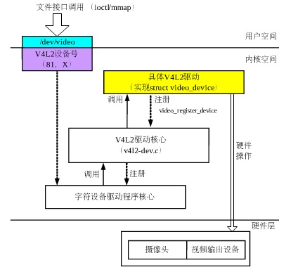
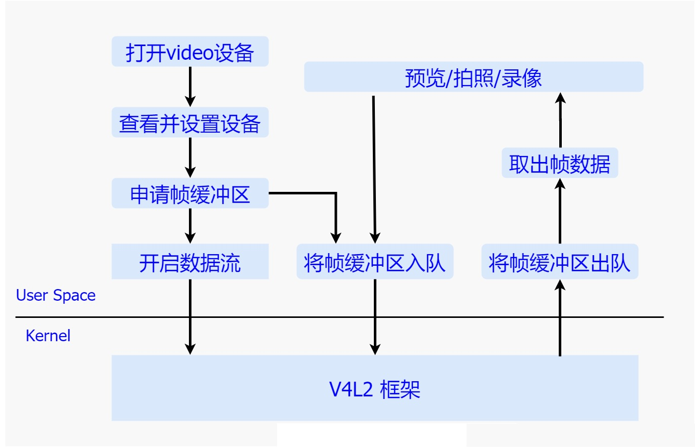
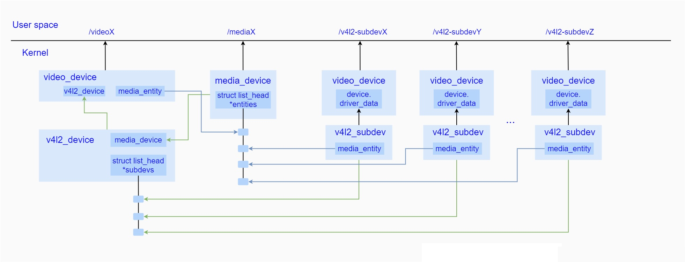

### 概览

<p style="text-indent:2em">相机驱动层位于HAL Moudle与硬件层之间，借助linux内核驱动框架，以文件节点的方式暴露接口给用户空间，让HAL Module通过标准的文件访问接口，从而能够将请求顺利地下发到内核中，而在内核中，为了更好的支持视频流的操作，早先提出了v4l视频处理框架，但是由于操作复杂，并且代码无法进行较好的重构，难以维护等原因，之后便衍生出了v4l2框架。</p>

<p style="text-indent:2em">V4L2英文是Video for Linux 2，该框架是诞生于Linux系统，用于提供一个标准的视频控制框架，其中一般默认会嵌入media controller框架中进行统一管理，v4l2提供给用户空间操作节点，media controller拥有对于每一个设备的枚举控制能力，与此同时，由于v4l2包含了一定数量的子设备，而这一系列的子设备都是处于平级关系，但是在实际的图像采集过程中，子设备之间往往还存在着包含与被包含的关系，所以为了维护并管理这种关系，media controller针对多个子设备建立了的一个拓扑图，数据流也就按照这个拓扑图进行流转。按照v4l2标准，它将一个数据流设备抽象成一个videoX节点，从属的子设备都对应着各自的v4l2_subdev实现，并且通过media controller进行统一管理，整个流程复杂但高效，同时代码的扩展性也较高。</p>



<p style="text-indent:2em">而对高通平台而言，高通整个内核相机驱动是建立在v4l2框架上的，并且对其进行了相应的扩展，创建了一个整体相机控制者的CRM，它以节点video0暴露给用户空间，主要用于管理内核中的Session、Request以及与子设备，同时各个子模块都实现了各自的v4l2_subdev设备，并且以v4l2_subdev节点暴露给用户空间，与此同时，高通还创建了另一个video1设备Camera SYNC，该设备主要用于同步数据流，保证用户空间和内核空间的buffer能够高效得进行传递。</p>

<p style="text-indent:2em">再往下与相机驱动交互的便是整个相机框架的最底层Camera Hardware了，驱动部分控制着其上下电逻辑以及寄存器读取时序并按照I2C协议进行与硬件的通信，和根据MIPI CSI协议传递数据，从而达到控制各个硬件设备，并且获取图像数据的目的。</p>

### 流程简介

<p style="text-indent:2em">整个对于v4l2的操作主要包含了如下几个主要流程：</p>



#### 打开video设备

<p style="text-indent:2em">在需要进行视频数据流的操作之前，首先要通过标准的字符设备操作接口open方法来打开一个video设备，并且将返回的字符句柄存在本地，之后的一系列操作都是基于该句柄，而在打开的过程中，会去给每一个子设备的上电，并完成各自的一系列初始化操作。</p>

#### 查看并设置设备

<p style="text-indent:2em">在打开设备获取其文件句柄之后，就需要查询设备的属性，该动作主要通过ioctl传入VIDIOC_QUERYCAP参数来完成，其中该系列属性通过v4l2_capability结构体来表达，除此之外，还可以通过传入VIDIOC_ENUM_FMT来枚举支持的数据格式，通过传入VIDIOC_G_FMT/VIDIOC_S_FMT来分别获取和获取当前的数据格式，通过传入VIDIOC_G_PARM/VIDIOC_S_PARM来分别获取和设置参数。</p>

#### 申请帧缓冲区

<p style="text-indent:2em">完成设备的配置之后，便可以开始向设备申请多个用于盛装图像数据的帧缓冲区，该动作通过调用ioctl并且传入VIDIOC_REQBUFS命令来完成，最后将缓冲区通过mmap方式映射到用户空间。</p>

#### 将帧缓冲区入队

<p style="text-indent:2em">申请好帧缓冲区之后，通过调用ioctl方法传入VIDIOC_QBUF命令来将帧缓冲区加入到v4l2 框架中的缓冲区队列中，静等硬件模块将图像数据填充到缓冲区中。</p>

#### 开启数据流

<p style="text-indent:2em">将所有的缓冲区都加入队列中之后便可以调用ioctl并且传入VIDIOC_STREAMON命令，来通知整个框架开始进行数据传输，其中大致包括了通知各个子设备开始进行工作，最终将数据填充到V4L2框架中的缓冲区队列中。</p>

#### 将帧缓冲区出队

<p style="text-indent:2em">一旦数据流开始进行流转了，我们就可以通过调用ioctl下发VIDIOC_DQBUF命令来获取帧缓冲区，并且将缓冲区的图像数据取出，进行预览、拍照或者录像的处理，处理完成之后，需要将此次缓冲区再次放入V4L2框架中的队列中等待下次的图像数据的填充。</p><br/>

<p style="text-indent:2em">整个采集图像数据的流程现在看来还是比较简单的，接口的控制逻辑很清晰，主要原因是为了提供给用户的接口简单而且抽象，这样方便用户进行集成开发，其中的大部分复杂的业务处理都被V4L2很好的封装了，接下来我们来详细了解下V4L2框架内部是如何表达以及如何运转的。</p>

### 关键结构体



<p style="text-indent:2em">从上图不难看出，v4l2_device作为顶层管理者，一方面通过嵌入到一个video_device中，暴露video设备节点给用户空间进行控制，另一方面，video_device内部会创建一个media_entity作为在media controller中的抽象体，被加入到media_device中的entitie链表中，此外，为了保持对所从属子设备的控制，内部还维护了一个挂载了所有子设备的subdevs链表。</p>

<p style="text-indent:2em">而对于其中每一个子设备而言，统一采用了v4l2_subdev结构体来进行描述，一方面通过嵌入到video_device，暴露v4l2_subdev子设备节点给用户空间进行控制，另一方面其内部也维护着在media controller中的对应的一个media_entity抽象体，而该抽象体也会链入到media_device中的entities链表中。</p>

<p style="text-indent:2em">通过加入entities链表的方式，media_device保持了对所有的设备信息的查询和控制的能力，而该能力会通过media controller框架在用户空间创建meida设备节点，将这种能力暴露给用户进行控制。</p>

<p style="text-indent:2em">由此可见，V4L2框架都是围绕着以上几个主要结构体来进行的，接下来我们依次简单介绍下：</p>

<details><summary>v4l2_device 源码如下：</summary>
<pre><code>struct v4l2_device {
    struct device *dev;
#if defined(CONFIG_MEDIA_CONTROLLER)
    struct media_device *mdev;
#endif
    struct list_head subdevs;
    spinlock_t lock;
    char name[V4L2_DEVICE_NAME_SIZE];
    void (*notify)(struct v4l2_subdev *sd,
        unsigned int notification, void *arg);
    struct v4l2_ctrl_handler *ctrl_handler;
    struct v4l2_prio_state prio;
    struct kref ref;
    void (*release)(struct v4l2_device *v4l2_dev);
};</code></pre>
</details>


```c
struct v4l2_device {
    struct device *dev;
#if defined(CONFIG_MEDIA_CONTROLLER)
    struct media_device *mdev;
#endif
    struct list_head subdevs;
    spinlock_t lock;
    char name[V4L2_DEVICE_NAME_SIZE];
    void (*notify)(struct v4l2_subdev *sd,
        unsigned int notification, void *arg);
    struct v4l2_ctrl_handler *ctrl_handler;
    struct v4l2_prio_state prio;
    struct kref ref;
    void (*release)(struct v4l2_device *v4l2_dev);
};
```

<p style="text-indent:2em">该结构体代表了一个整个V4L2设备，作为整个V4L2的顶层管理者，内部通过一个链表管理着整个从属的所有的子设备，并且如果将整个框架放入media conntroller进行管理，便在初始化的时候需要将创建成功的media_device赋值给内部变量 mdev，这样便建立了于与media_device的联系，驱动通过调用v4l2_device_register方法和v4l2_device_unregister方法分别向系统注册和释放一个v4l2_device。</p>

v4l2_subdev源码如下：

```c
struct v4l2_subdev {
#if defined(CONFIG_MEDIA_CONTROLLER)
    struct media_entity entity;
#endif
    struct list_head list;
    struct module *owner;
    bool owner_v4l2_dev;
    u32 flags;
    struct v4l2_device *v4l2_dev;
    const struct v4l2_subdev_ops *ops;
    const struct v4l2_subdev_internal_ops *internal_ops;
    struct v4l2_ctrl_handler *ctrl_handler;
    char name[V4L2_SUBDEV_NAME_SIZE];
    u32 grp_id;
    void *dev_priv;
    void *host_priv;
    struct video_device *devnode;
    struct device *dev;
    struct fwnode_handle *fwnode;
    struct list_head async_list;
    struct v4l2_async_subdev *asd;
    struct v4l2_async_notifier *notifier;
    struct v4l2_subdev_platform_data *pdata;
};
```

<p style="text-indent:2em">该结构体代表了一个子设备，每一个子设备都需要在初始化的时候挂载到一个总的v4l2_device上，并且将该v4l2设备赋值给内部的v4l2_dev变量，之后将自身加入到v4l2_device中的子设备链表中进行统一管理，这种方式提高了遍历访问所有子设备的效率，同时为了表达不同硬件模块的特殊操作行为，v4l2_subdev定义了一个v4l2_subdev_ops 结构体来进行定义，其实现交由不同的硬件模块来具体完成。其中如果使能了CONFIG_MEDIA_CONTROLLER宏，便会在media_controller中生成一个对应的media_entity，来代表该子设备，而该entity便会存入子设备结构体中的entity变量中，最后，如果需要创建一个设备节点的话，通过video_device调用标准API接口进行实现，而相应的video_device便会存入其内部devnode变量中。</p>

<p style="text-indent:2em">video_device源码如下：</p>

```c
struct video_device
{
#if defined(CONFIG_MEDIA_CONTROLLER)
    struct media_entity entity;
    struct media_intf_devnode *intf_devnode;
    struct media_pipeline pipe;
#endif
    const struct v4l2_file_operations *fops;
 
    u32 device_caps;
 
    /* sysfs */
    struct device dev;
    struct cdev *cdev;
 
    struct v4l2_device *v4l2_dev;
    struct device *dev_parent;
 
    struct v4l2_ctrl_handler *ctrl_handler;
 
    struct vb2_queue *queue;
 
    struct v4l2_prio_state *prio;
 
    /* device info */
    char name[32];
    int vfl_type;
    int vfl_dir;
    int minor;
    u16 num;
    unsigned long flags;
    int index;
 
    /* V4L2 file handles */
    spinlock_t      fh_lock;
    struct list_head    fh_list;
 
    int dev_debug;
 
    v4l2_std_id tvnorms;
 
    /* callbacks */
    void (*release)(struct video_device *vdev);
    const struct v4l2_ioctl_ops *ioctl_ops;
    DECLARE_BITMAP(valid_ioctls, BASE_VIDIOC_PRIVATE);
 
    DECLARE_BITMAP(disable_locking, BASE_VIDIOC_PRIVATE);
    struct mutex *lock;
};
```

<p style="text-indent:2em">如果需要给v4l2_device或者v4l2_subdev在系统中创建节点的话，便需要实现该结构体，并且通过video_register_device方法进行创建，而其中的fops便是video_device所对应的操作方法集，在v4l2框架内部，会将video_device嵌入到一个具有特定主设备号的字符设备中，而其方法集会在操作节点时被调用到。除了这些标准的操作集外，还定义了一系列的ioctl操作集，通过内部ioctl_ops来描述。</p>

<p style="text-indent:2em">media_device源码如下:</p>

```c
struct media_device {
    /* dev->driver_data points to this struct. */
    struct device *dev;
    struct media_devnode *devnode;
 
    char model[32];
    char driver_name[32];
    char serial[40];
    char bus_info[32];
    u32 hw_revision;
 
    u64 topology_version;
 
    u32 id;
    struct ida entity_internal_idx;
    int entity_internal_idx_max;
 
    struct list_head entities;
    struct list_head interfaces;
    struct list_head pads;
    struct list_head links;
 
    /* notify callback list invoked when a new entity is registered */
    struct list_head entity_notify;
 
    /* Serializes graph operations. */
    struct mutex graph_mutex;
    struct media_graph pm_count_walk;
 
    void *source_priv;
    int (*enable_source)(struct media_entity *entity,
                 struct media_pipeline *pipe);
    void (*disable_source)(struct media_entity *entity);
 
    const struct media_device_ops *ops;
};
```

<p style="text-indent:2em">如果使能了CONFIG_MEDIA_CONTROLLER宏，则当v4l2_device初始化的过程中便会去创建一个media_device，而这个media_device便是整个media controller的抽象管理者，每一个v4l2设备以及从属的子设备都会对应的各自的entity，并且将其存入media_device中进行统一管理，与其它抽象设备一样，media_device也具有自身的行为，比如用户可以通过访问media节点，枚举出所有的从属于同一个v4l2_device的子设备，另外，在开启数据流的时候，media_device通过将各个media_entity按照一定的顺序连接起来，实现了数据流向的整体控制。</p>

<p style="text-indent:2em">vb2_queue源码如下：</p>

```c
struct vb2_queue {
    unsigned int            type;
    unsigned int            io_modes;
    struct device           *dev;
    unsigned long           dma_attrs;
    unsigned            bidirectional:1;
    unsigned            fileio_read_once:1;
    unsigned            fileio_write_immediately:1;
    unsigned            allow_zero_bytesused:1;
    unsigned           quirk_poll_must_check_waiting_for_buffers:1;
 
    struct mutex            *lock;
    void                *owner;
 
    const struct vb2_ops        *ops;
    const struct vb2_mem_ops    *mem_ops;
    const struct vb2_buf_ops    *buf_ops;
 
    void                *drv_priv;
    unsigned int            buf_struct_size;
    u32             timestamp_flags;
    gfp_t               gfp_flags;
    u32             min_buffers_needed;
 
    /* private: internal use only */
    struct mutex            mmap_lock;
    unsigned int            memory;
    enum dma_data_direction     dma_dir;
    struct vb2_buffer       *bufs[VB2_MAX_FRAME];
    unsigned int            num_buffers;
 
    struct list_head        queued_list;
    unsigned int            queued_count;
 
    atomic_t            owned_by_drv_count;
    struct list_head        done_list;
    spinlock_t          done_lock;
    wait_queue_head_t       done_wq;
 
    struct device           *alloc_devs[VB2_MAX_PLANES];
 
    unsigned int            streaming:1;
    unsigned int            start_streaming_called:1;
    unsigned int            error:1;
    unsigned int            waiting_for_buffers:1;
    unsigned int            is_multiplanar:1;
    unsigned int            is_output:1;
    unsigned int            copy_timestamp:1;
    unsigned int            last_buffer_dequeued:1;
 
    struct vb2_fileio_data      *fileio;
    struct vb2_threadio_data    *threadio;
 
#ifdef CONFIG_VIDEO_ADV_DEBUG
    /*
     * Counters for how often these queue-related ops are
     * called. Used to check for unbalanced ops.
     */
    u32             cnt_queue_setup;
    u32             cnt_wait_prepare;
    u32             cnt_wait_finish;
    u32             cnt_start_streaming;
    u32             cnt_stop_streaming;
#endif
};
```

<p style="text-indent:2em">在整个V4L2框架运转过程中，最为核心的是图像数据缓冲区的管理，而这个管理工作便是由vb2_queue来完成的，vb2_queue通常在打开设备的时候被创建，其结构体中的vb2_ops可以由驱动自己进行实现，而vb2_mem_ops代表了内存分配的方法集，另外，还有一个用于将管理用户空间和内核空间的相互传递的方法集buf_ops，而该方法集一般都定义为v4l2_buf_ops这一标准方法集。除了这些方法集外，vb2_queue还通过一个vb2_buffer的数组来管理申请的所有数据缓冲区，并且通过queued_list来管理入队状态的所有buffer，通过done_list来管理被填充了数据等待消费的所有buffer。</p>

<p style="text-indent:2em">vb2_buffer源码如下：</p>

```c
struct vb2_buffer {
    struct vb2_queue    *vb2_queue;
    unsigned int        index;
    unsigned int        type;
    unsigned int        memory;
    unsigned int        num_planes;
    struct vb2_plane    planes[VB2_MAX_PLANES];
    u64         timestamp;
 
    /* private: internal use only
     *
     * state:       current buffer state; do not change
     * queued_entry:    entry on the queued buffers list, which holds
     *          all buffers queued from userspace
     * done_entry:      entry on the list that stores all buffers ready
     *          to be dequeued to userspace
     */
    enum vb2_buffer_state   state;
 
    struct list_head    queued_entry;
    struct list_head    done_entry;
};
```

<p style="text-indent:2em">该结构体代表了V4L2框架中的图像缓冲区，当处于入队状态时内部queued_entry会被链接到vb2_queue中的queued_list中，当处于等待消费的状态时其内部done_entry会被链接到vb2_queue 中的done_list中，而其中的vb2_queue便是该缓冲区的管理者。</p>

<p style="text-indent:2em">以上便是V4L2框架的几个核心结构体，从上面的简单分析不难看出，v4l2_device作为一个相机内核体系的顶层管理者，内部使用一个链表控制着所有从属子设备v4l2_subdev，使用vb2_queue来申请并管理所有数据缓冲区，并且通过video_device向用户空间暴露设备节点以及控制接口，接收来自用户空间的控制指令，通过将自身嵌入media controller中来实现枚举、连接子设备同时控制数据流走向的目的。</p>

### 模块初始化

<p style="text-indent:2em">整个v4l2框架是在linux内核中实现的，所以按照内核驱动的运行机制，会在系统启动的过程中，通过标准的module_init方式进行初始化操作，而其初始化主要包含两个方面，一个是v4l2_device的初始化，一个是子设备的初始化，首先我们来看下v4l2_device的初始化动作的基本流程。</p>

<p style="text-indent:2em">由于驱动的实现都交由各个平台厂商进行实现，所有内部逻辑都各不相同，这里我们抽离出主要方法来进行梳理：</p>

<p style="text-indent:2em">首先对于v4l2_device的初始化而言，在系统启动的过程中，linux内核会找到module_init声明的驱动，调用其probe方法进行探测相应设备，一旦探测成功，便表示初始化工作完成。</p>

<p style="text-indent:2em">而在probe方法内部，主要做了以下操作：</p>

- 获取dts硬件信息，初始化部分硬件设备。
- 创建v4l2_device结构体，填充信息，通过v4l2_device_register方法向系统注册并且创建video设备节点。
- 创建media_device结构体，填充信息，通过media_device_register向系统注册，并创建media设备节点，并将其赋值给v4l2_device中的mdev。
- 创建v4l2_device的media_entity,并将其添加到media controller进行管理。

<p style="text-indent:2em">类似于v4l2_device的初始化工作，子设备的流程如下：</p>

- 获取dts硬件信息，初始化子设备硬件模块
- 创建v4l2_subdev结构体，填充信息，通过v4l2_device_register_subdev向系统注册，并将其挂载到v4l2_device设备中
- 创建对应的media_entity，并通过media_device_register_entity方法其添加到media controller中进行统一管理。
- 最后调用v4l2_device_register_subdev_nodes方法，为所有的设置了V4L2_SUBDEV_FL_HAS_DEVNODE属性的子设备创建设备节点。

### 处理用户空间请求

<p style="text-indent:2em">系统启动之后，初始化工作便已经完成，现在一旦用户想要使用图像采集功能，便会触发整个视频采集流程，会通过操作相应的video节点来获取图像数据，一般来讲，标准的V4L2框架只需要通过操作video节点即可，但是由于现在的硬件功能越来越复杂，常规的v4l2_controller已经满足不了采集需求，所以现在的平台厂商通常会暴露子设备的设备节点，在用户空间直接通过标准的字符设备控制接口来控制各个设备，而现在我们的目的是梳理V4L2框架，所以暂时默认不创建子设备节点，简单介绍下整个流程。</p>

<p style="text-indent:2em">在操作之前，还有一个准备工作需要做，那就是需要找到哪些是我们所需要的设备，而它的设备节点是什么，此时便可以通过打开media设备节点，并且通过ioctl注入MEDIA_IOC_ENUM_ENTITIES参数来获取v4l2_device下的video设备节点，该操作会调用到内核中的media_device_ioctl方法，而之后根据传入的命令，进而调用到media_device_enum_entities方法来枚举所有的设备。</p>

<p style="text-indent:2em">整个采集流程，主要使用三个标准字符设备接口来完成，分别是用于打开设备的open方法、用于控制设备的ioctl方法以及关闭设备的close方法。</p>

1. #### 打开设备(open)

<p style="text-indent:2em">一旦确认了我们需要操作的video节点是哪一个，便可以通过调用字符设备标准接口open方法来打开设备，而这个方法会首先陷入内核空间，然后调用file_operations中的open方法，再到v4l2_file_operations中的open方法，而该方法由驱动自己进行实现，其中主要包括了给各个硬件模块上电，并且调用vb2_queue_init方法创建并初始化一个vb2_queue用于数据缓冲区的管理。</p>

2. #### 控制设备(ioctl)

<p style="text-indent:2em">在打开设备之后，接下来的大部分操作都是通过ioctl方法来完成的，而在该方法中，会首先陷入到内核空间，之后调用字符设备的v4l2_fops中的v4l2_ioctl方法，而在该方法中又会去调用video_device的video_ioctl2方法，video_ioctl2方法定义了一系列video标准的方法，通过不同的命令在v4l2_ioctls中找到相应的标准方法实现，同时为了满足用户自定义命令的实现，在video_ioctl2方法中会去调用到之前注册video_device时赋予的ioctl_ops中的vidioc_default方法，在该方法中加入用户自己的控制逻辑。</p>

<p style="text-indent:2em">在整个控制流程中，首先通过命令VIDIOC_QUERYCAP来获取设备所具有的属性，通过VIDIOC_G_PARM/VIDIOC_S_PARM来分别获取和设置设备参数，在这一系列操作配置完成之后，便需要向内核申请用于数据流转的缓冲区(Buffer)，该操作通过命令VIDIOC_REQBUFS来完成，在内核部分主要调用了标准方法vb2_reqbufs，进而调用__vb2_queue_alloc来向内核申请已知个数的Buffer，并且将其存入之前创建的vb2_queue中进行管理。</p>

<p style="text-indent:2em">申请好了Buffer之后，便可以通过传入VIDIOC_QBUF命令将申请的Buffer入队，具体操作最终会调用vb2_qbuf方法，而在该方法中会从vb2_queue的bufs数组中取出Buffer，将其加入queued_list链表中，并且更新Buffer状态，等待数据的填充或者来自用户空间的出队操作。</p>

<p style="text-indent:2em">在完成上面的操作后，整个数据流并没有开始流转起来，所以需要下发VIDIOC_STREAMON命令来通知整个框架开始出数据，在驱动中主要会去调用vb2_streamon方法，进而调用vb2_start_streaming方法，其中该方法会去将队列中的的Buffer放入到相应的驱动中，等待被填充，紧接着会去调用vb2_queue.ops.start_streaming方法来通知设备开始出图，而该方法一般由驱动自己实现，最后会调用v4l2_subdev_call(subdev, video, s_stream, mode)方法通知各个子设备开始出图。</p>

<p style="text-indent:2em">当有图像产生时，会填充到之前传入的buffer中，并且调用vb2_buffer_done方法通知vb2_queue将buffer加入到done_list链表中，并更新状态为VB2_BUF_STATE_DONE。</p>

<p style="text-indent:2em">在整个数据流开启之后，并不会自动的将图像传入用户空间，必须通过VIDIOC_DQBUF命令来从设备中读取一个帧图像数据，具体操作是通过层层调用会调用到vb2_dqbuf方法，而在该方法中会调用__vb2_get_done_vb方法去从done_list中获取Buffer，如果当前链表为空则会等待最终数据准备好，如果有准备好的buffer便直接从done_list取出，并且将其从queued_list中去掉，最后通过__vb2_dqbuf方法将Buffer返回用户空间。</p>

<p style="text-indent:2em">获取到图像数据之后，便可以进行后期的图像处理流程了，在处理完成之后，需要下发VIDIOC_QBUF将此次buffer重新加入queued_list中，等待下一次的数据的填充和出队操作。</p>

<p style="text-indent:2em">但不需要进行图像的采集时，可以通过下发VIDIOC_STREAMOFF命令来停止整个流程，具体流程首先会调用v4l2_subdev_call(subdev, video, s_stream, 0)通知所有子设备停止出图操作，其次调用vb2_buffer_done唤醒可能的等待Buffer的线程，同时更新Buffer状态为VB2_BUF_STATE_ERROR，然后调用vb2_streamoff取消所有的数据流并更新vb2_queue.streaming的为disable状态。</p>

3. #### 关闭设备(close)

<p style="text-indent:2em">当确认不使用当前设备进行图像采集操作之后，便可以调用标准方法close来关闭设备。其中主要包括了调用vb2_queue_release方法释放了vb2_queue以及设备下电操作和相关资源的释放。</p></br>

<p style="text-indent:2em">通过上面的介绍，我相信我们已经对整个V4L2框架有了一个比较深入的认识， 然而对于一个优秀的软件架构而言，仅仅是支持现有的功能是远远不够的，随着功能的不断完善，势必会出现需要进行扩展的地方，而v4l2在设计之初便很好的考虑到了这一点，所以提供了用于扩展的方法集，开发者可以通过加入自定的命令来扩充整个框架，高通在这一点上做的非常好，在v4l2框架基础上，设计出了一个独特的KMD框架，提供给UMD CSL进行访问的接口。</p>

