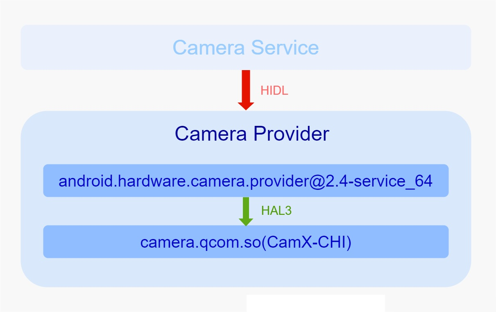
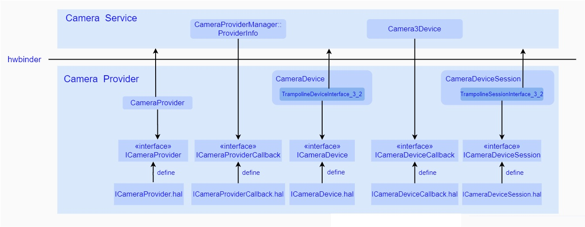
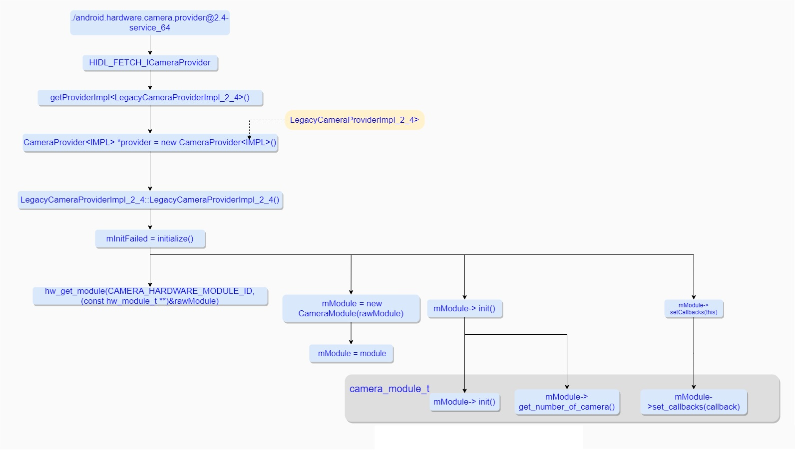
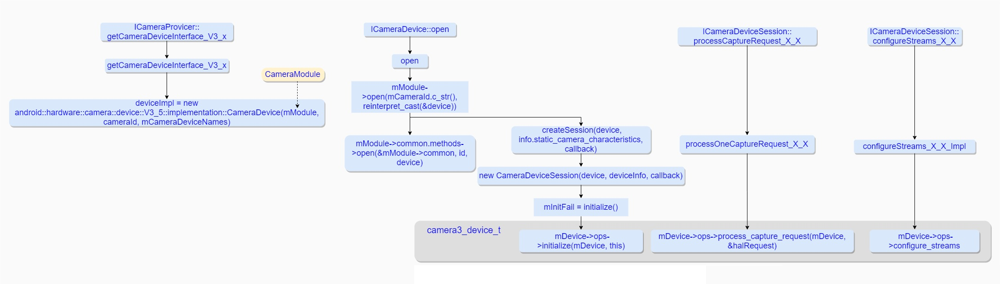

### 概览

始于谷歌的Treble开源项目，基于接口与实现分离的设计原则，谷歌加入了Camera Provider这一抽象层，该层作为一个独立进程存在于整个系统中，并且通过HIDL这一自定义语言成功地将Camera Hal Module从Camera Service中解耦出来，承担起了对Camera HAL的封装工作，纵观整个Android Camera系统，对于Camera Provider而言，对上是通过HIDL接口负责与Camera Service的跨进程通信，对下通过标准的HAL3接口下发针对Camera的实际操作，这俨然是一个中央枢纽般的调配中心的角色，而事实上正是如此，由此看来，对Camera Provider的梳理变得尤为重要，接下来就以我个人理解出发来简单介绍下Camera Provider。

Camera Provider通过提供标准的HIDL接口给Camera Service进行调用，保持与Service的正常通信，其中谷歌将HIDL接口的定义直接暴露给平台厂商进行自定义实现，其中为了极大地减轻并降低开发者的工作量和开发难度，谷歌很好地封装了其跨进程实现细节，同样地，Camera Provider通过标准的HAL3接口，向下控制着具体的Camera HAL Module，而这个接口依然交由平台厂商负责去实现，而进程内部则通过简单的函数调用，将HIDL接口与HAL3接口完美的衔接起来，由此构成了Provider整体架构。

由图中可以看出Camera Provider进程由两部分组成，一是运行在系统中的主程序通过提供了标准的HIDL接口保持了与Camera Service的跨进程通讯，二是为了进一步扩展其功能，通过dlopen方式加载了一系列so库，而其中就包括了实现了Camera HAL3接口的so库，而HAL3接口主要定义了用于实现图像控制的功能，其实现主要交由平台厂商或者开发者来完成，所以Camera HAL3 so库的实现各式各样，这里在高通平台上的实现就是我们本文重点需要分析的CamX-CHI框架。在开始梳理CamX-CHI之前，不防先从上到下，以接口为主线简单梳理下Camera Provider的各个部分:

### Camera HIDL 接口

首先需要明确一个概念，就是HIDL是一种自定义语言，其核心是接口的定义，而谷歌为了使开发者将注意力落在接口的定义上而不是机制的实现上，主动封装了HIDL机制的实现细节，开发者只需要通过*.hal文件定义接口，填充接口内部实际的实现即可，接下来来看下具体定义的几个主要接口：

因为HIDL机制本身是跨进程通讯的，所以Camera Service本身通过HIDL接口获取的对象都会有Bn端和Bp端，分别代表了Binder两端，接下来为了方便理解，我们都省略掉Bn/Bp说法,直接用具体接口类代表，忽略跨进程两端的区别。

ICameraProvider.hal文件中定义了ICameraProvider接口类，由CameraProvider继承并实现，在Camera Provider启动的时候被实例化，主要接口如下：

- getCameraDeviceInterface_V3_x: 该方法主要用于Camera Service获取ICameraDevice，通过该对象可以控制Camera 设备的诸如配置数据流、下发request等具体行为。
- setCallback： 将CameraService 实现的ICameraProviderCallback传入CameraProvider，一旦Provider有事件产生时便可以通过该对象通知Camera Service。

ICameraProviderCallback.hal文件中定义了ICameraProviderCallback回调接口类，该接口由Camera Service中的CameraProviderManager::ProviderInfo继承并实现，在Camera Service启动的时候被实例化，通过调用ICameraProvider::setCallback接口注册到Camera Provider中，其主要接口如下：

- cameraDeviceStatusChange： 将Camera 设备状态上传至Camera Service，状态由CameraDeviceStatus定义

ICameraDevice.hal文件中定义了ICameraDevice接口类，由CameraDevice::TrampolineDeviceInterface_3_2实现，其主要接口如下:

- open： 用于创建一个Camera设备，并且将Camera Service中继承ICameraDeviceCallback并实现了相应接口的Camera3Device作为参数传入Provider中，供Provider上传事件或者图像数据。
- getCameraCharacteristics：用于获取Camera设备的属性。

ICameraDeviceCallback.hal文件中定义了ICameraDeviceCallback接口类，由Camera Service中的Camera3Device继承并实现，通过调用ICameraDevice::open方法注册到Provider中，其主要接口如下：

- processCaptureResult_3_4: 一旦有图像数据产生会通过调用该方法将数据以及metadata上传至Camera Service。
- notify: 通过该方法上传事件至Camera Service中，比如shutter事件等。

ICameraDeviceSession.hal文件中定义了ICameraDeviceSession接口类，由CameraDeviceSession::TrampolineSessionInterface_3_2继承并实现，其主要接口如下：

- constructDefaultRequestSettings：用于创建默认的Request配置项。
- configureStreams_3_5：用于配置数据流，其中包括了output buffer/Surface/图像格式大小等属性。
- processCaptureRequest_3_4：下发request到Provider中，一个request对应着一次图像需求。
- close: 关闭当前会话

### Camera Provider 主程序

接下来进入到Provider内部去看看，整个进程是如何运转的，以下图为例进行分析:

在系统初始化的时候，系统会去运行android.hardware.camera.provider@2.4-service_64程序启动Provider进程，并加入HW Service Manager中接受统一管理，在该过程中实例化了一个LegacyCameraProviderImpl_2_4对象，并在其构造函数中通过hw_get_module标准方法获取HAL的camera_module_t结构体,并将其存入CameraModule对象中，之后通过调用该camera_modult_t结构体的init方法初始化HAL Module，紧接着调用其get_number_of_camera方法获取当前HAL支持的Camera数量，最后通过调用其set_callbacks方法将LegcyCameraProviderImpl_2_4(LegcyCameraProviderImpl_2_4继承了camera_modult_callback_t)作为参数传入CamX-CHI中，接受来自CamX-CHI中的数据以及事件，当这一系列动作完成了之后，Camera Provider进程便一直便存在于系统中，监听着来自Camera Service的调用。

接下来以上图为例简单介绍下Provider中几个重要流程：

- Camera Service通过调用ICameraProvider的getCameraDeviceInterface_v3_x接口获取ICameraDevice，在此过程中，Provider会去实例化一个CameraDevice对象，并且将之前存有camera_modult_t结构体的CameraModule对象传入CameraDevice中，这样就可以在CameraDevice内部通过CameraModule访问到camera_module_t的相关资源，然后将CameraDevice内部类TrampolineDeviceInterface_3_2(该类继承并实现了ICameraDevice接口)返回给Camera Service。

- Camera Service通过之前获取的ICameraDevice，调用其open方法来打开Camera设备，接着在Provider中会去调用CameraDevice对象的open方法，在该方法内部会去调用camera_module_t结构体的open方法，从而获取到HAL部分的camera3_device_t结构体，紧接着Provider会实例化一个CameraDeviceSession对象，并且将刚才获取到的camera3_device_t结构体以参数的方式传入CameraDeviceSession中，在CameraDeviceSession的构造方法中又会调用CameraDeviceSession的initialize方法，在该方法内部又会去调用camera3_device_t结构体的ops内的initialize方法开始HAL部分的初始化工作，最后CameraDeviceSession对象被作为camera3_callback_ops的实现传入HAL，接收来自HAL的数据或者具体事件，当一切动作都完成后，Provider会将CameraDeviceSession::TrampolineSessionInterface_3_2(该类继承并实现了ICameraDeviceSession接口)对象通过HIDL回调的方法返回给Camera Service中。
- Camera Service通过调用ICameraDevcieSession的configureStreams_3_5接口进行数据流的配置，在Provider中，最终会通过调用之前获取的camera3_device_t结构体内ops的configure_streams方法下发到HAL中进行处理。
- Camera Service通过调用ICameraDevcieSession的processCaptureRequest_3_4接口下发request请求到Provider中，在Provider中，最终依然会通过调用获取的camera3_device_t结构体内ops中的process_capture_request方法将此次请求下发到HAL中进行处理。

从整个流程不难看出，这几个接口最终对应的是HAL3的接口，并且Provider并没有经过太多复杂的额外的处理。

### Camera HAL3 接口

HAL(Hardware Abstraction Layer,硬件抽象层)，是谷歌开发的用于屏蔽底层硬件抽象出来的一个软件层， 每一个平台厂商可以将不开源的代码封装在这一层，仅仅提供二进制文件。该层定义了自己的一套通用标准接口，平台厂商务必按照以下规则定义自己的Module:

- 每一个硬件模块都通过hw_module_t来描述，具有固定的名字HMI
- 每一个硬件模块都必须实现hw_module_t里面的open方法，用于打开硬件设备，并返回对应的操作接口集合
- 硬件的操作接口集合使用hw_device_t 来描述，并可以通过自定义一个更大的包含hw_device_t的结构体来拓展硬件操作集合

其中代表硬件模块的是hw_module_t，对应的设备是通过hw_device_t来描述，从这两者的定义可以看出，主要是通过hw_module_t 代表了模块，通过其open方法用来打开一个设备，而该设备是用hw_device_t来表示，其中除了用来关闭设备的close方法外，并无其它方法，由此可见谷歌定义的HAL接口，并不能满足绝大部分HAL模块的需要，所以谷歌想出了一个比较好的解决方式，那便是将这两个基本结构嵌入到更大的结构体内部，同时在更大的结构内部定义了各自模块特有的方法，用于实现模块的功能，这样，一来对上保持了HAL的统一规范，二来也扩展了模块的功能。

基于上面的方式，谷歌便针对Camera 提出了HAL3接口，其中主要包括了用于代表一系列操作主体的结构体以及具体操作函数，接下来我们分别进行详细介绍：

#### 核心结构体解析

HAL3中主要定义了
camera_module_t/camera3_device_t/camera3_stream_configuration/camera3_stream以及camera3_stream_buffer几个主要结构体。

由其中camera_module_t以及camera3_device_t代码定义不难发现，camera_module_t包含了hw_module_t，主要用于表示Camera模块，其中定义了诸如get_number_of_cameras以及set_callbacks等扩展方法，而camera3_device_t包含了hw_device_t，主要用来表示Camera设备，其中定义了camera3_device_ops操作方法集合，用来实现正常获取图像数据以及控制Camera的功能。

结构体camera3_stream_configuration主要用来代表配置的数据流列表，内部装有上层需要进行配置的数据流的指针，内部的定义简单介绍下：

- num_streams: 代表了来自上层的数据流的数量，其中包括了output以及input stream。
- streams: 是streams的指针数组，包括了至少一条output stream以及至多一条input stream。
- operation_mode: 当前数据流的操作模式，该模式在camera3_stream_configuration_mode_t中被定义，HAL通过这个参数可以针对streams做不同的设置。
- session_parameters: 该参数可以作为缺省参数，直接设置为NULL即可，CAMERA_DEVICE_API_VERSION_3_5以上的版本才支持。

camera3_stream_t结构体主要用来代表具体的数据流实体，在整个的配置过程中，需要在上层进行填充，当下发到HAL中后，HAL会针对其中的各项属性进行配置，这里便简单介绍下其内部的各个元素的意义：

- stream_type: 表示数据流的类型，类型在camera3_stream_type_t中被定义。
- width： 表示当前数据流中的buffer的宽度。
- height: 表示当前数据流中buffer的高度。
- format: 表示当前数据流中buffer的格式，该格式是在system/graphics.h中被定义。
- usage： 表示当前数据流的gralloc用法，其用法定义在gralloc.h中。
- max_buffers： 指定了当前数据流中可能支持的最大数据buffer数量。
- data_space: 指定了当前数据流buffer中存储的图像数据的颜色空间。
- rotation：指定了当前数据流的输出buffer的旋转角度，其角度的定义在camera3_stream_rotation_t中，该参数由Camera Service进行设置，必须在HAL中进行设置，该参数对于input stream并没有效果。
- physical_camera_id： 指定了当前数据流从属的物理camera Id。

结构体camera3_stream_buffer_t主要用来代表具体的buffer对象，其中重要元素如下：

- stream: 代表了从属的数据流
- buffer：buffer句柄

#### 核心接口函数解析

HAL3的核心接口都是在camera3_device_ops中被定义,该结构体定义了一系列的函数指针，用来指向平台厂商实际的实现方法，接下来就其中几个方法简单介绍下：

##### a) initialize

该方法必须在camera_module_t中的open方法之后，其它camera3_device_ops中方法之前被调用，主要用来将上层实现的回调方法注册到HAL中，并且根据需要在该方法中加入自定义的一些初始化操作，另外，谷歌针对该方法在性能方面也有严格的限制，该方法需要在5ms内返回，最长不能超过10ms。

##### b) configure_streams

该方法在完成initialize方法之后，在调用process_capture_request方法之前被调用，主要用于重设当前正在运行的Pipeline以及设置新的输入输出流，其中它会将stream_list中的新的数据流替换之前配置的数据流。在调用该方法之前必须确保没有新的request下发并且当前request的动作已经完成，否则会引起无法预测的错误。一旦HAL调用了该方法，则必须在内部配置好满足当前数据流配置的帧率，确保这个流程的运行的顺畅性。其中包含了两个参数，分别是camera3_device以及stream_list(camera3_stream_configuration_t ),其中第二个参数是上层传入的数据流配置列表，该列表中必须包含至少一个output stream，同时至多包含一个input stream。另外，谷歌针对该方法有着严格的性能要求，平台厂商在实现该方法的时候，需要在500ms内返回，最长不能超过1000ms。

##### c) construct_default_request_settings

该方法主要用于构建一系列默认的Camera Usecase的capture设置项，通过camera_metadata_t来进行描述，其中返回值是一个camera_metadata_t指针，其指向的内存地址是由HAL来进行维护的，同样地，该方法需要在1ms内返回，最长不能超过5ms。

##### d) process_capture_request

该方法用于下发单次新的capture request到HAL中， 上层必须保证该方法的调用都是在一个线程中完成，而且该方法是异步的，同时其结果并不是通过返回值给到上层，而是通过HAL调用另一个接口process_capture_result()来将结果返回给上层的，在使用的过程中，通过in-flight机制，保证短时间内下发足够多的request，从而满足帧率要求。

该方法的性能依然受到谷歌的严格要求，规定其需要在一帧图像处理完的时长内返回，最长不超过4帧图像处理完成的时长，比如当前预览帧率是30帧，则该方法的操作耗时最长不能超过120ms，否则便会引起明显的帧抖动，从而影响用户体验。

##### e) dump

该方法用于打印当前Camera设备的状态，一般是由上层通过dumpsys工具输出debug dump信息或者主动抓取bugreport的时候被调用，该方法必须是非阻塞实现，同时需要保证在1ms内返回，最长不能超过10ms。

##### f) flush

当上层需要执行新的configure_streams的时候，需要调用该方法去尽可能快地清除掉当前已经在处理中的或者即将处理的任务，为配置数据流提供一个相对稳定的环境，其具体工作如下：

- 所有的还在流转的request会尽可能快的返回
- 并未开始进行流转的request会直接返回，并携带错误信息
- 任何可以打断的硬件操作会立即被停止
- 任何无法进行打断的硬件操作会在当前状态下进行休眠

flush会在所有的buffer都得以释放，所有request都成功返回后才真正返回，该方法需要在100ms内返回，最长不能超过1000ms。

上面的一系列方法是上层直接对下控制Camera Hal，而一旦Camera Hal产生了数据或者事件的时候，可以通过camera3_callback_ops中定义的回调方法将数据或者事件返回至上层，该结构体中常用的回调方法主要有两个：用于返回数据的process_capture_result以及用于返回事件的notify，接下来分别介绍下：

- process_capture_result

该方法用于返回HAL部分产生的metadata和image buffers，它与request是多对一的关系，同一个request，可能会对应到多个result，比如可以通过调用一次该方法用于返回metadata以及低分辨率的图像数据，再调用一次该方法用于返回jpeg格式的拍照数据，而这两次调用时对应于同一个process_capture_request动作。同一个Request的Metadata以及Image Buffers的先后顺序无关紧要，但是同一个数据流的不同Request之间的Result必须严格按照Request的下发先后顺序进行依次返回的，如若不然，会导致图像数据显示出现顺序错乱的情况。该方法是非阻塞的，而且并且必须要在5ms内返回。

- notify

该方法用于异步返回HAL事件到上层，必须非阻塞实现，而且要在5ms内返回。

谷歌为了将系统框架和平台厂商的自定义部分相分离，在Android上推出了Treble项目，该项目直接将平台厂商的实现部分放入vendor分区中进行管理，进而与system分区保持隔离，这样便可以在相互独立的空间中进行各自的迭代升级，而互不干扰，而在相机框架体系中，便将Camera HAL Module从Camera Service中解耦出来，放入独立进程Camera Provider中进行管理，而为了更好的进行跨进程访问，谷歌针对Provider提出了HIDL机制用于Camera Service对于Camera Provier的访问，而HIDL接口的实现是在Camera Provider中实现，针对Camera HAL Module的控制又是通过谷歌制定的Camera HAL3接口来完成，所以由此看来，Provider的职责也比较简单，通过HIDL机制保持与Camera Service的通信，通过HAL3接口控制着Camera HAL Module。

