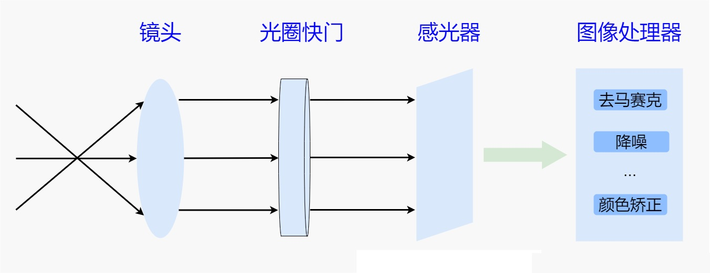

### 简介

相机的硬件层，作为整个框架的最底层，通过硬件模块接收来自客观世界的真实光影效果，将其转换为计算机所熟知的数字信号，并按照一定的数据格式向上源源不断提供成稳定并成像效果优秀的图像数据，整个部分复杂且高效，可以说是，一个优秀的硬件基础，就好比为整个相机框架的地基，拥有一个好的地基，便使得建造一座摩天大厦成为可能，接下来我们来详细介绍下，这部分各个组件的基本情况。

### 基本硬件结构

而今的相机硬件系统纷繁复杂，但是如果仔细深入研究的话，你会发现，其实核心组件无外乎镜头、感光器、图像处理器三大件，其中镜头用来聚光，感光器件用于光电转换，而图像处理器用来加工处理图像数据，接下来我们就以这三个组件开始展开对于相机系统的世界的探索之旅。

1. #### 镜头焦距(Lens Focus)

将时间的转盘向前波动一下，让我们回到各自的小学时代，那时候老师给我们都布置了一个家庭作业，任务是制作一个小孔成像的简单模型，这个简单模型便是我接触的最原始最简单的成像系统，但是那是我一直有一个疑问，成像为什么那么模糊，这个疑问在我接触到真正的相机之后才得以解开，原来一切都是光线惹的祸。

根据小孔成像原理，小孔的一端是光源，另一端是成像平面，光经过小孔，入射到平面上，无数个光线都入射到这个平面上，便形成了光源的像，但是有一个问题，就是光线是按照发散路径向四周蔓延开来，光源某点所发出的某一束光线通过小孔后会到达成像平面的某一点上，但是很显然，该点也会接收来自另一个光源上的点所发出的另一束光线，这样就形成的光的干扰，进而影响了最终的成像效果。所以为了改善这个问题，镜头便被发明出来，而镜头其实就是我们日常生活中接触的凸透镜，其根本目的就是为了解决光线互相干扰的问题，其原理就是通过凸透镜的折射原理，将来自同一点的光线，重新汇聚至一点，从而大幅度提升了成像效果。而这里的重新汇聚的一点便是光源那点在透镜后的像点，而由于随着光源点的不断变换，其像点会相应的变化，所以我们常常将来自无限远处的光线，通过透镜之后汇聚而成的那个点称为该镜头的焦点，而焦点到透镜中心的距离，便称为焦距，一旦透镜制作完成，焦距便被确定下来。

2. #### 光圈快门

对于一个制作完成的镜头，无法随意调整镜头的直径，所以便在其中加入了一个叫做光圈的部件，该部件一般采用正多边形或者圆形的孔状光栅，通过调整光栅开合大小进而控制这个镜头的瞬时进光量，然而针对总的进光亮的控制仅仅依靠光圈也是不够的，需要再用到另一个叫做快门的部件，它主要决定着曝光的时长，最初的快门是通过调整镜头前的盖子的开关来进行实现，随着时代的进步，现在快门衍生出了多个实现方式，其中包括机械快门，它是作为一种只使用弹簧或者其他机械结构，不靠电力来驱动与控制速度的快门结构，电子快门，该快门结构通过马达和磁铁在电力驱动的作用下进行控制。电子断流快门，一种完全没有机械结构的快门结构，具有高快门速率和很快的影响捕捉频率，但是缺点是容易产生高光溢出现象。

光圈控制着瞬时进光量，快门控制着曝光时间，通过两者的共同合作，完成了控制光线进入量的目的，进而进一步真实再现了场景的光影效果，避免了过度曝光的情况发生，极大的提升了整个提成像质量。

3. #### 对焦马达

正如之前所说，入射光线会在通过透镜之后以锥形路径汇聚到一点，该点叫做像点，之后再以锥形发散开去，而所有的相同距离发射的光线，都会汇聚到各自的像点上时，便形成了一个都是像点组成的一个平面，而这个平面一般叫做像平面，又由于这个平面是所有像点所汇聚而成的，所以该平面是成像清晰的，而现如今的对焦的本质便是通过移动透镜，使像平面与感光器件平面重合，从而在感光器件上形成清晰的像。一般来讲，对焦可以通过手动移动透镜完成，但是更一般地，是通过一个叫做对焦马达的器件来完成。除了手动调整镜头进而完成对焦操作外，现在比较主流的方式是通过自动移动透镜进而完成对焦动作，随着技术的不断发展，而今的对焦又发展出了自动对焦策略，其中包括了相位对焦和对比度对焦。其基本原理是前后调整镜头使像平面与感光器感光平面重合，从而形成清晰的成像效果。另外，针对更为复杂的相机系统，为了获得更加优秀的成像质量，一般都会采用多个透镜组合来实现，一来可以消除色差，二来可以通过马达调整透镜间的距离，来动态的修改整个透镜组的焦距，从而满足更加复杂场景下的成像需求。

4. #### 感光器(Sensor)

正如之前所讲，透镜的作用是为了汇聚光线，从而形成像平面，但是如何将这个所谓的像平面转换成计算机所熟知的图像信息呢？这就需要用到这里的感光器了，感光器并不是现代社会的专有发明，其实早在19世界初期的欧洲便有了这个概念，一位名叫尼埃普斯的法国人通过使用沥青加上薰衣草油，再以铅锡合金板作为片基，拍摄了从他家楼上看到的窗户外的场景，名叫《鸽子窝》的照片，而这里的沥青混以薰衣草油便是一种简单的感光物质，从这开始感光技术开始进入快速发展期，在1888年，美国柯达公司生产出了一种新型感光材料，柔软且可卷绕的胶卷，这是感光材料的一个质的飞跃，之后1969年在贝尔实验室，CCD数字感光器件被发明出来，将整个感光技术推入了数字时代，随后技术的不断革新，便于大规模批量生产的CMOS应运而生，将成像系统往更小更好的方向推进了一大步。随着CMOS的技术不断发展，优势明显的它渐渐取代了CCD，成为相机系统的主流感光器件。

5. #### 滤光片(IR Filter)

由于感光材料的特性所致，它会感受除了可见光波长范围内的光线，比如部分红外光，由于这部分红外光是不可见的，所以对于我们而言没有实际的用处(当然，这也不绝对，有的情况就是需要采集红外光的信息，比如夜视照相机)，并且可能会干扰之后的ISP的处理，所以往往需要使用一个用于过滤红外光，避免红外光线干扰，修正摄入的光线的滤片，一般分为干涉式的IR/AR-CUT(在低通滤波晶片上镀膜，利用干涉相消的原理)和吸收式的玻璃(利用光谱吸收的原理)。

6. #### 闪光灯(Flash)

针对某些特殊场景，比如暗光环境下拍摄需求，此时由于光线本身较少，无法完成充分的感光操作，但是为了获取正常的拍摄需求，往往需要通过外部补光来作为额外的光照补偿，基于此，闪光灯便应运而生，对于手机而言，其主要分为氙气灯与LED灯两种，由于LED闪光灯具有功耗较低、体积较小的优势，作为手机闪光灯的主流选择。另外，现在很多手机采用了双色闪光灯的策略，双色闪光灯可以根据环境的需要调节两灯发光的强度，可以更为逼近自然光的效果，相比单闪光灯强度有所提升，另外色温也较普通双闪光灯要更为准确，总体来讲效果较好。

7. #### 图像处理器(ISP)

一旦当感光器件完成光电转换之后，便会将数据给到图像处理器，而ISP第一步需要做的便是去掉暗电流噪声，何为暗电流噪声呢？这要从感光器件说起，针对CCD/CMOS而言，通常并不是全部都用于感光，有一部分是被专门遮挡住，用于采集在并未感光情况的暗电流情况，通过这种方式消除掉暗电流带来的噪声。

对于镜头的各处的折射率不同的属性，会随着视场角的慢慢增大，能够通过镜头的斜光束慢慢减少，从而产生了图像中心亮度较边缘部分要高，这个现象在光学系统中叫做渐晕，很显然这种差异性会带成像的不自然，所以ISP接下来需要对于这种偏差进行修正，而修正的算法便是镜头阴影矫正，具体原理便是以图像中间亮度均匀的区域为中心，计算出个点由于衰减带来的图像变暗速度，从而计算出RGB三通道的补偿因子，根据这些补偿因子来对图像进行修正。

随后，由于感光器件针对光线都是采用红、绿、蓝三基色进行分别采集而成的，所以数据一般会呈现出类似马赛克的排布效果，此时便需要完成去马赛克处理，基本原理便是通过一定的插值算法，通过附近的颜色分量猜测该像素所缺失的颜色分量，力争还原每一个像素的真实颜色效果，从而形成一个颜色真实的图像数据，而此时的数据格式便是RAW数据格式，即最原始的图像数据。

当感光器进行光电转换的过程中，每一个环节都会产生一定的偏差，而这个偏差到最后便会以噪声的方式表现出来，所以接下来需要对于这个无关信息–噪声进行一定的降噪处理，当前主要采用了非线性去噪算法，比如双边滤波器，在采样时不仅考虑了像素在空间距离上的关系，同时还加入了像素间的相似程度考虑，从而保持了原始图像的大体分块，对于边缘信息保持良好。

进一步降低了噪声之后，ISP需要对于图像白平衡进行处理，由于不同场景下的外界色温的不同，需要按照一定的比例调整RGB分量的值，从而使得在感光器中，白色依然是呈现白色的效果。白平衡可以采用手动白平衡，通过手动调整三个颜色分量的比例关系，达到白平衡的目的，而更一般地采用了自动白平衡的处理，这里ISP就承担着自动白平衡的使命，通过对当前图像进行分析，得到各颜色分量的比例关系，进而调整其成像效果。

调整好图像白平衡后，需要进一步地调整颜色误差，这里的误差主要由于滤光片各颜色块之间存在颜色渗透所导致，一般在Tunning过程中会利用相机模组拍摄的图像与标准图像相比较得到的一个矫正矩阵，ISP利用这个矩阵来对拍摄的图像进行图像颜色矫正，从而达到还原拍摄场景中真实颜色的目的。

以上简单罗列了下，图像处理器的几个基本功能，虽然每个厂商所生产的ISP都不尽相同，但是基本都包括了以上几个步骤，由此可见，图像处理器是用来提升整个相机系统的成像效果的。

### 手机相机简介

对于手机上的相机系统，受到尺寸以及功耗的限制，无法像专业相机那样，为了保证成像效果，可以的很方便地更换更大的镜头，加入更大尺寸的CCD/CMOS感光器件，可以放入更加强大的图像处理模块，所以留给手机的发挥空间并不是很大，但是即便如此，各大手机厂商依旧在有限的空间和续航能力下，将相机系统做到了在某些领域媲美专业相机的地步，接下来我们来简单介绍下这套小体积但具有大能量的相机系统。

如图所示，手机的相机系统可以分为两个部分，一个是相机模组，一个是图像处理器ISP，相机模组是用来进行进行光电转换的，而图像处理器正如之前所介绍那样是用于图像处理的，接下来我们分别来看下，两者在手机端是如何运行的。

1. #### 相机模组

由于受到体积的限制，手机相机模组往往做得十分精致小巧，里面主要包括了镜头、对焦马达、滤光片以及感光器(Sensor)。

一般为了消除色差都会采用多个透镜的组合，手机中的镜头也不例外，其材质多是玻璃和塑料的组合，对于塑料镜头而言，成本较低，适合用于低端产品中的相机系统，而玻璃一般成像质量较高，但是成本也稍高于塑料镜头，所以往往用于一些追求成像质量的手机中，同时其中，镜头主要存在以下几个参数：

- 视场角FOV，该参数表明了通过镜头可以成像多大范围的场景，一般FOV越大就越能看到大范围的景物，但是有可能会带来严重的畸变，通常使用后期的畸变矫正算法来修正大FOV所带来的畸变。
- 焦距F ，规定所有平行于透镜主轴的光线汇聚到的那点叫做焦点，而焦点到透镜中心的距离便是这里的焦距，一般焦距越大，镜头的FOV也就越小。而越短的焦距，往往FOV越大。
- 光圈值f，通过镜头焦距与实际光圈的直径比值来指定，该值越小，说明进光量也就越大，手机镜头一般采用f/2.0的固定光圈。

紧接着是对焦马达，这部分在手机中主要采用的是音圈马达(VCM)，而为了方便调整镜头，一般会将整个镜头集成在马达模组中，主板通过I2C总线传输指令，进而驱动马达的移动调整镜头达到对焦或者变焦的目的，这里我们简单介绍下音圈马达。**音圈马达**在电子学中被称为音圈电机，之所以被称为音圈，是因为其实现原理与扬声器类似，都是在一个永久磁场内部，通过改变马达内线圈的直流电流大小，来控制弹簧片的拉升位置，进而带动镜头上下运动，达到对焦或者变焦的目的，由于具有着高灵敏度与高精度的特点，使之成为手机的主流对焦组件。在手机端，对于音圈马达的使用一般分为两种模式，一种是变焦，一种是对焦，两者原理和目的都不一样。

- 变焦: 通过马达调整镜头组中某一个透镜的移动，进而改变整个镜头的焦距，引起视场角的变化，从而实现对于景物的放大缩小的目的，这种方式便是我们常说的光学变焦，这种变焦手段的优点是在放大景物的过程中，不会损失图像细节，但是缺点也很明显，受到体积的限制，无法进行大范围的光学变焦，所以手机厂商一般采用光学与数字变焦的组合方式，达到高范围的变焦目的。
- 对焦: 通过音圈马达直接前后移动整个镜头，使物体的像平面与感光器的感光平面重合，进而得到一幅清晰的图像，这种方式正是对焦的过程。其目的是为了获得清晰的图像。

光线在经过了镜头之后，会首先进入到下一个组件–滤光片，该部分会针对光线做进一步处理，主要有两个目的：

- 过滤红外线: 由于感光器会感受到部分不可见的红外线，进而干扰后面的图像处理效果，所以需要通过滤光片，将这部分红外线过滤掉，只让可见光透过。
- 修正光线: 光线通过透镜之后，并不都是平行垂直射向感光器的，还有很多并非直射的光线，很显然如果不对其进行拦截，会对感光器产生一定的干扰，所以滤光片利用石英的物理偏光特性，保留了直射的光线，反射掉斜射部份，避免影响旁边的感光点，进一步提升成像效果。

经过滤光片的过滤与修正，此时入射的光线具有一定的稳定性，此时就需要通过这个相机体系的核心感光器来进行光电转换了。

手机端的感光器主要有CCD与CMOS，但是由于成本较高，体积较大，CCD在手机端已经用的不多了，CMOS成为了这个领域的主流感光器，手机端的CMOS依然采用了三层结构，微透镜/滤光片/感光层，具体定义如下：

- 微透镜层主要用于扩展单个像素的受光面积。
- 滤光片采用的是Bayer模式，类似与RGB模式，都是采用RGB几个颜色分量来分别度量每一个像素的三通道的灰度值，但是基于人眼对于绿色更为敏感的基本规律，Bayer模式进一步强调了绿色分量，从而将绿色分量分别定义了Gr以及Gb，用于更好地表达图像的色彩和亮度。
- 感光层，用于将光子转换成电子信号，在经过放大电路以及模数转换电路，将其转换成数字信号。
- 其感光层的核心便是一个个感光二极管，每一个二极管边上都包含了一个放大器和一个数模转换电路。由于每一个感光元件都有一个放大器，虽然在一定程度上加快的速度的读取，但是却无法保证每一个放大器的放大效果一致，所以这种设计会带来可能的噪声。另外，由于CMOS在每一个二极管旁都加入了额外的硬件电路，势必会造成感光面积的缩小，所以这种设计会影响整体感光效果，这种设计被称为前照式，为了解决该问题，CMOS厂商推出了背照式设计，这种设计将感光像素与金属电极晶体管分别放置于感光片的两面，提高了像素占空比，增加了光线感应效率，增加了像素数量，改善了信噪比，极大的提升了成像效果。

2. #### 图像处理器

手机端的图像处理器的实现流程基本和非手机端的相机系统中类似，对于高通平台的ISP，其中主要包括了诸如IFE/BPS/IPE/JPEG等硬件模块，他们分别担任了不通过图像处理任务，接下来我们一一简单介绍下：

- IFE(Image Front End)： Sensor输出的数据首先会到达IFE，该硬件模块会针对preview以及video去做一些颜色校正、下采样、去马赛克统计3A数据的处理。
- BPS(Bayer Processing Segment): 该硬件模块主要用于拍照图像数据的坏点去除、相位对焦、 去马赛克，下采样、HDR处理以及Bayer的混合降噪处理。
- IPE(Image Processing Engine): 该硬件主要由NPS、PPS两部分组成，承担诸如硬件降噪（MFNR、MFSR）、图像的裁剪、降噪、颜色处理、细节增强等图像处理工作。
- JPEG: 拍照数据的存储通过该硬件模块进行jpeg编码工作。

3. #### 多摄相机系统

相对于专业相机而言，手机相机的受众并不了解太多专业的摄影学知识，但是这类群体具有一个明显不同于专业相机受众的特点，那就是比较关注相机的便携性和可玩性，其中便携性不用多说，整体手机相机的都是以小巧著称，但是可玩性方面，各大手机厂商也是煞费苦心，采用了很多策略来扩展了相机的可玩性，其中多摄便是一个比较典型的例子。

早期的手机相机，一般都是单独的后摄走遍天下，其功能比较单一，之后随着时代的发展以及年轻用户日益增多，对于自拍的需求愈发强烈，其中对于该领域的技术也有所突破。所以手机厂商便顺势推出了双摄模式，在手机前面额外加入一个相机模组来主要用于自拍，其中还在ISP中创新性地加入了美颜算法，进而大幅提升了自拍图像效果。紧接着，手机厂商将多个模组集成到手机上，进而满足了多个场景的拍照需求。现如今的手机相机，往往采用了多个摄像模组，有专门的用于拍摄微缩景观的微距模组，也有专门拍摄广角场景的广角模组，也有为了满足特定需求开发的双摄系统，由于双摄技术的飞速发展，而今已经产生了很多中成熟的方案。

双摄技术顾名思义，是采用了两个摄像头模组分别成像，并通过特定的算法处理，融合成一张图像，达到特定成像需求的目的。普遍地，现在双摄方案主要用于实现背景虚化、提升暗光/夜景条件下成像质量、光学变焦，接下来依次进行简单的介绍：

##### **背景虚化(RGB + RGB)**

为了实现该目的，主要采用了两个RGB的相机模组，同时对景物进行成像，利用三角测量原理，计算出每个点的景深数据，依靠该系列数据，进行前景以及背景的分离，再通过虚化算法针对背景虚化处理，最终营造出背景虚化的成像效果。值得注意的是，这里由于三角测量的原理的限制，需要对两个相机模组进行标定，使得两者成像平面位于同一平面，并且保持像素对齐。

##### **暗光提升(RGB + MONO)**

在较暗的环境中，往往拍摄出来的效果不尽如人意，所以手机厂商便采用了一个RGB和一个黑白相机模组(MONO)来提升暗光成像效果，具体原理是，由于黑白相机模组没有Bayer滤光片，所以在暗光条件下，可以获得更多的进光量，进而保存了更多的图像细节，再加之RGB相机模组的颜色份量的补充，这样就可以更好的保证了暗光下的成像质量，同样的由于需要对两个相机模组的成像进行融合，所以依然需要进行标定操作，使两个相机模组能够保持像素对齐。

##### **光学变焦(广角 + 长焦)**

光学变焦，正如之前介绍的，完全可以在对焦马达中通过调整单个透镜进行焦距变换，从而实现变焦的目的，但是有受到体积的限制，往往无法从单个相机模组中得到更大的变焦范围，所以手机厂商就提出采用两个具有不同焦距(广角和长焦)的相机模组，共同实现光学变焦的目的，其原理是通过广角模组呈现大范围的场景，通过长焦模组看到更远的场景，在拍照是模组切换以及优秀的融合算法实现了相对平滑的变焦操作。
 

通过上面的介绍，我们可以看到一个相机系统是通过镜头、光圈快门、感光器以及图像处理器组成，而为了提高其成像质量，在发展过程中逐步加入了滤光片、对焦马达以及闪光灯等组件，同时为了将相机系统嵌入手机中，无法避免地对硬件进行了一定的裁剪，比如光圈往往摒弃了可调形式，采用了固定光圈，另外，由于体积以及续航限制，手机上主流感光器主要采用了CMOS，而对焦马达也由于体积限制，对焦范围也有所缩小。但是即便硬件受到不小的限制，通过这这几年图像处理芯片不断发展，以及算法的不断优化，手机相机系统其实正在逐步缩小与专业相机的差距，我相信在不久的将来成像效果手机相机完全可以媲美专业相机。

