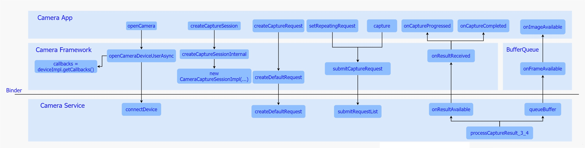

### 概览

相机应用处于整个框架的上层，在现实生活中，为了满足各式各样的应用场景，会加入很多业务处理逻辑，但是一旦当我们拨开繁杂的业务逻辑，便会发现其核心部分依然是通过调用谷歌制订的一系列Camera Api接口来完成的，而所有的相机行为都包含在该接口中。

起初，相机系统采用的是Camera Api v1接口，它通过一个Camera 类以及该类中的几个标准方法来实现整个相机系统的预览、拍照以及录像功能，控制逻辑比较简单，同时也比较容易理解，但也正是这种简单，导致了它无法逐帧控制底层硬件，无法通过元数据进行修改进而增强帧的表达能力，再加之应用场景的多样化趋势，该接口在新功能的实现上显得些许力不从心。面对该接口难以进一步扩展相机功能这一局面，谷歌在Andorid 5.0(API Level 21)便重新对Camera进行了设计，摒弃了Camera Api v1的设计逻辑，提出了一个全新的API-camera2，引入了Session以及Request概念，将控制逻辑统一成一个视图，因此在使用上更加复杂，同时也支持了更多特性，比如逐帧控制曝光、感光度以及支持Raw格式的输出等。并且由于对控制逻辑的高度抽象化，使得该接口具有很高的灵活性，可以通过简单的操作实现30fps的全高清连拍的功能，总的来说，该接口极大地提高了对于相机框架的控制能力，同时也进一步大幅度提升了其整体性能。

谷歌提出Camera Api v2接口的同时，将其具体实现放入了Camera Framework中来完成，Framework内部负责解析来自App的请求，并且通过AIDL跨进程接口下发到Camera Service中进行处理，并且等待结果的回传。接下来我们首先以Camera Api v2接口为主简单讲解下其逻辑含义，然后详细梳理下Camera Framework对于它的实现，最后以一个简单App Demo为例，来介绍下如何使用该接口来控制整个相机体系。

#### Camera Api v2

在介绍Camera Api v2之前，首先我们来回顾下Api v1接口的基本逻辑，该接口主要通过一个Camera.java类来定义了所有的控制行为，通过定义诸如open、startPreview、takePicture、AutoFocus等标准的接口来实现打开设备、预览、拍照以及对焦操作的功能，同时通过定义Camera.Parameters来实现了参数的读取与设置，其中包括了帧率、图片格式的控制，另外，通过定义了Camera.CameraInfo来实现了图像元数据的获取。而为了更加细致化地控制相机系统的Camera Api v2接口，相对于Api v1接口而言，复杂了许多，通过不同的接口类以及接口方法定义了复杂的相机系统行为，接下来我们来逐一进行介绍：

##### CameraManager

谷歌将CameraManager定义为一个系统服务，通过Context.getSystemService来获取，主要用于检测以及打开系统相机，其中打开操作通过openCamera方法来完成。除此之外，还定义了getCameraCharacteristics方法来获取当前Camera设备支持的属性信息，而该属性信息通过CameraCharacteristics来表示，其中包括了图像数据的大小以及帧率等信息。

##### CameraDevice

代表了一个被打开的系统相机，类似于Camera Api v1中的Camera类，用于创建CameraCaptureSession以及对于最后相机资源的释放。

##### CameraDevice.StateCallback

该类定义了一系列的回调方法，其实现交由App来完成，主要用于返回创建Camera设备的结果，一旦创建成功相机框架会通过回调其onOpened方法将CameraDevice实例给到App，如果失败，则调用onError返回错误信息。

##### CameraCaptureSession

该类代表了一个具体的相机会话，建立了与Camera设备的通道，而之后对于Camera 设备的控制都是通过该通道来完成的。当需要进行预览或者拍照时，首先通过该类创建一个Session，并且调用其setRepeatingRequest方法开启预览流程，或者调用capture方法开始一次拍照动作。

##### CameraCaptureSession.StateCallback

该接口类定义了一系列回调方法，其实现交由App完成，主要用于返回创建CameraCaptureSession的结果，成功则通过onConfigured方法返回一个CameraCaptureSession实例，如果失败则通过onConfigureFailed返回错误信息。

##### CameraCaptureSession.CaptureCallback

该接口类定义了一系列回调方法，用于返回来自Camera Framework的数据和事件，其中onCaptureStarted方法在下发图像需求之后立即被调用，告知App此次图像需求已经收到，onCaptureProgressed方法在产生partial metadata的时候回调，onCaptureCompleted方法在图像采集完成，上传metadata数据时被调用。

##### CaptureRequest

该类用于表示一次图像请求，在需要进行预览或者拍照时，都需要创建一个CaptureRequest，并且将针对图片的一系列诸如曝光/对焦设置参数都加入到该Request中，通过CameraCaptureSession下发到相机系统中。

##### TotalCaptureResult

每当通过CameraDevice完成了一次CaptureRequest之后会生成一个TotalCaptureResult对象，该对象包含了此次抓取动作所产生的所有信息，其中包括关于硬件模块(包括Sensor/lens/flash)的配置信息以及相机设备的状态信息等。

##### CaptureResult

该类代表了某次抓取动作最终生成的图像信息，其中包括了此次关于硬件软件的配置信息以及输出的图像数据，以及显示了当前Camera设备的状态的元数据(meta data)，该类并不保证拥有所有的图像信息。

### Camera Framework

基于接口与实现相分离的基本设计原则，谷歌通过Camera Api 接口的定义，搭建起了App与相机系统的桥梁，而具体实现便是由Camera Framework来负责完成的。在采用Camera Api v1接口的时期，该部分是通过JNI层来进行java到C++的转换，进而到达native层，而在native层会通过实现CameraClient建立与Camera Service的通讯 ，整个过程比较繁琐，使得整体框架略显繁杂，而随着Camera Api v2的提出，在该层便大量使用AIDL机制，直接在Java层建立与Camera Service的通信，进一步简化了整体框架。接下来我们以几个主要接口为主线，简单梳理下其具体实现。

##### CameraManager

实现主要在CameraManager.java中，通过CameraManager查询、获取以及打开一个Camera 设备。在该类中还实现了内部类CameraManagerGlobal，该类继承于ICameraServiceListener.Stub，在内部会获取到ICameraService远程代理，并且调用ICameraService的addListener方法将自己注册到Camera Service中，一旦Camera Service状态有所变更便会通过其实现的回调方法通知到Camera Manager服务，另外，该类在打开相机设备的时候，还通过调用ICameraService.connectDevice()方法获取到Camera Service中的CameraDevice远程代理ICameraDeviceUser对象，并且将该代理传入CameraDeviceImpl中，进而与Camera Service建立了连接。

##### CameraDeviceImpl

该类定义在CameraDeviceImpl.java文件中，继承并实现了CameraDevice接口，代表了一个相机设备，可以完成CameraCaptureSession的创建以及CaptureRequest创建等工作，内部定义了CameraDeviceCallbacks类(该类继承于ICameraDeviceCallbacks.Stub，对应于ICameraDeviceCallbacks接口)，用于接收来自Camera Service中的Camera Device的状态回调，并且内部维护着一个Camera Service 的远程ICameraDevice代理，进而可以下发图像请求到Camera Service中。

##### CameraCaptureSessionImpl

该类定义在CameraCaptureSessionImpl.java文件中，继承并实现了CameraCaptureSession接口，每一个相机设备在一个时间段中，只能创建并存在一个CameraCaptureSession，该类维护着来自实例化时传入的Surface列表，这些Surface正是包含了每一个图像请求的数据缓冲区。

其中该类包含了两种Session，一种是普通的，适用于一般情况下的会话操作，另一种是用于Reprocess流程的会话操作，该流程主要用于对于现有的图像数据进行再处理的操作。

除了以上这几个接口，还有几个接口是需要App部分进行实现的，用于返回App所需要的对象或者数据：

##### CameraDevice.StateCallback

被App端进行继承并实现，用于在调用CameraManager的openCamera方法时，通过参数的形式传入Framework，在Framework中，一旦CameraDeviceImpl创建成功便通过其中的onOpened方法将其返回给App，如果失败，便会通过其他方法返回给App错误信息。

##### CameraCaptureSession.StateCallback

被App端进行继承并实现，用于在调用CameraDevice的createCaptureSession方法时作为参数传入Framework中，一旦创建成功，Framework便会通过调用该类的onConfigured接口返回一个CameraCaptureSessionImpl的对象，如果失败，Framework会调用其onConfigureFailed方法将错误信息返回至App。

##### CameraCaptureSession.CaptureCallback

被App端进行继承并实现，App通过调用CameraCaptureSessionImpl的setRepeatingRequest或者capture方法时作为参数传入Framework，一旦Framework接收到来自CameraService的数据时，便会通过调用这个回调类将数据发送至App中。

Camera Framework 中针对几个接口的调用流程如上图，接下来我们依次进行分析：

###### a) openCamera

当用户打开相机应用时，会去调用该方法打开一个相机设备，其中该方法最终经过层层调用会调用到Camera Framework中的openCameraDeviceUserAsync方法，在该方法中主要做了三件事：

- 首先是调用其getCameraCharacteristics方法通过获取ICameraService代理来获取当前设备的属性。
- 其次是实例化了一个CameraDeviceImpl对象，并将来自App的CameraDevice.StateCallback接口存入该对象中，再将CameraDeviceImpl中的内部类CameraDeviceCallbacks对象作为参数通过ICameraService的connectDevice方法传入Camera Service去打开并获取一个ICameraDeviceUser代理，并将该代理存入CameraDeviceImpl中进行管理。
- 最后通过App传入的回调将CameraDeviceImpl返回给App使用，至此整个流程便完成了。

###### b) createCaptureSession

在打开相机设备之后便需要去创建一个相机会话，用于传输图像请求，其最终实现是调用该方法来进行实现的，而该方法会去调用到Camera Framework中的createCaptureSessionInternal方法，该方法主要做了两件事：

- 首先调用configureStreamsChecked方法来配置数据流。
- 其次实例化了一个CameraCaptureImpl对象，并通过传入CameraCaptureSession.StateCallback回调类将该对象发送至至App中。

而在configureStreamsChecked方法中会去调用ICameraDeviceUser代理的一系列方法进行数据流配置，其中调用cancelRequest方法停掉当前的的预览流程，调用deleteStream方法删除之前的数据流，调用createStream创建新的数据流，最后调用endConfigure来进行数据流的配置工作，针对性的配置便在最后这个endConfigure方法中。

###### c) createCaptureRequest

在创建并获取相机会话之后，便可以开始下发图像请求了，而在此之前，需要通过该方法来创建一个CaptureRequest，一旦调用该方法，最终会调用到Camera Service中ICameraDeviceUser的createDefaultRequest方法来创建一个默认配置的CameraMetadataNative，其次实例化一个CaptureRequest.Builder对象，并将刚才获取的CameraMetadataNative传入其中，之后返回该CaptureRequest.Builder对象，在App中，直接通过调用该Buidler对象的build方法，获取一个CaptureRequest对象。CaptureRequest对象也创建成功了，接下来需要下发图像请求了，一般常用请求分为两种,一个是预览一个是拍照。

###### d) setRepeatingRequest

App调用该方法开始预览流程，通过层层调用最终会调用到Framework中的submitCaptureRequest方法，该方法主要做了两件事：

- 首先调用CameraService层ICameraDeviceUser的submitRequestList方法，将此次Request下发到CameraService中。
- 其次将App通过参数传入的CameraCaptureSession.CaptureCallback对象存到CameraDeviceImpI对象中。

接下来看下拍照请求的处理流程：

###### e) capture

该方法最终也会调用到Framework中的submitCaptureRequest方法，接下来边和预览流程大致相同，会去调用Camera Service 中的ICameraDeviceUser的submitRequestList方法传入请求，之后将App实现的回调对象存入CameraDeviceImpl对象中。

###### f) onCaptureProgressed

一旦Request下发到Camera Service之后，当底层生成了partial metadata数据，Camera Service会调用通过调用在打开相机设备时传入的ICameraDeviceCallbacks代理，通过其onResultReceived方法将数据传回Framework，之后调用App传入的CameraCaptureSession.CaptureCallback中的onCaputreProgressed方法将结果回传至App进行解析以及后处理。

###### g) onCaptureCompleted

一旦Request下发到Camera Service之后，当底层生成了metadata数据，Camera Service会调用通过调用在打开相机设备时传入的ICameraDeviceCallbacks代理，通过其onResultReceived方法将数据传回Framework，之后调用App传入的CameraCaptureSession.CaptureCallback中的onCaputreCompleted方法将结果回传至App进行解析以及后处理。

###### h) onImageAvailable

之前已经通过两个回调接口onCaptureProgressed以及onCaptureCompleted方法将metadata上传到了App，一般情况下，图像数据会在他们之后上传，而且这个上传过程并不经过Camera Framework，而是通过BufferQueue来进行的，当Camera Service接收到底层传来的图像数据，便会立即调用processCaptureResult_3_4方法，该方法中会去调用BufferQueue中生产者角色的Surface的queueBuffer方法，将数据入队并通知消费者去消费，而此时的消费者正是App端的ImageReader，并经过一层层回调，最终会通过调用ImageReader的onImageAvailable方法，通知ImageReader去将数据取出，并做后期操作。

从上面的梳理不难发现，整个Camera Framework除了是对Camera Api v2的实现外，还承担着与Camera Service跨进程通信的任务，充当了一个位于App与Service之间的中转站的角色。

