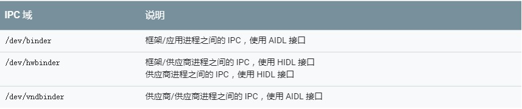
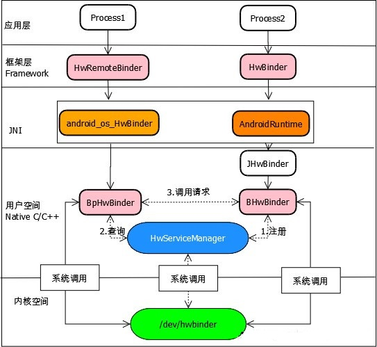
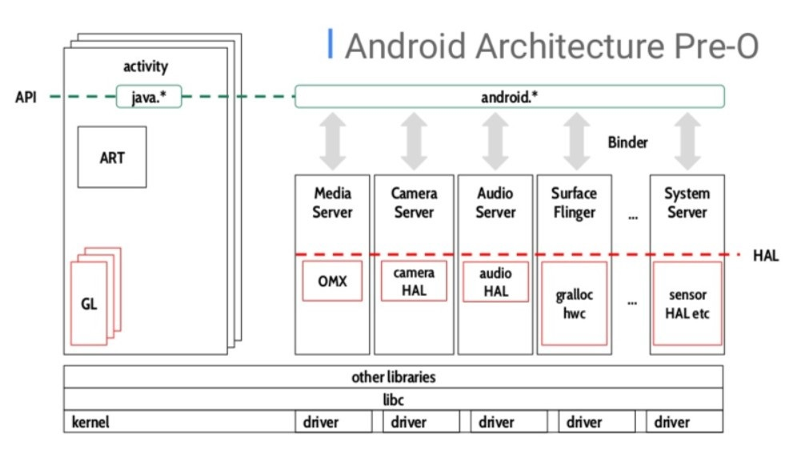
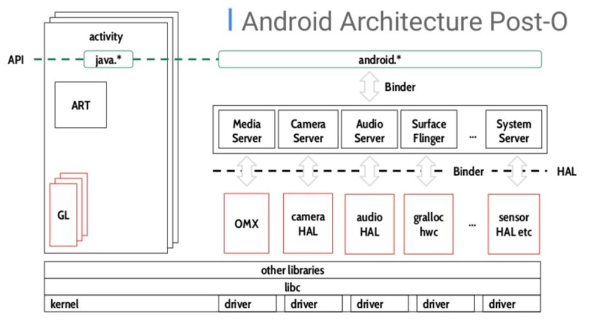
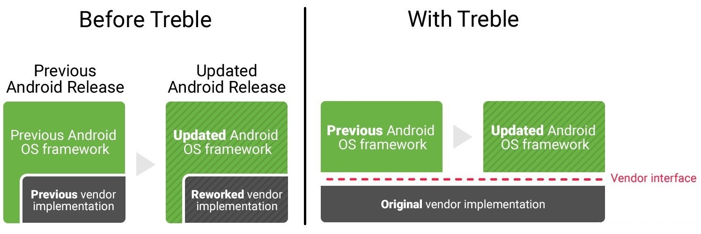
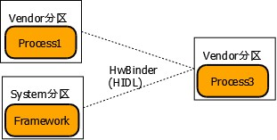
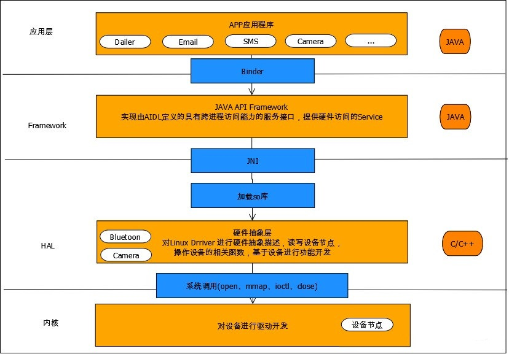
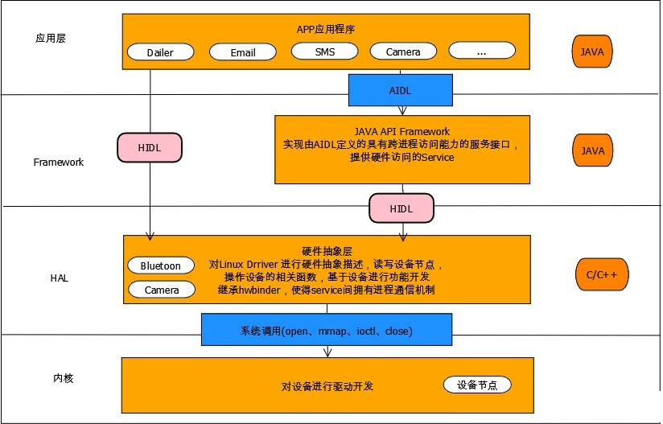

### 前言

<p style="text-indent:2em">HAL Binder是Android O(8.0)专门用于HAL(Hardware Abstract Layer)层(native)进程与其clients之间的通信机制(clients可以是native进程，也可以是Java Framework进程)。HAL Binder替代了早先使用的socket通信，其kernel层实际是基于原有的binder驱动，但为了配合Client与Server之间的数据传输，需要使用特定的中间层HIDL来进行接口与数据的转换。那么，相对之前的HAL通信方式(socket)，基于HIDL的HAL通信有什么优势？从系统架构的角度，HIDL为客户端与服务端提供了清晰的接口；从效率的角度，Binder IPC实际在传输数据上只有一次拷贝，而socket实际传输需要两次数据拷贝。


### 概述

<p style="text-indent:2em">在Android 8.0 之前，Binder机制比较简单，只有一个驱动设备"/dev/binder"，一个守护进程"/system/bin/servicemanager"，一个binder库"/system/lib64/libbinder.so"。在Android 8.0开始，Android引入了Treble的机制，为了方便Android系统的快速移植、升级，提升系统稳定性，Binder机制被拓展成了"/dev/binder", "/dev/hwbinder","/dev/vndbinder"。我们原先使用的"/dev/binder"，成为框架进程的专有节点，这意味着vendor进程无法再访问此节点。vendor进程可以访问"/dev/hwbinder"，但必须将其AIDL接口转为使用HIDL。对于想要继续在vendor进程之间使用AIDL接口的供应商，需要使用"/dev/vndbinder"(而非 /dev/binder)。Android8.0及之后的Binder域如下图所示：




### HwBinder 框架

#### Binder和HwBinder的一些差异

```
 Binder          	-> 	HwBinder
 BpProxy           	-> 	BpHwBinder
 BBinder            -> 	BHwBinder
 JavaBBinder	    -> 	JHwBinder
 BinderProxy.java	-> 	HwRemoteBinder.java
 Binder.java		-> 	HwBinder.java
```

#### HwBinder架构如下图所示：



<p style="text-indent:2em">在Android 8.0之前，Android Framework与Android HAL是打包成一个system.img的，而且Framework与HAL之间是紧耦合的，HAL是一个个的.so库，库和framework位于同一个进程。Android8.0之前的系统框架当中framework与HAL之间的一般架构框架是：




<p style="text-indent:2em">在上图的这种架构中，每次Android的Framework进行升级时，对应的HAL层都需要跟着升级，费时费力，这也Android最新版本推广较慢的原因。在Android 8.0及之后，Google觉得这也不行，每次出了新版本，但是用的人很少，得让大家快速使用新版本。于是Android引入了一个Treble的架构，把vendor的一些功能和库与system进行分离，OEM厂商设计的内容都放到vendor中去，Android原生的放到system中，这样Android只要升级system就能快速完成版本的升级，在这个场景下，Android Framework放在了System空间，厂商的HAL库放在了Vendor空间，两者之间使用hwbinder进行通信，通信的接口语言为HIDL。Android8.0及之后的系统框架当中framework与HAL之间的一般架构框架是：




<p style="text-indent:2em">下图展示了Android有Treble和没有Treble的升级方式：</p>



### Hwbinder 与Binder的区别

#### Binder

<p style="text-indent:2em">在Android 8.0之前，这是我们最熟悉也一直使用的Binder。Java层继承Binder，Native C/C++层继承Bbinder，接着通过servicemanager进程注册实名Binder，然后通过已经创建好的Binder接口传递匿名Binder对象，拿到BinderProxy或者BpBinder以后，就可以Binder通信了。在Android 8.0后，这个Binder机制继续保留，/dev/binder设备节点成为框架进程的专有节点，这意味着供应商进程无法再访问此节点。如果你是系统厂商，在system分区有进程，/dev/biner机制还是可以继续使用，但是你的进程在vendor分区，那只能使用/dev/hwbinder 或者/dev/vndbinder。 Binder机制需要两个进程都同属于System分区


#### HwBinder

<p style="text-indent:2em">hwbinder和binder不同，hwbinder是一套全新的流程，有单独的驱动设备"/dev/hwbinder"，独立的守护进程"hwservicemanager"，独立的SDK-"libhwbinder"。HwBinder机制可以跨System和Vendor分区使用




### 为什么要引入hwbinder

<p style="text-indent:2em">Android 8.0中引入了Treble机制，Treble项目通过将底层供应商实现从Android内核框架中剥离出来，使Android更新变得更简单。这种模块化的设计允许分别独立更新平台和供应商提供的组件。让更新变得更轻松、更快速，然而，Treble 加强模块化设计还有一个目的：提高安全性。Treble引入后，新增了一个vendor.img，即原先的system分区，被拆分为了system分区和vendor分区，soc及供应商的功能实现都需要放到vendor分区，这样将system和vendor相关的镜像分开，便于能方便地更新和升级system，并且不依赖vendor等底层。在Android 8.0之前，HAL是一个个的.so库，通过dlopen来进行打开，库和framework位于同一个进程， 在此之前的Android系统架构当中，Android Framework与Android HAL是打包成一个system.img的，而且Framework与HAL之间是紧耦合的，通过链接的方式使用相应的硬件相关so库。Android 8.0之前的通信机制如下图所示：</p>



<p style="text-indent:2em">所以每次Android framework的升级需要对应的Android HAL升级，这需要供应商花费很多的人力去升级相应的 Vendor HAL Implemetation，这也就是导致Android版本升级很缓慢，很多用户几年之后，Android都不能得到及时更新。在Android 8.0及以后的版本中，Android更新了新的框架设计，在新的框架设计当中，设计了一套新的机制来隔离HAL层，引入了一个HIDL的语言来定义Framework和HAL之间的接口。Android Framework会在system分区当中，而VendorHAL Implemetation会在一个新定义的分区(Vendor.img)当中，这样刷新的system.img 才不会影响到Vendor HAL Implemetation。在Android 8.0及之后，HAL库和framework不在同一个进程，他们之间使用hwbinder进行进程间通信。Android 8.0引入Treble后，各层的通信机制如下：</p>



