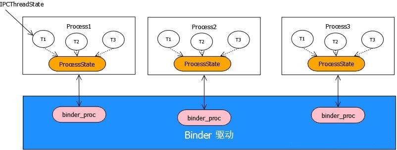

### 概述

在上一节中，我们知道了HwServiceManager的启动过程，注册、获取服务的处理细节。服务的信息都存在于一个mServiceMap的map容器中。mServiceMap对应的key为package interface名称，例如"android.hidl.manager@1.0::IServiceManager"， 对应的value为一个PackageInterfaceMap结构体，其中包含了lookup()、insertService()等方法，service的对象最终被插入到InstanceMap这个map容器中。

前面我们已经写了一个HIDL实例，来展示了Native层的服务注册和获取调用流程，但是Native层的服务注册、获取流程是如何实现的，现在还不清楚。这一节，我们深度分析Native层的HAL服务的注册和获取。

### Native层的HwBinder架构

### 重要类分析

在真正看代码前，需要先了解两个类：ProcessState和IPCThreadState，这两个很重要类的概念。

#### ProcessState

ProcessState从字面意思可以理解是表示“进程状态”代表了这个进程的行为，在Android中，每个进程都是独立的，所以每个进程都要有一个“进程状态”--ProcessState对象。一个进程中有很多个线程，不能每个线程都来new一个新的ProcessState()，在Binder通信机制中，ProcessState使用了单例模式，即一个进程只有个ProcessState对象，采用单例模式后，每个线程都可以使用同一个ProcessState来和Binder驱动通信。ProcessState作为进程状态的记录器，主要用来打开Binder驱动获取句柄，mmap申请一块(1M-8K)的内存空间，设置Binder线程最大个数。

#### IPCThreadState

IPCThreadState从字面意思可以理解是表示“进程间通信的线程状态”，有了进程状态后，自然需要有线程状态。ProcessState代表了进程，IPCThreadState代表了线程。Android系统中有很多进程，进程间相互隔离，每个进程内部又有很多线程，线程之间也是相互独立的。所以说一个进程会存在很多个线程，每个线程都有自己的“线程状态”--IPCThreadState对象。这个对象存储在线程的本地存储区(TLS:Thread local storage)中，每个线程都拥有自己的TLS，并且是私有空间，线程之间不会共享。IPCThreadState对象根据key:gTLS去进行存储。通过pthread_getspecific/pthread_setspecific函数可以获取/设置这些空间中的内容。IPCThreadState负责与Binder驱动进行数据交互。

#### BpHwBinder

BpHwBinder展开后就是Binder Proxy，也就是Binder代理的含义。BpHwBinder 是客户端用来与服务交互的代理类，负责实现跨进程传输的传输机制，不关心具体的传输内容。通信功能由其它类和函数实现，但由于这些类和函数被BpHwBinder代理，所以客户端需要通过BpHwBinder来发送Binder通信数据。

#### BHwBinder

BHwBinder代表服务端，可以理解为服务的Binder实体，当服务端从Binder驱动中读取到数据后，由BHwBinder类进行处理。

### IDemo的服务注册

#### IDemo的HIDL服务注册流程如下图所示：

#### 调用栈如下

