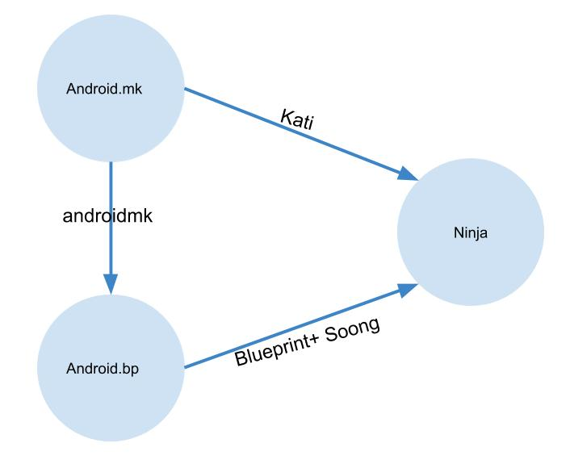
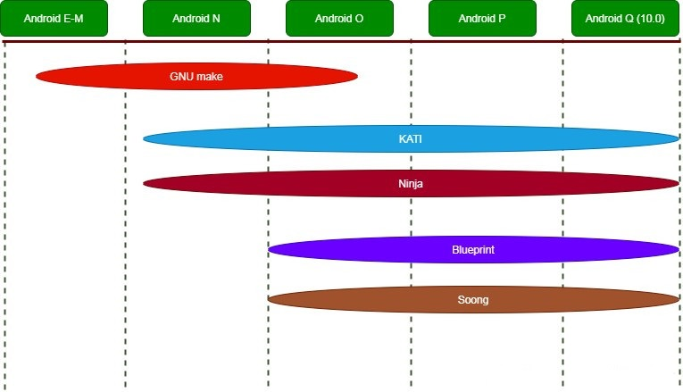
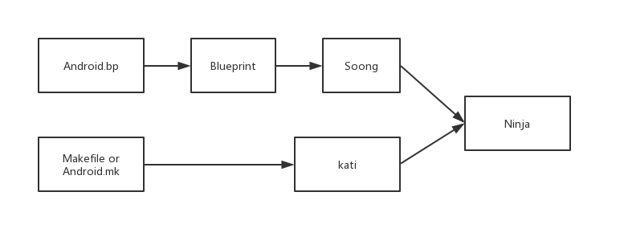
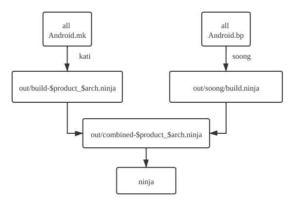
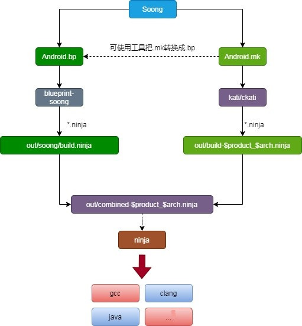
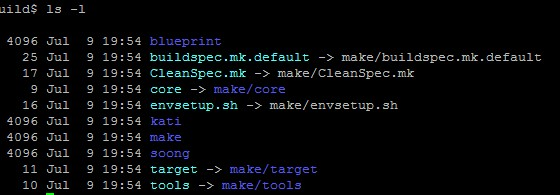
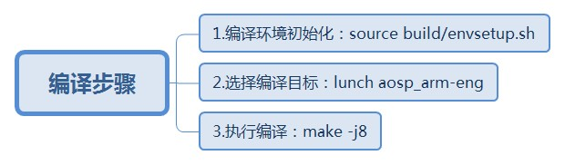
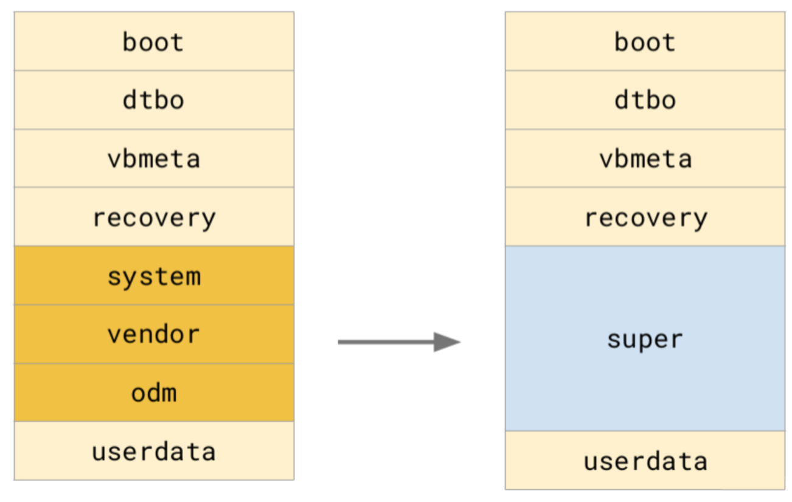
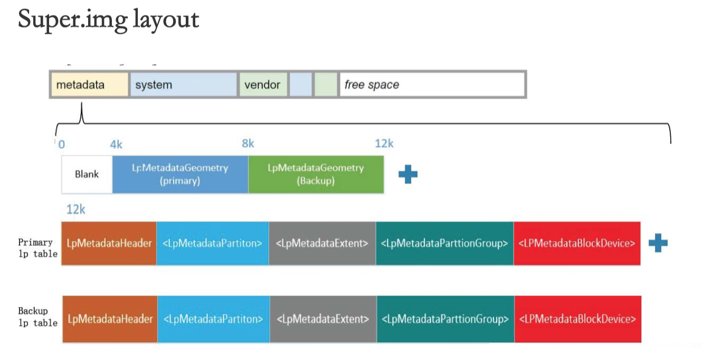
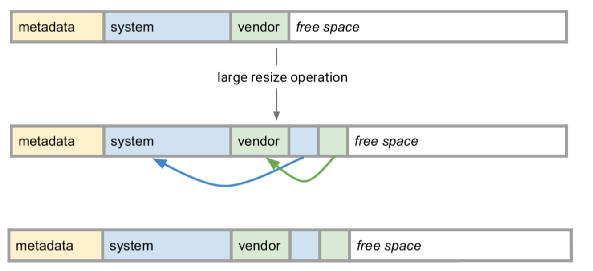

### 概述

<p style="text-indent:2em">在Android 7.0之前，Android编译系统使用GNU Make描述和shell来构建编译规则，模块定义都使用Android.mk进行定义，Android.mk的本质就是Makefile，但是随着Android的工程越来越大，包含的模块越来越多，以Makefile组织的项目编译时间越来越长。这样下去Google工程师觉得不行，得要优化。因此，在Android7.0开始，Google引入了<a href="https://ninja-build.org" style="text-decoration:none">ninja</a>编译系统来取代之前使用的make，相对于Makefile来说Ninja在大的项目管理中速度和并行方面有突出的优势。由于之前的Android.mk数据实在巨大，不可能把所有的Android.mk改写成ninja的构建规则，因此Google加入了一个kati工具，用于将Android.mk转换成ninja的构建规则文件buildxxx.ninja，再使用ninja来进行构建工作。编译速度快了一些，但是既然要干，那就干个大的，最终目标要把make都取代，于是从Android8.0开始，Google为了进一步淘汰Makefile，因此引入了Android.bp文件来替换之前的Android.mk。Android.bp只是一个纯粹的配置文件，不包括分支、循环语句等控制流程，本质上就是一个json配置文件。通过androidmk可以将Android.mk转换成Android.bp，但针对没有分支、循环等流程控制的Android.mk才有效。同时还引入Soong这个工具，Android.bp通过Blueprint+Soong转换成ninja的构建规则文件build.ninja，再使用ninja来进行构建工作。但之前的模块全部是用Android.mk来定义的，google不可能一下子把所有模块都修改成Android.bp，只能逐步替换。Android10.0上，mk和bp编译的列表可以从 \out\.module_paths中的Android.bp.list、Android.mk.list中看到，Android10.0还有400多个mk文件没有被替换完，Google任重道远。




###  Android编译演进过程：

```
Android 7.0 之前使用GNU Make
Android 7.0 引入ninja编译框架、kati转换工具。
Android 8.0 引入Android.bp和soong构建系统，默认打开Android.bp
Android 9.0 强制使用Android.bp
```

<p style="text-indent:2em">Google在Android 7.0之后，引入了Soong构建系统，旨在取代Make，它利用Kati GNU Make克隆工具和Ninja构建系统组件来加速Android的构建。Make构建系统得到了广泛的支持和使用，但在Android层面变得缓慢、容易出错、无法扩展且难以测试。Soong构建系统正好提供了Android Build所需的灵活性。



### 编译系统中Makefile、Android.mk、Ninja、Kati、Soong、Blueprint、Android.bp概念介绍

<p style="text-indent:2em"><b>Makefile </b>Android平台的编译系统其实就是用Makefile写出来的一个独立项目。它定义了编译的规则，实现了“自动化编译”，不仅把分散在数百个Git库中的代码整合起来、统一编译， 而且还把产物分门别类地输出到一个目录，打包成手机ROM，还可以生成应用开发时所使用的SDK、NDK等。因此，采用Makefile编写的编译系统，也可以称为Makefile编译系统。Makefile默认文件名为Makefile或makefile，也常用.make或.mk作为文件后缀。</p>

<p style="text-indent:2em"><b>Android.mk</b> Makefile编译系统的一部分，定义了一个模块的必要参数，使模块随着平台编译。通俗来讲就是告诉编译系统，以什么样的规则编译你的源代码，并生成对应的目标文件。</p>

<p style="text-indent:2em"><b>Ninja </b>ninja是一个编译框架，会根据相应的ninja格式的配置文件进行编译，但是ninja文件一般不会手动修改，而是通过将Android.bp文件转换成ninja格文件来编译。可以看作是一个致力于速度的小型编译系统，如果把其他的编译系统看作高级语言，那么Ninja 目标就是汇编。Ninja的默认文件名是build.ninja，其它文件以.ninja为后缀。Makefile与Ninja的区别在于, Makefile是设计来给开发编写的，而Ninja设计出来是给其它程序生成的。如果Makefile是Java语言，那么Ninja就是汇编语言。</p>

<p style="text-indent:2em"><b>Kati </b>kati是Google专为Android开发的一个基于Golang和C++的工具，主要功能是把Android中的Android.mk文件转换成Ninja文件。Makefile文件会通过kati转换为Ninja文件。代码路径是build/kati，编译后的产物是ckati。Kati代码是开源的，可以把它clone下来，简单分析下它的运行原理，在Android全编译以后，可以使用ninja来编译已经生成的.ninja文件。执行编译odex编译命令。</p>

<p style="text-indent:2em"><b>Blueprint和Soong </b>Blueprint是生成、解析Android.bp的工具，用于解析Android.bp文件翻译成Ninja语法文件，是Soong的一部分。Soong是谷歌用来替代此前的Makefile编译系统的替代品，类似于之前的Makefile编译系统的核心，Soong负责提供Android.bp文件的语义解析，并将之转换为Ninja文件。Soong还会编译生成一个androidmk命令，用于将Android.mk文件转换为Android.bp文件，不过这个转换功能仅限于没有分支、循环等流程控制的Android.mk才有效。Soong是负责Android编译而设计的工具，而Blueprint只是解析文件格式，Soong解析内容的具体含义。Blueprint负责解析Android.bp文件内容，Blueprint类似一个处理相关语法的库文件，Soong则是定义具体如何处理相应的语法以及命令实现。通俗来讲就是Soong借助于Blueprint定义的Android.bp语法，完成Android.bp的解析，最终转换成Ninja文件。Blueprint和Soong都是由Golang写的项目，从Android 7.0，prebuilts/go/目录下新增Golang所需的运行环境，在编译时使用。因为Soong和Blueprint是Google为Android.bp特别定制的工具，所以不要摘出来单独来操作。</p>

<p style="text-indent:2em"><b>Android.bp </b>Android.bp的出现就是为了替换Android.mk文件。bp跟mk文件不同，它是纯粹的配置，没有分支、循环等流程控制，不能做算术逻辑运算。如果需要控制逻辑，那么只能通过Go语言编写。
编译android源码后，androidmk工具会生成在：out/soong/host/linux-x86/bin目录下，用于Android.mk转换成Android.bp使用。</p>

<p style="text-indent:2em"><b>Android.mk、Ninja、Soong、Blueprint、kati、Android.bp的概念之间的联系为：</b></p>



<p style="text-indent:2em">在编译过程中，Android.bp会被收集到out/soong/build.ninja.d，blueprint以此为基础，生成out/soong/build.ninja，Android.mk会由kati/ckati生成为out/build-aosp_arm.ninja，两个ninja文件会被整合进入out/combined-aosp_arm.ninja。</p>



**out/combined-aosp_arm.ninja内容如下所示：**

```
builddir = out
include out/build-aosp_arm.ninja
include out/soong/build.ninja
build out/combined-aosp_arm.ninja: phony out/soong/build.ninja
```

### Soong构建系统

#### Soong构建系统家族成员及各自关系如下图所示：



<p style="text-indent:2em">Android的编译目录在/build 中，看一下Android 10.0源码中的build目录，现在是这个样子：</p>



<p style="text-indent:2em">这个目录中可以看到core文件夹被link到了make/core，envsetup.sh被link到make/envsetup.sh，这主要是为了对使用者屏蔽切换编译系统的差异。这里重点看四个文件夹：blueprint、kati、make、soong：</p>

```
blueprint：用于处理Android.bp，编译生成*.ninja文件，用于做ninja的处理
kati：用于处理Android.mk，编译生成.ninja文件，用于做ninja的处理
soong：构建系统，核心编译为soong_ui.bash
make：文件夹还是原始的make那一套流程，比如envsetup.sh
```

### 编译源码的方式

<p style="text-indent:2em">Androd系统源码编译有很多种方式，主要有以下几种：</p>

- 在Linux中直接进行系统源码编译(Android官方支持)
- 在Mac OS中直接进行系统源码编译(Android官方支持)
- 使用[Docker](https://www.docker.com/products)编译，支持Mac OS和Windows。

<p style="text-indent:2em">其中需要注意的是，Docker的最低支持版本为Windows7，建议用Windows10环境下使用Docker，因为在Windows7种还需要借助Docker Toolbox和VirtualBox中的容器进行通信，效率相对低些。</p>

### 环境搭建

1. 下载依赖包

```bash
sudo apt install git-core gnupg flex bison gperf build-essential zip curl zlib1g-dev gcc-multilib g++-multilib libc6-dev-i386 lib32ncurses5-dev x11proto-core-dev libx11-dev lib32z-dev ccache libgl1-mesa-dev libxml2-utils xsltproc unzip m4 libssl-dev libswitch-perl
```

2. Java环境配置

```bash
# 安装 jdk8
sudo apt-get update
sudo apt-get install openjdk-8-jdk
# 编译源码的时候可能需要切换jdk
sudo update-alternatives --config java
sudo update-alternatives --config javac
# 如果没有将jdk路径添加进系统，需要先添加。
sudo update-alternatives --install /usr/bin/java java ~/tools/java/jdk1.6.0_45/bin/java 700
sudo update-alternatives --install /usr/bin/javac javac ~/tools/java/jdk1.6.0_45/bin/javac 700
sudo update-alternatives --install /usr/bin/jar jar ~/tools/java/jdk1.6.0_45/bin/jar 700
# 这里的700是优先级， ~/tools/java/jdk1.6.0_45/bin是自己安装jdk的目录
```

3. 配置ccache

<p style="text-indent:2em">ccache是一个编译cache系统，可以加快c/c++代码编译的速度(编译过一次之后)。有ccache的情况下，整个android编译的时间从超过1个小时下降到约半个小时。配置方法见android网站说明：https://source.android.com/source/initializing.html#optimizing-a-build-environment
    上述配置对kernel代码无效。kernel编译使用ccache请参考下述文章：https://apuroth.gitbooks.io/android-study/content/20160701.html</p>

```bash
# 编译安卓P、Q启用ccache方法：
sudo apt install ccache
vim ~/.bashrc
export USE_CCACHE=1
source ~/.bashrc
ccache -M 100G
# 缓存数据默认保持在~/.ccache，上一行指令可以自己设置缓存的最大值。
```

### 编译

#### 源码整编

<p style="text-indent:2em">整编就是编译整个Android源码，整编主要有三个步骤，下面分别就行介绍。




```bash
source build/envsetup.sh   # 初始化编译环境
lunch aosp_arm-eng         # 或者 m PRODUCT-aosp_x86_64-eng，Android 10.0不一定需要lunch命令
make -j8                   # 编译模块也可以直接用 m libart
```

1. ##### 初始化环境

<p style="text-indent:2em">在AOSP的根目录，输入如下的命令,使用build目录中的envsetup.sh脚本初始化环境，这个脚本会引入其他的执行脚本。</p>

```bash
source build/envsetup.sh
// 编译前删除build文件夹out
make clobber
```

2. ##### 选择编译目标

<p style="text-indent:2em">输入命令：</p>

```bash
lunch
```

<p style="text-indent:2em">lunch命令是envsetup.sh里定义的一个命令，用来让用户选择编译目标。会有以下信息输出：</p>

```
You're building on Linux

Lunch menu... pick a combo:
     1. aosp_arm-eng
     2. aosp_arm64-eng
     3. aosp_blueline-userdebug
     4. aosp_blueline_car-userdebug
     5. aosp_bonito-userdebug
     6. aosp_bonito_car-userdebug
     7. aosp_bramble-userdebug
     8. aosp_car_arm-userdebug
     9. aosp_car_arm64-userdebug
     10. aosp_car_x86-userdebug
     11. aosp_car_x86_64-userdebug
     12. aosp_cf_arm64_auto-userdebug
     13. aosp_cf_arm64_phone-userdebug
     14. aosp_cf_x86_64_pc-userdebug
     15. aosp_cf_x86_64_phone-userdebug
     16. aosp_cf_x86_auto-userdebug
     17. aosp_cf_x86_phone-userdebug
     18. aosp_cf_x86_tv-userdebug
     19. aosp_coral-userdebug
     20. aosp_coral_car-userdebug
     21. aosp_crosshatch-userdebug
     22. aosp_crosshatch_car-userdebug
     23. aosp_flame-userdebug
     24. aosp_flame_car-userdebug
     25. aosp_redfin-userdebug
     26. aosp_sargo-userdebug
     27. aosp_sunfish-userdebug
     28. aosp_trout_arm64-userdebug
     29. aosp_trout_x86-userdebug
     30. aosp_x86-eng
     31. aosp_x86_64-eng
     32. arm_krait-eng
     33. arm_v7_v8-eng
     34. armv8-eng
     35. armv8_cortex_a55-eng
     36. armv8_kryo385-eng
     37. beagle_x15-userdebug
     38. beagle_x15_auto-userdebug
     39. car_x86_64-userdebug
     40. db845c-userdebug
     41. fuchsia_arm64-eng
     42. fuchsia_x86_64-eng
     43. hikey-userdebug
     44. hikey64_only-userdebug
     45. hikey960-userdebug
     46. hikey960_tv-userdebug
     47. hikey_tv-userdebug
     48. pixel3_mainline-userdebug
     49. poplar-eng
     50. poplar-user
     51. poplar-userdebug
     52. qemu_trusty_arm64-userdebug
     53. silvermont-eng
     54. uml-userdebug
     55. yukawa-userdebug
     56. yukawa_sei510-userdebug

Which would you like? [aosp_arm-eng]
```

<p style="text-indent:2em">意思就是要你选择编译目标的格式，编译目标的格式组成为BUILD-BUILDTYPE，比如 aosp_arm-eng 的BUILD为aosp_arm，BUILDTYPE为eng。其中BUILD表示编译出的镜像可以运行在什么环境，aosp代表Android开源项目，arm表示系统是运行在arm架构的处理器上。
    更多参考<a href=https://source.android.google.cn/source/running.html#selecting-device-build>官方文档</a>。BUILDTYPE 指的是编译类型，有以下三种：</p>


```
- user：用来正式发布到市场的版本，权限受限，如没有 root 权限，不能 dedug，adb默认处于停用状态。
- userdebug：在user版本的基础上开放了 root 权限和 debug 权限，adb默认处于启用状态。一般用于调试真机。
- eng：开发工程师的版本，拥有最大的权限(root等)，具有额外调试工具的开发配置。一般用于模拟器。
```

<p style="text-indent:2em">如果没有Nexus设备，只想编译完后运行在模拟器查看，那么BUILD可以选择aosp_x86，BUILDTYPE选择eng，Which would you like? [aosp_arm-eng] 后面直接输入对应序号30就可以了。也可以直接指定编译的目标或者序号(不同的系统版本，序号的对应会有差别，建议不要直接用序号）：


```bash
lunch aosp_x86-eng
# or
lunch 30
```

3. ##### 开始编译

```bash
make -j12  2>&1 | tee build.log
```

<p style="text-indent:2em">通过-jN参数来设置编译的并行任务数，以提高编译速度，这里N值最好选在核数到2倍核数之间。编译成功后会在 out/target/product/generic_x86/目录生成了三个重要的镜像文件： system.img、userdata.img、ramdisk.img。大概介绍着三个镜像文件：</p>

```
- system.img：系统镜像,里面包含了Android系统主要的目录和文件,通过init.c进行解析并mount挂载到/system目录下。
- userdata.img：用户镜像,是Android系统中存放用户数据的,通过init.c进行解析并mount挂载到/data目录下。
- ramdisk.img：根文件系统镜像,包含一些启动Android系统的重要文件，比如init.rc。
```

4. ##### 运行模拟器

<p style="text-indent:2em">在编译完成之后,就可以通过以下命令运行Android虚拟机了，命令如下:


```bash
# 如果是在编译完后运行虚拟机，由于之前已经执行过source和lunch命令了，可以直接运行：
emulator
# 
source build/envsetup.sh
lunch 30
emulator
```

#### 源码单编

- make命令来进行编译

```bash
source build/envsetup.sh

# 编译 system.img
lunch qssi-userdebug
make <system related images>
#编译除system.img外的其他img
lunch xx-userdebug
make <non-system images>
```

- 高通提供的build.sh脚本进行编译

```bash
# 编译所有img，包括system和其它img
source build/envsetup.sh
lunch XX-userdebug
./build.sh dist -j32
# 编译system.img，产物在qssi目录下
source build/envsetup.sh
lunch xx-userdebug
./build.sh dist qssi_only -j32
# 编译super.img
source build/envsetup.sh
lunch xx-userdebug
./build.sh dist merge_only -j32
# 编译其它img，例如vendorimage，如果不指定会编译其它所有img，产物在XX目录下
source build/envsetup.sh
lunch xx-userdebug
./build.sh vendorimage dist target_only -j32
```

- 动态分区刷机的方法

  <p style="text-indent:2em">Q版本将system和vendor分区合并为super分区，无法通过adb reboot bootloader模式单独刷动态分区里面的img，例如system,vendor,product,odm，只能刷super.img和其他的。但是fastboot模式下可以单独刷动态分区里面的img，推荐进入fastboot模式刷机:</p>

```bash
adb reboot fastboot
fastboot getvar is-userspace
# is-userspace: yes
# Finished. Total time: 0.002s
fastboot flash vendor vendor.img
fastboot flash system system.img
fastboot flash vbmeta vbmeta.img
fastboot flash vbmeta_system vbmeta_system.img
# fastbootd是用户空间的代码，因为动态的逻辑分区只能在应用空间识别

# fastboot刷机出现权限问题，需要将fastboot的所有者属性改成root
sudo chown root:root fastboot
sudo chmod +s fastboot
```

- 动态分区

  <p style="text-indent:2em">编译包中，我们找不到了对应的system,vendor等img文件，但是多了一个super.img，system,vendor,product,odm合并为super分区，这个就是动态分区了。Google在android Q中加入了动态分区，为了在OTA的时候能够灵活创建分区和修改分区大小，将system,vendor,odm,product合并成super分区，并在super分区上预留出一定量的free space，这样就可以动态调整这些分区的大小，解决了OTA的时候分区不足，以及调整分区的风险。</p>

  

  

  <p style="text-indent:2em">当ota升级之后，需要重新调整分区大小：</p>

  

- qssi(Qualcomm Single System Image)

  <p style="text-indent:2em">为了配合project treble，将系统与odm相关的解耦，需要单独编译system.img和其他img。而编译system image的时候需要lunch qssi，而编译其他分区的时候需要lunch target。引入qssi为解决Android碎片化问题，把system.img和vendor.img进一步拆分。</p>


