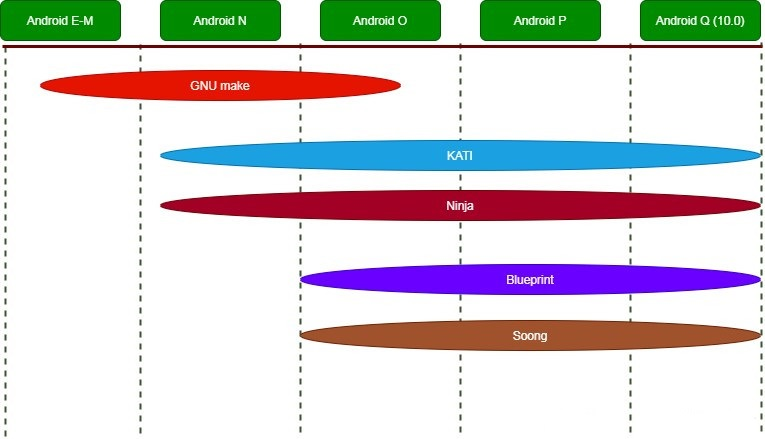
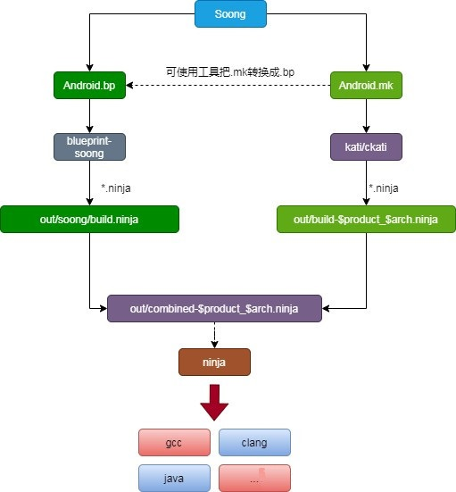
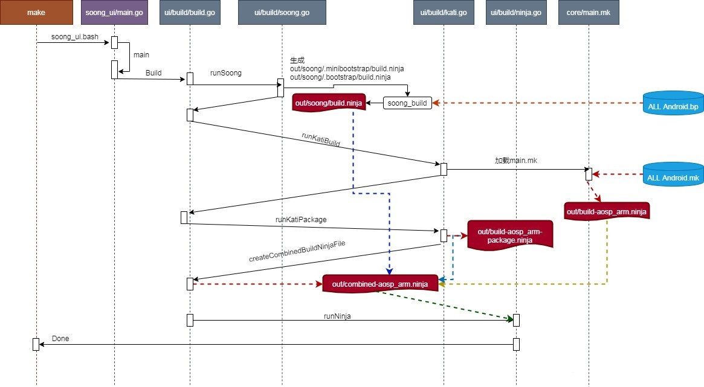
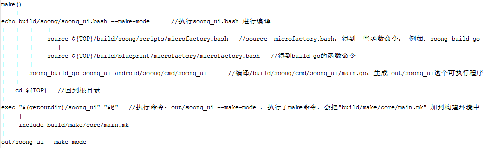

### 概述

<p style="text-indent:2em">上一节，我们理清了编译环境初始化的过程，环境变量已经加载，并配置了编译目标，接下来执行一个make命令我们就能够进行编译。这一节，我们探讨输入 make 之后是怎么完成编译的。</p>

### Android系统的编译历程

<p style="text-indent:2em">Google在Android 7.0之后，引入了Soong构建系统，旨在取代 GNU Make的编译，它利用Kati GNU Make克隆工具和Ninja构建系统组件来加速Android的构建。Make构建系统得到了广泛的支持和使用，但在Android层面变得缓慢、容易出错、无法扩展且难以测试。Soong构建系统正好提供了Android Build所需的灵活性。因此在Android10.0 上，make执行后，我们走的是soong构建环境。</p>



### Soong编译系统家族成员

<p style="text-indent:2em"> 从下图可知，mk文件被编译成了out/build-aosp_arm.ninja和out/build-aosp_arm-package.ninja，bp文件被编译成了out/soong/build.ninja，这三个ninja文件又被合并成out/combined-aosp_arm.ninja，最终通过ninja工具来编译out/combined-aosp_arm.ninja完成最终的编译。</p>



### make的流程图

<p style="text-indent:2em">soong构建的流程图如下图所示：</p>



### make()

<p style="text-indent:2em">执行完make命令后，会调用envsetup.sh的make()函数进行处理。</p>

```bash
function make()
{
    _wrap_build $(get_make_command "$@") "$@"
}
```

<p style="text-indent:2em">从get_make_command()可以看出，make后，真正然后执行<b>编译的入口是：build/soong/soong_ui.bash</b></p>

```bash
function get_make_command()
{
    # If we're in the top of an Android tree, use soong_ui.bash instead of make
    if [ -f build/soong/soong_ui.bash ]; then
        # Always use the real make if -C is passed in
        for arg in "$@"; do
            if [[ $arg == -C* ]]; then
                echo command make
                return
            fi
        done
        echo build/soong/soong_ui.bash --make-mode
    else
        echo command make
    fi
}
```

### soong_ui.bash

#### soong_ui.bash调用栈



#### soong_ui.bash执行过程：

1. source  microfactory.bash，得到一些函数命令， 例如：soong_build_go
2. 编译/build/soong/cmd/soong_ui/main.go，生成 out/soong_ui这个可执行程序
3. 执行命令：out/soong_ui --make-mode ，执行了make命令，会把"build/make/core/main.mk" 加到构建环境中，同
4. 启动kati、blueprint-soong、ninja的编译。

<p style="text-indent:2em">接下来根据调用栈的流程，来详细分析编译的过程。</p>

