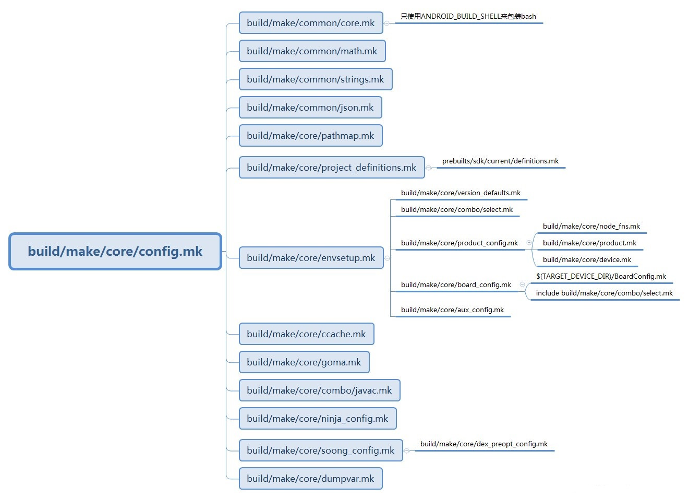

### 概述

<p style="text-indent:2em">上一节针对Android编译系统做了一个笼统的说明，这一节针对编译环境初始化做一下详细的展示。</p>

### 初始化命令介绍

```bash
# 初始化命令：
source build/envsetup.sh
```

<p style="text-indent:2em">envsetup.sh 构建代码：</p>

```bash
  ...						# 1
  validate_current_shell      # 2
  source_vendorsetup          # 3 
  addcompletions              # 4
```

<p style="text-indent:2em">envsetup.sh主要做了下面几个事情：</p>


#### hmm 查看支持接口

<p style="text-indent:2em"> 输入hmm可以看到envsetup支持的一些接口：</p>

| 命令       | 说明                                                         |
| ---------- | ------------------------------------------------------------ |
| lunch      | lunch <product_name>-<build_variant></br>选择<product_name>作为要构建的产品，<build_variant>作为要构建的变体，并将这些选择存储在环境中，以便后续调用“m”等读取。 |
| tapas      | 交互方式：tapas [&ltApp1&gt &ltApp2&gt ...] [arm\|x86\|mips\|arm64\|x86_64\|mips64] [eng\|userdebug\|user]</br>设置构建解绑定应用程序(APKs)的构建环境。 |
| banchan    | 交互方式：banchan &ltmodule1&gt [&ltmodule2&gt ...] [arm\|x86\|arm64\|x86_64] [eng\|userdebug\|user] |
| croot      | 将目录更改到树的顶部或其子目录。                             |
| m          | 编译整个源码，可以不用切换到根目录                           |
| mm         | 编译当前目录下的源码，不包含他们的依赖模块                   |
| mmm        | 编译指定目录下的所有模块，不包含他们的依赖模块.例如：</br>mmm dir/:target1,target2. |
| mma        | 编译当前目录下的源码，包含他们的依赖模块                     |
| mmma       | 编译指定目录下的所模块，包含他们的依赖模块                   |
| provision  | 具有所有必需分区的闪存设备。选项将传递给fastboot。           |
| cgrep      | 对系统本地所有的C/C++文件执行grep命令                        |
| ggrep      | 对系统本地所有的Gradle文件执行grep命令                       |
| gogrep     | 对系统本地所有的Go文件执行grep命令                           |
| jgrep      | 对系统本地所有的Java文件执行grep命令                         |
| ktgrep     | 对系统本地所有的Kotlin文件执行grep命令                       |
| resgrep    | 对系统本地所有的res目录下的xml文件执行grep命令               |
| mangrep    | 对系统本地所有的AndroidManifest.xml文件执行grep命令          |
| mgrep      | 对系统本地所有的Makefiles文件和*.bp文件执行grep命令          |
| owngrep    | 对系统本地所有的OWNERS文件执行grep命令                       |
| rsgrep     | 对系统本地所有的source文件执行grep命令                       |
| sepgrep    | 对系统本地所有的Rust文件执行grep命令                         |
| sgrep      | 对系统本地所有的source文件执行grep命令                       |
| godir      | 根据godir后的参数文件名在整个目录下查找，并且切换目录        |
| allmod     | 列出所有模块                                                 |
| gomod      | 转到包含模块的目录                                           |
| pathmod    | 获取包含模块的目录                                           |
| outmod     | 获取具有特定扩展名的模块的已安装输出的位置。                 |
| dirmods    | 获取在给定目录中定义的模块。                                 |
| installmod | Adb安装模块构建的APK。                                       |
| refreshmod | 刷新allmod/gomod/pathmod/outmod/installmod的模块列表         |
| syswrite   | 将分区(例如system.img)重新挂载为可写分区，必要时重新启动。   |

#### validate_current_shell

<p style="text-indent:2em"> 确定当前的shell环境，建立shell命令</p>

```bash
function validate_current_shell() {
    local current_sh="$(ps -o command -p $$)"
    case "$current_sh" in
        *bash*)
            function check_type() { type -t "$1"; }
            ;;
        *zsh*)
            function check_type() { type "$1"; }
            enable_zsh_completion ;;
        *)
            echo -e "WARNING: Only bash and zsh are supported.\nUse of other shell would lead to erroneous results."
            ;;
    esac
}
```

#### source_vendorsetup

<p style="text-indent:2em"> 从device\vendor\product等目录遍历搜索vendorsetup.sh,并source进来</p>

```bash
# Execute the contents of any vendorsetup.sh files we can find.
# Unless we find an allowed-vendorsetup_sh-files file, in which case we'll only
# load those.
#
# This allows loading only approved vendorsetup.sh files
function source_vendorsetup() {
    unset VENDOR_PYTHONPATH
    local T="$(gettop)"
    allowed=
    for f in $(cd "$T" && find -L device vendor product -maxdepth 4 -name 'allowed-vendorsetup_sh-files' 2>/dev/null | sort); do
        if [ -n "$allowed" ]; then
            echo "More than one 'allowed_vendorsetup_sh-files' file found, not including any vendorsetup.sh files:"
            echo "  $allowed"
            echo "  $f"
            return
        fi
        allowed="$T/$f"
    done

    allowed_files=
    [ -n "$allowed" ] && allowed_files=$(cat "$allowed")
    for dir in device vendor product; do
        for f in $(cd "$T" && test -d $dir && \
            find -L $dir -maxdepth 4 -name 'vendorsetup.sh' 2>/dev/null | sort); do

            if [[ -z "$allowed" || "$allowed_files" =~ $f ]]; then
                echo "including $f"; . "$T/$f"
            else
                echo "ignoring $f, not in $allowed"
            fi
        done
    done
}
```

```bash
# 例：
# 	1.建立一个目录：/vendor/luojianwei/build
# 	2.创建一个vendorsetup.sh
#   	写一个log: echo "vendor build test."
# 	3.执行source build/envsetup.sh
. build/envsetup.sh
# source后打印：
# including vendor/luojianwei/build/vendorsetup.sh
# vendor build test.
```

#### addcompletions

```bash
function addcompletions()
{
    local f=

    # Keep us from trying to run in something that's neither bash nor zsh.
    if [ -z "$BASH_VERSION" -a -z "$ZSH_VERSION" ]; then
        return
    fi

    # Keep us from trying to run in bash that's too old.
    if [ -n "$BASH_VERSION" -a ${BASH_VERSINFO[0]} -lt 3 ]; then
        return
    fi

    local completion_files=(
      system/core/adb/adb.bash
      system/core/fastboot/fastboot.bash
      tools/asuite/asuite.sh
    )
    # Completion can be disabled selectively to allow users to use non-standard completion.
    # e.g.
    # ENVSETUP_NO_COMPLETION=adb # -> disable adb completion
    # ENVSETUP_NO_COMPLETION=adb:bit # -> disable adb and bit completion
    for f in ${completion_files[*]}; do
        if [ -f "$f" ] && should_add_completion "$f"; then
            . $f
        fi
    done

    if should_add_completion bit ; then
        complete -C "bit --tab" bit
    fi
    if [ -z "$ZSH_VERSION" ]; then
        # Doesn't work in zsh.
        complete -o nospace -F _croot croot
    fi
    complete -F _lunch lunch

    complete -F _complete_android_module_names pathmod
    complete -F _complete_android_module_names gomod
    complete -F _complete_android_module_names outmod
    complete -F _complete_android_module_names installmod
    complete -F _complete_android_module_names m
}
```

### lunch aosp_arm_eng

#### lunch说明

<p style="text-indent:2em"> 环境变量初始化完成后，我们需要选择一个编译目标。lunch 主要作用是根据用户输入或者选择的产品名来设置与具体产品相关的环境变量。如果你不知道想要编译的目标是什么，直接执行一个lunch命令，会列出所有的目标，直接回车，会默认使用aosp_arm-eng这个目标。</p>

```bash
You're building on Linux

Lunch menu... pick a combo:
     1. aosp_arm-eng
     2. aosp_arm64-eng
     3. aosp_blueline-userdebug
     4. aosp_blueline_car-userdebug
     5. aosp_bonito-userdebug
     6. aosp_bonito_car-userdebug
     7. aosp_bramble-userdebug
     8. aosp_car_arm-userdebug
     9. aosp_car_arm64-userdebug
     10. aosp_car_x86-userdebug
     11. aosp_car_x86_64-userdebug
     12. aosp_cf_arm64_auto-userdebug
     13. aosp_cf_arm64_phone-userdebug
     14. aosp_cf_x86_64_pc-userdebug
     15. aosp_cf_x86_64_phone-userdebug
     16. aosp_cf_x86_auto-userdebug
     17. aosp_cf_x86_phone-userdebug
     18. aosp_cf_x86_tv-userdebug
     19. aosp_coral-userdebug
     20. aosp_coral_car-userdebug
     21. aosp_crosshatch-userdebug
     22. aosp_crosshatch_car-userdebug
     23. aosp_flame-userdebug
     24. aosp_flame_car-userdebug
     25. aosp_redfin-userdebug
     26. aosp_sargo-userdebug
     27. aosp_sunfish-userdebug
     28. aosp_trout_arm64-userdebug
     29. aosp_trout_x86-userdebug
     30. aosp_x86-eng
     31. aosp_x86_64-eng
     32. arm_krait-eng
     33. arm_v7_v8-eng
     34. armv8-eng
     35. armv8_cortex_a55-eng
     36. armv8_kryo385-eng
     37. beagle_x15-userdebug
     38. beagle_x15_auto-userdebug
     39. car_x86_64-userdebug
     40. db845c-userdebug
     41. fuchsia_arm64-eng
     42. fuchsia_x86_64-eng
     43. hikey-userdebug
     44. hikey64_only-userdebug
     45. hikey960-userdebug
     46. hikey960_tv-userdebug
     47. hikey_tv-userdebug
     48. pixel3_mainline-userdebug
     49. poplar-eng
     50. poplar-user
     51. poplar-userdebug
     52. qemu_trusty_arm64-userdebug
     53. silvermont-eng
     54. uml-userdebug
     55. yukawa-userdebug
     56. yukawa_sei510-userdebug

Which would you like? [aosp_arm-eng]
```

<p style="text-indent:2em"> 执行命令：lunch 1， 可以看到配置的一些环境变量。</p>

```bash
============================================
PLATFORM_VERSION_CODENAME=S
PLATFORM_VERSION=S
TARGET_PRODUCT=aosp_arm
TARGET_BUILD_VARIANT=eng
TARGET_BUILD_TYPE=release
TARGET_ARCH=arm
TARGET_ARCH_VARIANT=armv7-a-neon
TARGET_CPU_VARIANT=generic
HOST_ARCH=x86_64
HOST_2ND_ARCH=x86
HOST_OS=linux
HOST_OS_EXTRA=Linux-4.4.0-186-generic-x86_64-Ubuntu-16.04.7-LTS
HOST_CROSS_OS=windows
HOST_CROSS_ARCH=x86
HOST_CROSS_2ND_ARCH=x86_64
HOST_BUILD_TYPE=release
BUILD_ID=AOSP.MASTER
OUT_DIR=out
PRODUCT_SOONG_NAMESPACES=device/generic/goldfish device/generic/goldfish-opengl hardware/google/camera hardware/google/camera/devices/EmulatedCamera device/generic/goldfish device/generic/goldfish-opengl
============================================
```

<p style="text-indent:2em"> 这些环境变量的含义如下：</p>

| lunch结果                                                    | 说明                                 |
| ------------------------------------------------------------ | ------------------------------------ |
| PLATFORM_VERSION_CODENAME=S                                  | 表示平台版本的名称                   |
| PLATFORM_VERSION=S                                           | Android平台的版本号                  |
| TARGET_PRODUCT=aosp_arm                                      | 所编译的产品名称                     |
| TARGET_BUILD_VARIANT=userdebug                               | 所编译产品的类型                     |
| TARGET_BUILD_TYPE=release                                    | 编译的类型，debug和release           |
| TARGET_ARCH=arm                                              | 表示编译目标的CPU架构                |
| ARGET_ARCH_VARIANT=armv7-a-neon                              | 表示编译目标的CPU架构版本            |
| TARGET_CPU_VARIANT=generic                                   | 表示编译目标的CPU代号                |
| HOST_ARCH=x86_64                                             | 表示编译平台的架构                   |
| HOST_2ND_ARCH=x86                                            |                                      |
| HOST_OS=linux                                                | 表示编译平台的操作系统               |
| HOST_OS_EXTRA=Linux-4.4.0-186-generic-x86_64-Ubuntu-16.04.7-LTS | 编译系统之外的额外信息               |
| HOST_CROSS_OS=windows                                        |                                      |
| HOST_CROSS_ARCH=x86                                          |                                      |
| HOST_CROSS_2ND_ARCH=x86_64                                   |                                      |
| HOST_BUILD_TYPE=release                                      |                                      |
| BUILD_ID=AOSP.MASTER                                         | BUILD_ID会出现在版本信息中，可以利用 |
| OUT_DIR                                                      |                                      |
| PRODUCT_SOONG_NAMESPACES                                     |                                      |

<p style="text-indent:2em"> lunch aosp_arm-eng 结束后，后创建一个out文件夹，生成一些中间文件。</p>

#### lunch()

<p style="text-indent:2em"> lunch命令用来设置 TARGET_PRODUCT、TARGET_BUILD_VARIANT、TARGET_PLATFORM_VERSION、TARGET_BUILD_TYPE、TARGET_BUILD_APPS等环境变量。lunch操作流程如下：</p>

```
1.获取lunch操作的参数，如果参数不为空，参数则为指定要编译的设备型号和编译类型；如果参数为空，会调用print_lunch_menu来显示Lunch菜单项，读取用户的输入，存入answer
2.如果answer为空，即之前在lunch菜单中用户只敲了一个回车。会将默认选项改为aosp_arm-eng，结果存入selection
3.如果lunch操作得到的输入是数字，则将数字转换为LUNCH_MENU_CHOICES中的字符串，结果存入selection
4.解析selection的值，得到 product = aosp_arm 和 variant = eng, 把他们分别保存到 TARGET_PRODUCT 和 TARGET_BUILD_VARIANT 中
5.根据前面的设置，调用build_build_var_cache 来更新编译环境相关变量
6.export 编译选项TARGET_PRODUCT, TARGET_BUILD_VARIANT和TARGET_BUILD_TYPE三元组
7.调用set_stuff_for_environment 来设置其他环境变量，如PROMPT_COMMAND，编译toolchain和tools相关的路径等
8.调用printconfig 来输出当前的设置选项
```

```bash
function lunch()
{
    local answer

    if [[ $# -gt 1 ]]; then
        echo "usage: lunch [target]" >&2
        return 1
    fi

    if [ "$1" ]; then
        answer=$1
    else
        print_lunch_menu
        echo -n "Which would you like? [aosp_arm-eng] "
        read answer
    fi

    local selection=

    if [ -z "$answer" ]
    then
        selection=aosp_arm-eng
    elif (echo -n $answer | grep -q -e "^[0-9][0-9]*$")
    then
        local choices=($(TARGET_BUILD_APPS= get_build_var COMMON_LUNCH_CHOICES))
        if [ $answer -le ${#choices[@]} ]
        then
            # array in zsh starts from 1 instead of 0.
            if [ -n "$ZSH_VERSION" ]
            then
                selection=${choices[$(($answer))]}
            else
                selection=${choices[$(($answer-1))]}
            fi
        fi
    else
        selection=$answer
    fi

    export TARGET_BUILD_APPS=

    local product variant_and_version variant version
    product=${selection%%-*} # Trim everything after first dash
    variant_and_version=${selection#*-} # Trim everything up to first dash
    if [ "$variant_and_version" != "$selection" ]; then
        variant=${variant_and_version%%-*}
        if [ "$variant" != "$variant_and_version" ]; then
            version=${variant_and_version#*-}
        fi
    fi

    if [ -z "$product" ]
    then
        echo
        echo "Invalid lunch combo: $selection"
        return 1
    fi

    TARGET_PRODUCT=$product \
    TARGET_BUILD_VARIANT=$variant \
    TARGET_PLATFORM_VERSION=$version \
    build_build_var_cache
    if [ $? -ne 0 ]
    then
        if [[ "$product" =~ .*_(eng|user|userdebug) ]]
        then
            echo "Did you mean -${product/*_/}? (dash instead of underscore)"
        fi
        return 1
    fi
    export TARGET_PRODUCT=$(get_build_var TARGET_PRODUCT)
    export TARGET_BUILD_VARIANT=$(get_build_var TARGET_BUILD_VARIANT)
    if [ -n "$version" ]; then
      export TARGET_PLATFORM_VERSION=$(get_build_var TARGET_PLATFORM_VERSION)
    else
      unset TARGET_PLATFORM_VERSION
    fi
    export TARGET_BUILD_TYPE=release

    [[ -n "${ANDROID_QUIET_BUILD:-}" ]] || echo

    set_stuff_for_environment
    [[ -n "${ANDROID_QUIET_BUILD:-}" ]] || printconfig
    destroy_build_var_cache
}
```

##### build_build_var_cache()

<p style="text-indent:2em"> 根据前面的设置，更新编译环境相关变量。主要通过执行 "build/soong/soong_ui.bash --dumpvars-mode" 完成，最终执行的是 "./out/soog_ui  --dumpvars-mode"。</p>

```bash
# Get all the build variables needed by this script in a single call to the build system.
function build_build_var_cache()
{
    local T=$(gettop)
    # Grep out the variable names from the script.
    cached_vars=(`cat $T/build/envsetup.sh | tr '()' '  ' | awk '{for(i=1;i<=NF;i++) if($i~/get_build_var/) print $(i+1)}' | sort -u | tr '\n' ' '`)
    cached_abs_vars=(`cat $T/build/envsetup.sh | tr '()' '  ' | awk '{for(i=1;i<=NF;i++) if($i~/get_abs_build_var/) print $(i+1)}' | sort -u | tr '\n' ' '`)
    # Call the build system to dump the "<val>=<value>" pairs as a shell script.
    build_dicts_script=`\builtin cd $T; build/soong/soong_ui.bash --dumpvars-mode \
                        --vars="${cached_vars[*]}" \
                        --abs-vars="${cached_abs_vars[*]}" \
                        --var-prefix=var_cache_ \
                        --abs-var-prefix=abs_var_cache_`
    local ret=$?
    if [ $ret -ne 0 ]
    then
        unset build_dicts_script
        return $ret
    fi
    # Execute the script to store the "<val>=<value>" pairs as shell variables.
    eval "$build_dicts_script"
    ret=$?
    unset build_dicts_script
    if [ $ret -ne 0 ]
    then
        return $ret
    fi
    BUILD_VAR_CACHE_READY="true"
}
```

<p style="text-indent:2em"> soong_ui 由build/soong/cmd/soong_ui/main.go编译生成:</p>

```go
[build/soong/cmd/soong_ui/main.go]
func main() {
...
    if os.Args[1] == "--dumpvar-mode" {
        dumpVar(buildCtx, config, os.Args[2:])
    } else if os.Args[1] == "--dumpvars-mode" {
        dumpVars(buildCtx, config, os.Args[2:])
    } else {
        ...
    }
...
}
[build/soong/cmd/soong_ui/main.go]
func dumpVars(ctx build.Context, config build.Config, args []string) {
       varData, err := build.DumpMakeVars(ctx, config, nil, allVars)
}
```

<p style="text-indent:2em"> 最后调用到了ckati执行-f build/make/core/config.mk</p>

```go
[/build/soong/ui/build/dumpvars.go]
func dumpMakeVars(ctx Context, config Config, goals, vars []string, write_soong_vars bool) (map[string]string, error) {
    ctx.BeginTrace(metrics.RunKati, "dumpvars")
    defer ctx.EndTrace()
 
    cmd := Command(ctx, config, "dumpvars",
        config.PrebuiltBuildTool("ckati"),
        "-f", "build/make/core/config.mk",
        "--color_warnings",
        "--kati_stats",
        "dump-many-vars",
        "MAKECMDGOALS="+strings.Join(goals, " "))
    cmd.Environment.Set("CALLED_FROM_SETUP", "true")
    if write_soong_vars {
        cmd.Environment.Set("WRITE_SOONG_VARIABLES", "true")
    }
    cmd.Environment.Set("DUMP_MANY_VARS", strings.Join(vars, " "))
    cmd.Sandbox = dumpvarsSandbox
    output := bytes.Buffer{}
    cmd.Stdout = &output
    pipe, err := cmd.StderrPipe()
    if err != nil {
        ctx.Fatalln("Error getting output pipe for ckati:", err)
    }
    cmd.StartOrFatal()
    // TODO: error out when Stderr contains any content
    status.KatiReader(ctx.Status.StartTool(), pipe)
    cmd.WaitOrFatal()
 
    ret := make(map[string]string, len(vars))
    ...
 
    return ret, nil
}
```

<p style="text-indent:2em"> 下面我们单独研究一下config.mk。</p>

### config.mk



<p style="text-indent:2em"> 说明：config.mk首先加载了build/make/common 中的core.mk、math.mk、strings.mk、json.mk 用来配置一些shell环境、math函数、string和json的一些支持函数。最主要的操作还是加载build/make/core中的envsetup.mk和dumpvar.mk</p>

```makefile
...
#配置两个目录的变量，供之后的mk使用
BUILD_SYSTEM :=$= build/make/core
BUILD_SYSTEM_COMMON :=$= build/make/common
 
#加载core.mk， 只使用ANDROID_BUILD_SHELL来包装bash。
include $(BUILD_SYSTEM_COMMON)/core.mk
 
 
#设置make中使用的有效数学函数。
include $(BUILD_SYSTEM_COMMON)/math.mk
 
include $(BUILD_SYSTEM_COMMON)/strings.mk
 
include $(BUILD_SYSTEM_COMMON)/json.mk
 
# 避免硬件解码路径被覆盖的调用pathmap.mk建立硬解映射
include $(BUILD_SYSTEM)/pathmap.mk
 
# 允许项目定义自己的全局可用变量
include $(BUILD_SYSTEM)/project_definitions.mk
 
 
# ###############################################################
# Build system internal files
# ###############################################################
# 构建系统内部文件(写Android.mk时会调用include头文件，也就是这些makefile文件)
 
BUILD_COMBOS:= $(BUILD_SYSTEM)/combo
 
CLEAR_VARS:= $(BUILD_SYSTEM)/clear_vars.mk

BUILD_HOST_STATIC_LIBRARY:= $(BUILD_SYSTEM)/host_static_library.mk
BUILD_HOST_SHARED_LIBRARY:= $(BUILD_SYSTEM)/host_shared_library.mk
BUILD_STATIC_LIBRARY:= $(BUILD_SYSTEM)/static_library.mk
 
...
 
BUILD_NOTICE_FILE := $(BUILD_SYSTEM)/notice_files.mk
BUILD_HOST_DALVIK_JAVA_LIBRARY := $(BUILD_SYSTEM)/host_dalvik_java_library.mk
BUILD_HOST_DALVIK_STATIC_JAVA_LIBRARY := $(BUILD_SYSTEM)/host_dalvik_static_java_library.mk
 
BUILD_HOST_TEST_CONFIG := $(BUILD_SYSTEM)/host_test_config.mk
BUILD_TARGET_TEST_CONFIG := $(BUILD_SYSTEM)/target_test_config.mk
 
 
 
#定义大多数全局变量。这些是特定于用户的构建配置的。
include $(BUILD_SYSTEM)/envsetup.mk
 
#构建系统为在哪里找到内核公开了几个变量
#(1)TARGET_DEVICE_KERNEL_HEADERS是为当前正在构建的设备自动创建的。
#它被设置为$(TARGET_DEVICE_DIR)/kernel-headers，
#例如DEVICE/samsung/tuna/kernel-headers。此目录不是由任何人显式设置的，生成系统总是添加此子目录。
TARGET_DEVICE_KERNEL_HEADERS := $(strip $(wildcard $(TARGET_DEVICE_DIR)/kernel-headers))
 
#(2)TARGET_BOARD_KERNEL_HEADERS由BoardConfig.mk允许包含其他目录的文件。
#如果有一些常见的地方为一组设备保留了一些报头，那么这很有用。
#例如，device/<vendor>/common/kernel头可以包含一些<vendor>设备的头。
TARGET_BOARD_KERNEL_HEADERS := $(strip $(wildcard $(TARGET_BOARD_KERNEL_HEADERS)))
TARGET_BOARD_KERNEL_HEADERS := $(patsubst %/,%,$(TARGET_BOARD_KERNEL_HEADERS))
$(call validate-kernel-headers,$(TARGET_BOARD_KERNEL_HEADERS))
 
#(3)TARGET_PRODUCT_KERNEL_头由产品继承图生成。
#这允许体系结构产品为使用该体系结构的设备提供报头。
TARGET_PRODUCT_KERNEL_HEADERS := $(strip $(wildcard $(PRODUCT_VENDOR_KERNEL_HEADERS)))
TARGET_PRODUCT_KERNEL_HEADERS := $(patsubst %/,%,$(TARGET_PRODUCT_KERNEL_HEADERS))
$(call validate-kernel-headers,$(TARGET_PRODUCT_KERNEL_HEADERS))
 
 
# 选择一个Java编译器
include $(BUILD_SYSTEM)/combo/javac.mk
 
# A list of SEPolicy versions, besides PLATFORM_SEPOLICY_VERSION, that the framework supports.
#框架支持的SEPolicy版本列表，除了PLATFORM_SEPOLICY_VERSION
PLATFORM_SEPOLICY_COMPAT_VERSIONS := \
    26.0 \
    27.0 \
    28.0 \
    29.0 \
    30.0 \
 
ifeq ($(CALLED_FROM_SETUP),true)
include $(BUILD_SYSTEM)/ninja_config.mk
include $(BUILD_SYSTEM)/soong_config.mk
endif
 
#加载dumpvar.mk,用来生成make目标
include $(BUILD_SYSTEM)/dumpvar.mk
```

#### build/make/core/envsetup.mk

<p style="text-indent:2em"> envsetup.mk 主要加载了product_config.mk和board_config.mk，用来得到TARGET_DEVICE和其他变量。</p>

```makefile
...
#设置host和target编译链相关的变量
include $(BUILD_SYSTEM)/combo/select.mk
#(1)阅读产品规格，这样我们就可以得到TARGET_DEVICE和其他变量，我们需要找到输出文件
include $(BUILD_SYSTEM)/product_config.mk
 
include $(BUILD_SYSTEM)/board_config.mk
...
```

#### build/make/core/board_config.mk

<p style="text-indent:2em"> 板级可以在$(SRC_TARGET_DIR)/board/$(TARGET_DEVICE)下定义，也可以在vendor/*/$(TARGET_DEVICE)下定义。在这两个地方搜索，但要确保只存在一个。真正的板级应始终与OEM vendor相关联。</p>

```makefile
...
# Boards may be defined under $(SRC_TARGET_DIR)/board/$(TARGET_DEVICE)
# or under vendor/*/$(TARGET_DEVICE).  Search in both places, but
# make sure only one exists.
# Real boards should always be associated with an OEM vendor.
ifdef TARGET_DEVICE_DIR
  ifneq ($(origin TARGET_DEVICE_DIR),command line)
    $(error TARGET_DEVICE_DIR may not be set manually)
  endif
  board_config_mk := $(TARGET_DEVICE_DIR)/BoardConfig.mk
else
  board_config_mk := \
    $(strip $(sort $(wildcard \
      $(SRC_TARGET_DIR)/board/$(TARGET_DEVICE)/BoardConfig.mk \
      $(shell test -d device && find -L device -maxdepth 4 -path '*/$(TARGET_DEVICE)/BoardConfig.mk') \
      $(shell test -d vendor && find -L vendor -maxdepth 4 -path '*/$(TARGET_DEVICE)/BoardConfig.mk') \
    )))
  ifeq ($(board_config_mk),)
    $(error No config file found for TARGET_DEVICE $(TARGET_DEVICE))
  endif
  ifneq ($(words $(board_config_mk)),1)
    $(error Multiple board config files for TARGET_DEVICE $(TARGET_DEVICE): $(board_config_mk))
  endif
  TARGET_DEVICE_DIR := $(patsubst %/,%,$(dir $(board_config_mk)))
  .KATI_READONLY := TARGET_DEVICE_DIR
endif
include $(board_config_mk)
...
```

### 总结

<p style="text-indent:2em">至此，envsetup.sh 和lunch()的初始化流程基本上理清了，主要就是加载了环境变量，并选择了编译目标，后面只要执行一下make就能够进行启动编译，下一节让我们一起看看敲下make后到底发生了什么。</p>

