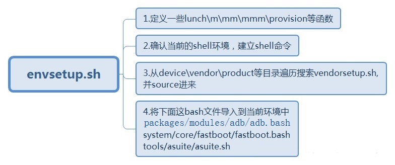

### 概述

<p style="text-indent:2em">上一节针对Android编译系统做了一个笼统的说明，这一节针对编译环境初始化做一下详细的展示。</p>

### 初始化命令介绍

```bash
# 初始化命令：
source build/envsetup.sh
```

<p style="text-indent:2em">envsetup.sh 主要做了下面几个事情：</p>



<p style="text-indent:2em">envsetup.sh 构建代码：</p>

```bash
  ...
  validate_current_shell
  source_vendorsetup
  addcompletions
```

输入hmm可以看到envsetup支持的一些接口

