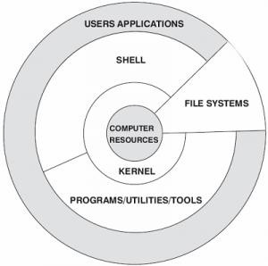
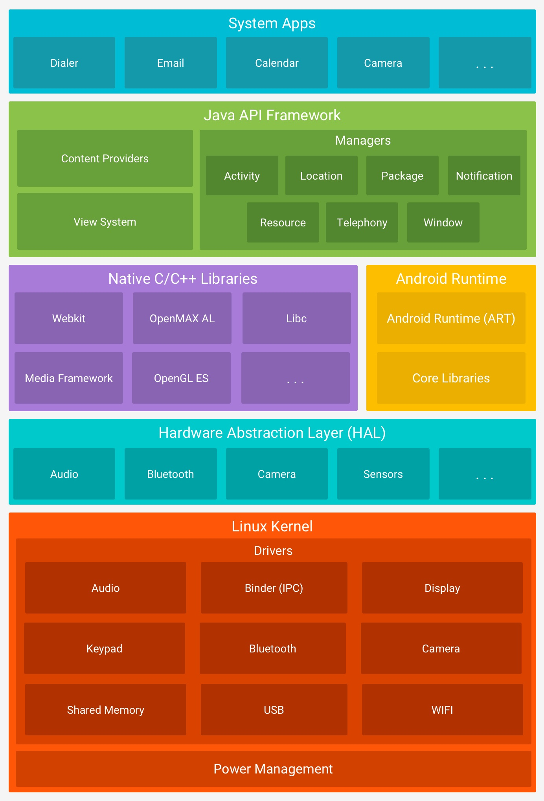

本文主要介绍Android的系统架构，Android使用linux内核(Marco kernel)，但是Android的架构又与Linux系统有所不同，因此在介绍Android系统架构之前，我们先一起来了解一下Linux系统的架构。 Linux架构如下图所示：

- Computer Resources：硬件资源
- Kernel：内核
- Shell：shell是系统的用户界面，提供了用户与内核进行交互操作的一种接口。它接收用户输入的命令并把它送入内核去执行，是一个命令解释器
- Programs/Utilities/Tools：库函数、工具等
- File systems：文件系统是文件存放在磁盘等存储设备上的组织方法。Linux系统能支持多种目前流行的文件系统，如EXT2、 EXT3、EXT4、 FAT、 FAT32、 VFAT和ISO9660。
- User Application: Linux应用，标准的Linux系统一般都有一套被称为应用程序的程序集，它包括文本编辑器、编程语言、X Window、办公套件、Internet工具和数据库等。

Linux系统一般由4个组成部分：内核Kernel、Shell、文件系统和应用程序。内核、shell和文件系统一起组成了基本的操作系统结构，它们让用户可以管理文件、运行程序并使用系统。Linux开机后，内核启动，激活内核空间，抽象硬件、初始化硬件参数等，运行并维护虚拟内存、调度器、信号及进程间通信(IPC)。内核启动后，再加载Shell和用户应用程序，用户应用程序使用C\C++编写，被编译成机器码，形成一个进程，通过系统调用(Syscall)与内核系统进行联通。进程间交流需要使用特殊的进程间通信(IPC)机制。

了解了Linux架构，我们再来看看Android系统架构。Android的系统非常庞大且错综复杂，需要具备全面的技术栈，但整体架构设计清晰，底层以Linux内核为基础。Android底层内核空间以Linux Kernel作为基石，上层用户空间由Native系统库、虚拟机运行环境、框架层组成，通过系统调用(Syscall)连通系统的内核空间与用户空间。对于用户空间主要采用C++和Java代码编写，通过JNI技术打通用户空间的Java层和Native层(C++/C)，从而连通整个系统。为了能让大家整体上大致了解Android系统涉及的知识层面，先来看一张Google提供经典Android架构图，从上往下依次为应用层(System Apps)、应用框架层(Java API Framework)、运行层(系统Native库和Android运行时环境)、硬件抽象层(HAL)、Liunx 内核(Marco Kernel)，其中每一层都包含大量的子模块或子系统。

- 应用层(System Apps) 该层中包含所有的Android应用程序，包括电话、相机、日历等，我们自己开发的Android应用程序也被安装在这层；大部分的应用使用JAVA开发，现在Google也开始力推kotlin进行开发。
- 应用框架层(Java API Framework)这一层主要提供构建应用程序时可能用到的各种API，Android自带的一些核心应用就是使用这些API完成的，开发者也可以通过使用API来构建自己的应用程序。
- 运行层
  - 系统Native库	Android包含一些C/C++库，这些库能被Android系统中不同的组件使用
  - Android运行时环境	Android包括了一个核心库，该核心库提供了Java编程语言核心库的大多数功能。虚拟机也在该层启动。每个Android应用都有一个专有的进程，这些进程每个都有一个Dalivik虚拟机实例，并在该实例中运行。
- 硬件抽象层(HAL) Android的硬件驱动与Linux不同，传统的Liunx内核驱动完全存在于内核空间中。但是Android在内核外部增加了一个硬件抽象层(HAL,Hardware Abstraction Layer)，把一部分硬件驱动放到了HAL层。为什么Android要这么做呢？Linux内核采用了GPL协议，如果硬件厂商需要支持Linux系统，就需要遵照GPL协议公开硬件驱动的源代码，这势必会影响到硬件厂家的核心利益。Android的HAL层运行在用户空间，HAL是一个“空壳”，Android会根据不同的需要，加载不同的动态库。这些动态库由硬件厂家提供。硬件厂家把相关硬件功能写入动态库，内核中只开放一些基本的读写接口操作。这样一些硬件厂家的驱动功能就由内核空间移动到了用户空间。Android的HAL层遵循Apache协议，并不要求它的配套程序，因此厂家提供的驱动库不需要进行开放，保护了硬件厂家的核心利益。
- Linux Kernel Android平台的基础是Linux内核，比如ART虚拟机最终调用底层Linux内核来执行功能。Linux内核的安全机制为Android提供相应的保障，也允许设备制造商为内核开发硬件驱动程序。

上图采用静态分层方式的架构划分，众所周知，程序代码是死的，系统运转是活的，各模块代码运行在不同的进程(线程)中，相互之间进行着各种错终复杂的信息传递与交互流，从这个角度来说此图并没能体现Android整个系统的内部架构、运行机理，以及各个模块之间是如何衔接与配合工作的。为了更深入地掌握Android整个架构思想以及各个模块在Android系统所处的地位与价值，计划以Android系统启动过程为主线，以进程的视角来诠释Android系统全貌，全方位的深度剖析各个模块功能，争取各个击破。这样才能犹如庖丁解牛，解决、分析问题则能游刃有余。

