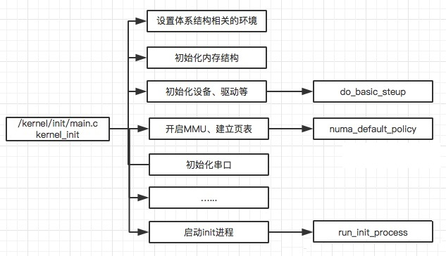
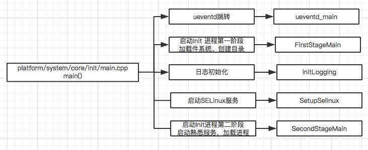

### 概述

init进程是linux系统中用户空间的第一个进程，进程号为1。当bootloader启动后，启动kernel，kernel启动完后，在用户空间启动init进程，再通过init进程来读取init.rc中的相关配置，从而来启动其他相关进程以及其他操作。init进程被赋予了很多重要工作，init进程启动主要分为两个阶段：

1. 第一个阶段完成以下内容：

- ueventd/watchdogd跳转及环境变量设置
- 挂载文件系统并创建目录
- 初始化日志输出、挂载分区设备
- 启用SELinux安全策略
- 开始第二阶段前的准备

2. 第二个阶段完成以下内容：

- 初始化属性系统
- 执行SELinux第二阶段并恢复一些文件安全上下文
- 新建epoll并初始化子进程终止信号处理函数
- 设置其他系统属性并开启属性服务

### 架构

#### Init进程如何被启动？

Init进程是在Kernel启动后，启动的第一个用户空间进程，PID为1。

kernel_init启动后，完成一些init的初始化操作，然后去系统根目录下依次找 ramdisk_execute_command 和 execute_command 设置的应用程序，如果这两个目录都找不到，就依次去根目录下找/sbin/init，/etc/init，/bin/init，/bin/sh 这四个应用程序进行启动，只要这些应用程序有一个启动了，其他就不启动了。

Android系统一般会在根目录下放一个init的可执行文件，也就是说Linux系统的init进程在内核初始化完成后，就直接执行init这个文件。

#### Init进程启动后，做了哪些事？

Init进程启动后，首先挂载文件系统、再挂载相应的分区，启动SELinux安全策略，启动属性服务，解析rc文件，并启动相应属性服务进程，初始化epoll，依次设置signal、property、keychord这3个fd可读时相对应的回调函数。进入无线循环，用来响应各个进程的变化与重建。

**init.rc**是一个规定init进程行为和动作的配置文件。init进程可以做哪些事情，都由它规定。init.rc文件中只包含两种声明，on和service，我们可以把on称为init行为，把service称为init服务。service声明了init服务以及init服务的各种行为。开机启动进程就是这里的init服务。service只定义init服务，但不能让init服务做任何事情，如果你需要init服务能够产生启动或者停止等相关动作，你就需要on，每个on下面的有各种命令，其中就包括很多对init服务的操作。
