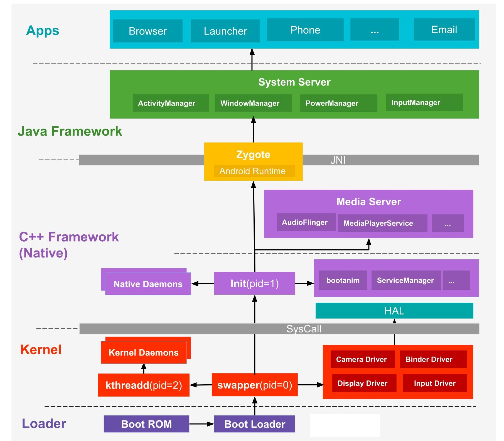
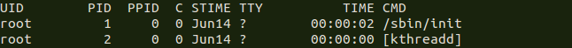

### 概述

Google提供的5层架构图很经典，但为了更进一步透视Android系统架构，本文更多的是以进程的视角，以分层的架构来诠释Android系统的全貌，阐述Android内部的环环相扣的内在联系。

- BootRom->BootLoader->Linux Kernel->Init->Zygote->SystemServer->Launcher
- Loader层：主要包括Boot Rom和Boot Loader
- Kernel层：主要是Android内核层
- Native层：主要是包括init进程以及其fork出来的用户空间的守护进程、HAL层、开机动画等
- JAVA Framework层：主要是AMS和PMS等Service的初始化
- Application层：主要指SystemUI、Launcher的启动
- Syscall && JNI
  - Native与Kernel之间有一层系统调用(SysCall)层
  - Java层与Native(C/C++)层之间的纽带JNI

### Android 系统启动流程

Android系统启动过程由上图可知，从下往上的一个过程是由`Loader`引导开机，然后依次进入 -> `Kernel` -> `Native` -> `Java Framework` -> `Apps`，接来下简要说说每个过程：

**第一步**：当手机处于关机状态时，长按Power键开机，手机开机后，引导芯片启动，引导芯片开始从固化在`ROM`里的预设代码开始执行，然后加载引导程序到`RAM`，Boot Loader是启动Android系统之前的引导程序，主要是检查RAM，初始化硬件参数等功能。

**第二步**：硬件等参数初始化完成后，进入到Kernel层，Kernel层主要加载一些硬件设备驱动，初始化进程管理等操作。在Kernel中首先启动kernel的swapper进程(pid=0)，该进程又称为idle进程, 系统初始化过程Kernel由无到有开创的第一个进程，用于初始化进程管理、内存管理、安装根文件系统，加载Display Driver，Camera Driver，Binder Driver，等相关工作，最后启动第一个用户进程init进程，它是所有用户进程的父进程，这样就进入了Android框架的启动阶段；再启动kthreadd进程(pid=2)，kthreadd是Linux系统的内核进程，会创建内核工作线程kworkder，软中断线程ksoftirqd，thermal等内核守护进程，`kthreadd进程是所有内核进程的鼻祖`。

**第三步**：Kernel层加载完毕后，初始化进程管理等操作会启动init进程，硬件设备驱动与HAL层进行交互，这些在Native层中。init进程(pid=1，是Linux系统的用户进程，`init进程是所有用户进程的鼻祖`，第一个启动，并且这个进程是不会死亡的，如果它死亡，内核就会崩溃。)启动后，会孵化出ueventd、logd、healthd、installd、adbd、lmkd等用户守护进程，当它执行mount_all指令挂载分区时，会加载/{system,vendor,odm}/etc/init目录下的所有rc脚本，这样就会启动cameraserver进程，mediaserver(多媒体服务进程)，surfaceflinger(屏幕渲染相关的进程)等，并且会启动`servicemanager`(binder服务管家)、`bootanim`(开机动画)等重要服务，同时孵化出zygote进程，zygote进程是Android系统的第一个Java进程(即虚拟机进程)，`Zygote是所有Java进程的父进程`，Zygote进程本身是由init进程孵化而来的。这里属于C++ Framework，代码为C++程序。硬件抽象层(HAL)提供标准接口，HAL包含多个库模块，其中每个模块都为特定类型的硬件组件实现一组接口，比如WIFI/蓝牙模块，当框架API请求访问设备硬件时，Android系统将为该硬件加载相应的库模块。

**第四步**：Zygote进程是由init进程解析init.rc(system\core\rootdir\init.rc)文件后fork生成的，它会加载ZygoteInit类注册Zygote Socket服务端套接字，加载虚拟机，提前加载类preloadClasses，提前加载资源preloadResouces，启动System Server(zygote孵化的第一个进程)，同时会启动相关的App进程，启动的第一个App进程为Launcher(这是用户看到的桌面App)，然后启动Browser，Phone，Email，SMS等进程。所有的App进程都由zygote fork生成，每个App至少运行在一个进程上，每个App在其自己的进程中都有自己的虚拟机实例，ART(Android Runtime)通过执行DEX文件可在设备运行多个虚拟机，DEX文件是一种专为Android设计的字节码格式文件，经过优化，使用内存很少。ART主要功能包括：预先(AOT)和即时(JIT)编译，优化的垃圾回收(GC)，以及调试相关的支持。System Server进程，是由Zygote进程fork而来，`System Server是Zygote孵化的第一个进程`，System Server负责启动和管理整个Java Framework里面的service，包含ActivityManager，WindowManager，PackageManager，PowerManager等服务。
