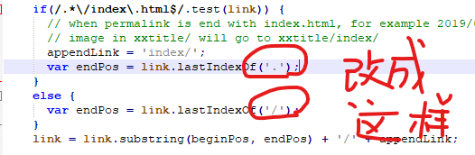

### 前言

<p style="text-indent:2em">现在市面上的博客很多，如CSDN，博客园，简书等平台，可以直接在上面发表，用户交互做的好，写的文章百度也能搜索的到。缺点是比较不自由，会受到平台的各种限制和恶心的广告。而自己购买域名或/和服务器，搭建博客的成本实在是太高了，不光是说这些购买成本，单单是花力气去自己搭这么一个网站，还要定期的维护它，对于我们大多数人来说，实在是没有这样的精力和时间。那么就有第三种选择，通过Hexo直接在github page等平台上托管我们的博客，这样就可以安心的来写作，又不需要定期维护。Hexo是一款基于Node.js的高效简洁的静态博客框架，依赖少易于安装使用，它使用MarkDown语法解析文章，可以方便的生成静态网页，托管在GitHub和Coding等托管平台上，是搭建博客的首选框架。</p>

### 搭建

1. #### 安装git、nodejs、hexo

<p style="text-indent:2em">Git是目前世界上最先进的分布式版本控制系统，可以高效的处理从很小到非常大的项目版本管理，也就是我们这里用来管理hexo博客文章上传到GitHub的工具。Hexo是基于Node.js编写的，Node.js是一个基于Chrome V8引擎的JavaScript运行时。所以需要安装一下Node.js和里面的npm工具。命令：sudo apt install git-core; sudo apt install nodejs;sudo apt install npm。git和nodejs安装好后，就可以用命令 npm install -g hexo-cli 全局安装hexo了。安装完后，检查一下有没有安装成功，至此就全部安装完了：


```bash
# git
git --version
# nodejs
node -v
# npm
npm -v
# hexo
hexo -v
```

<p style="text-indent:2em">接下来创建并初始化一下博客文件夹和安装Hexo需要的包，这个<blog-folder>可以自己取什么名字都行。</p>

```
hexo init <blog-folder> && cd <blog-folder> && npm install
```

<p style="text-indent:2em">新建完成后，指定文件夹目录下有：</p>

```
.
├── node_modules           :依赖包文件夹。
├── scaffolds              :模版文件夹。生成文章的一些模板，当您新建文章时，Hexo会根据scaffold来建立文件。
├── source                 :资源文件夹。是存放用户资源的地方，你用来存放博客文章的md文件就放在此处。
|   ├── _drafts            :
|   └── _posts             :
├── themes                 :主题文件夹。Hexo会根据主题来生成静态页面。
├── _config.yml            :博客的配置文件
├── db.json                :
├── package.json           :
└── package-lock.json      :
```

<p style="text-indent:2em">现在一个简单的个人博客已经创建完成，我们可以使用 hexo g(generate) 命令来生成静态网页。然后通过 hexo s(server) 命令启动本地服务器来预览一下hexo为我们提供的最原始博客页面。使用ctrl+c可以把服务关掉。</p>

2. #### GitHub托管

<p style="text-indent:2em"><b>创建个人仓库：</b>创建一个和用户名相同的仓库，后面加.github.io，只有这样，将来要部署到GitHub page的时候，才会被识别，也就是xxxx.github.io，其中xxx就是注册GitHub的用户名。
<p style="text-indent:2em"><b>安装 hexo-deployer-git 部署插件：</b>npm install hexo-deployer-git --save</p>
<p style="text-indent:2em"><b>安装 hexo-asset-image 图片引用插件：</b>npm install hexo-asset-image --save</p>

### 配置

#### 工具配置

##### npm 配置

1. 设置npm在安装全局模块时的路径和环境变量(Windows)

```bash
# 如果不设置的话，安装模块的时候就会把模块装到C盘，占用C盘的空间，并且有可能安装好hexo后却无法使用，所以我们需要设置一下：在nodejs文件夹中新建两个空文件夹 node_cache、node_global
npm config set prefix "path\nodejs\node_global"
npm config set cache "path\nodejs\node_cache"
#在系统变量中新建一个变量名为"NODE_PATH"，值为"path\nodejs\node_global\node_modules"
#编辑用户变量里的Path，将相应npm的路径改为："path\nodejs\\node_global"
```

2. 设置镜像源

```bash
npm config get registry
# https://registry.npmjs.org/
npm config set registry https://registry.npm.taobao.org
npm config get registry
# https://registry.npm.taobao.org
```

#### 插件配置

#####  hexo-asset-image 图片引用插件

<p style="text-indent:2em">将hexo本地根目录下的核心配置文件_config.yml的post_asset_folder: true。修改博客目录下`node_modules\hexo-asset-image\index.js`(原文件有bug)</p>



#### [主题配置](https://hexo.io/themes/)

##### 安装hexo next主题

```bash
npm install hexo-theme-next
cp -rf node_modules/hexo-theme-next themes && mv themes/hexo-theme-next themes/next
cp themes/next/_config.yml themes/next/_config.yml.bak
```

##### 配置next主题

<p style="text-indent:2em">打开目录blog/themes/next/下的_config.yml(称为<b>主题配置文件</b>)，只要将你选的主题前的#删除就行了。

#### 博客配置

<p style="text-indent:2em">在文件根目录下的<a href="https://hexo.io/zh-cn/docs/configuration" style="text-decoration:none">_config.yml</a>，就是整个hexo框架的配置文件了，称为<b>站点配置文件</b>，可以在里面修改大部分的配置。其中theme就是选择什么主题，也就是在theme这个文件夹下，在官网上有很多个主题，默认安装的是lanscape这个主题。当需要更换主题时，在官网上下载，把主题的文件放在theme文件夹下，再修改这个参数就可以了，这里主题改为next。deploy 就是网站的部署的，repo就是仓库(Repository)的简写，branch选择仓库的哪个分支。
</p>

```bash
# 备份原始核心配置文件
cp _config.yml _config.yml.bak
```

<p style="text-indent:2em"><b>front-matter前页(指扉页、版权页、目次等)</b>是文件最上方以 --- 分隔的区域，用于指定个别文件的变量。以下参数描述是预先定义的参数，可在模板中使用这些参数值并加以利用。其中，分类和标签需要区别一下，分类具有顺序性和层次性，也就是说 Foo, Bar 不等于 Bar, Foo；而标签没有顺序和层次。
</p>

```bash
# 参数描述
layout 布局
title 标题
date 创建日期
updated 更新日期
comments 开启文章的评论功能
tags 标签(不适用于分页)
categories 分类(不适用于分页)
permalink 覆盖文章网址
```

<p style="text-indent:2em"><b>layout(布局)</b>Hexo有三种默认布局：post、page和draft，它们分别对应不同的路径，而自定义的其他布局和post相同，都将储存到source/_posts文件夹。</p>

```bash
#布局路径
post source/_posts
page source
draft source/_drafts
```

<p style="text-indent:2em">而new这个命令其实是：</p>

```bash
hexo new [layout] <title>
```

<p style="text-indent:2em">默认使用的是post这个布局。</p>

<p style="text-indent:2em"><b>page(页面)</b>如果想另起一页，那么可以使用：</p>

```bash
hexo new page board
```

<p style="text-indent:2em">系统会自动给你在source文件夹下创建一个board文件夹，以及board文件夹中的index.md，这样你访问的board对应的链接就是https://xxx.xxx/board

<p style="text-indent:2em"><b>draft(草稿)</b>如果想写文章，又不希望被看到，那么可以:</p>

```bash
hexo new draft newpage
```

<p style="text-indent:2em">这样会在source/_draft中新建一个newpage.md文件，如果你的草稿文件写的过程中，想要预览一下，那么可以使用:</p>

```bash
hexo server --draft
```

<p style="text-indent:2em">在本地端口中开启服务预览。如果你的草稿文件写完了，想要发表到post中，

```bash
hexo publish draft newpage
```

<p style="text-indent:2em">就会自动把newpage.md发送到post中。</p>

#### 域名配置

<p style="text-indent:2em">在域名控制台中，对购买的域名点解析进去，添加解析，解析线路选择默认，在域名设置的功能设置中开启CNAME加速。在记录管理的快速添加解析中选择默认的网站解析选项卡，网站地址选择域名映射(CNAME)，然后填写yourusername.github.io。在GitHub的仓库的settings中设置Custom domain输入你的域名。然后在你博客目录blog/source中创建一个名为CNAME无后缀文件，写入域名。</p>

### 管理

#### 通过git分支进行多终端工作

##### 机制

<p style="text-indent:2em">由于 hexo d 上传部署到 github 的其实是 hexo 编译后的文件，是用来生成网页的，不包含源文件。也就是上传的是在本地目录里自动生成的 .deploy_git 里面。其他文件包括我们写在 source 里面的，配置文件，主题文件，都没有上传到 github。所以可以利用 git 的分支管理，将源文件上传到 github 的另一个分支即可。</p>

##### 方案

<p style="text-indent:2em">主要是通过维护两条 git 分支来实现，第一个分支是 Gihub 上默认的 master 分支，用于存放发布的博文的静态页面；另外再新建一个分支，比如命名为 hexo ，通过此分支存放主题、原始的博客文件等等，这些文件才是不同电脑需要同步的文件；当每次修改主题或者新增博文后，先将修改的主题文件(在themes文件夹下)或者新增博客(在source文件夹下)，同步到远程的 hexo 分支，然后在通过 hexo g -d 命令发布博文，也就是将新增的博文的静态页面同步到 master 分支。这样通过不同的分支管理不同的文件，实现了多台电脑同步更新博文的功能。</p>

##### 实现

- <p><b>创建分支 </b>在github上此仓库中新建一个hexo分支，并这个仓库的settings中，选择默认分支为hexo分支(这样每次同步的时候就不用指定分支，比较方便)。</p>

- <p><b>初始化分支 </b>在已经部署好Hexo环境的PC上将其克隆到本地，因为默认分支已经设成了hexo，所以clone时只clone了hexo。在克隆到本地的仓库中，把除了.git 文件夹外的所有文件都删掉。接着将本次修改推送到远端hexo；将刚才未删除的.git文件夹拷贝至<blog-folder>根目录，此时本地的<blog-folder>目录已与github上面的hexo分支关联了，而且默认的.gitignore已经配置了忽略规则，所以已经可以将根目录下的文件同步上去。这样上传完了之后可以去github仓库上看一看hexo分支有没有上传上去，其中node_modules、public、db.json已经被忽略掉了，没有关系，不需要上传的，因为在其他部署好Hexo环境的PC上需要重新输入命令安装。在其他部署好Hexo环境的PC上将仓库克隆到本地，进入仓库中执行：</p>

  ```bash
  npm install
  npm install hexo-deployer-git --save
  ```

不需要*hexo init*，就可以进行hexo博客操作了。


